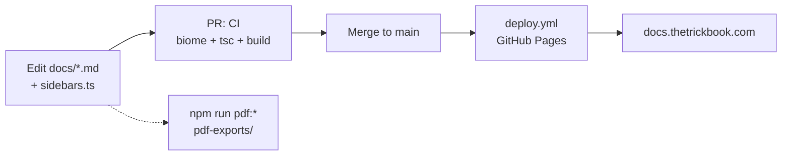

# TrickBook Documentation

> Technical documentation for the TrickBook platform — mobile app, web app, backend API, and Chrome extension — built with Docusaurus and TypeScript.

[](#license)
[](https://docusaurus.io/)
[](https://www.typescriptlang.org/)

**Live site:** [docs.thetrickbook.com](https://docs.thetrickbook.com)

## Overview

This repository is the single source of truth for TrickBook's engineering and product documentation. It covers:

- **Engineering Standards** — linting/formatting (Biome), testing, pre-commit hooks, error handling, logging, code quality, development workflow
- **Architecture** — system overview, repo dependency map, tech stack, data flow, Kaori (AI companion) architecture, and ADRs
- **Backend** — API endpoints, authentication, database schema, security
- **Mobile App** — navigation, state management, API integration, EAS/Expo build configuration
- **Chrome Extension** — overview and data model
- **Features** — TrickBook, Spots, Spots Map, Homies, Media, Notifications, and the AI Companions suite
- **Deployment** — App Store, Google Play, backend server, infrastructure, CI/CD
- **Release Notes**, **User Feedback**, and **Roadmap** — versioned changelogs, feedback log, priorities, and planning docs

The site supports Mermaid diagrams, dark mode, full-text search, and PDF export of any or all pages.

## Getting Started

Requires **Node.js >= 20** (see `.nvmrc`).

```bash
nvm use            # picks up Node 20 from .nvmrc
npm install        # install dependencies (also sets up Husky hooks)
npm start          # local dev server with hot reload (http://localhost:3000)
npm run build      # production build into build/
npm run serve      # serve the production build locally
```

## Scripts

| Script | Description |
|---|---|
| `npm start` | Start the Docusaurus dev server with hot reload |
| `npm run build` | Build the static site into `build/` (broken links fail the build) |
| `npm run serve` | Serve the production build locally |
| `npm run deploy` | Deploy via `docusaurus deploy` (manual GitHub Pages push) |
| `npm run clear` | Clear the Docusaurus cache (`.docusaurus/`) |
| `npm run lint` / `lint:fix` | Biome lint + format check (or auto-fix) per `biome.json` |
| `npm run format` / `format:check` | Biome formatting (write / check only) |
| `npm run typecheck` | TypeScript type checking (`tsc`) |
| `npm run validate` | Full gate: Biome check + typecheck + production build |
| `npm run pdf` / `pdf:all` | Generate one PDF per Markdown file in `docs/` into `pdf-exports/` (`scripts/generate-pdf.js`) |
| `npm run pdf:section <path>` | Same script, scoped to a single file or section, e.g. `npm run pdf:section docs/backend/` |
| `npm run pdf:combined` | Generate a single `TrickBook-Documentation-Curated.pdf` with cover page and table of contents, in a curated section order (`scripts/generate-combined-pdf.js`) |

Pre-commit hooks (Husky + lint-staged) run Biome on staged `.ts`/`.tsx`/`.css` files automatically.

## Content Structure

All content lives under `docs/`, organized by section:

```
docs/
├── intro.md            # Landing page / getting started
├── engineering/        # Engineering standards
├── architecture/       # System design, tech stack, ADRs (architecture/adrs/)
├── backend/            # API, auth, database, security
├── mobile/             # React Native app internals
├── chrome-extension/   # Extension docs
├── features/           # Product feature docs (incl. features/ai-companions/)
├── deployment/         # Store, server, and CI/CD deployment guides
├── releases/           # Release notes per version
├── feedback/           # User feedback log
└── roadmap/            # Priorities and planning docs
```

The sidebar is **explicitly curated** in `sidebars.ts` (a single `docsSidebar`), not auto-generated. Custom pages and styles live in `src/` (`src/pages/index.tsx`, `src/css/custom.css`).

**Adding a new doc:** create a `.md` file in the appropriate `docs/<section>/` folder (with frontmatter for title/sidebar position as needed), then register its document ID in the matching category in `sidebars.ts` — a doc that isn't in the sidebar won't be navigable. Mermaid code blocks render natively (` ```mermaid `). Note that `onBrokenLinks` is set to `throw`, so any broken internal link fails the build; run `npm run validate` before pushing to catch lint, type, and build errors in one pass.

## Deployment

The site deploys to **GitHub Pages** under the custom domain `docs.thetrickbook.com` (configured in `docusaurus.config.ts`: `organizationName: wbaxterh`, `projectName: TrickBookDocs`).

- **Automatic:** pushing to `main` triggers `.github/workflows/deploy.yml`, which builds and publishes to GitHub Pages (also runnable via `workflow_dispatch`).
- **CI:** pull requests against `main` run `.github/workflows/ci.yml` — Biome check, typecheck, and a full build.
- **Manual fallback:** `npm run build && npm run deploy`.



## Related Repositories

| Repo | Description |
|---|---|
| [TrickBookFrontend](https://github.com/wbaxterh/TrickBookFrontend) | Mobile app (React Native + Expo) |
| [TrickBookWebsite](https://github.com/wbaxterh/TrickBookWebsite) | Web app (Next.js) |
| [TB-Backend](https://github.com/wbaxterh/TB-Backend) | Backend API (Express + MongoDB + Socket.io) |

## License

Proprietary — Copyright © TrickBook. All rights reserved.
