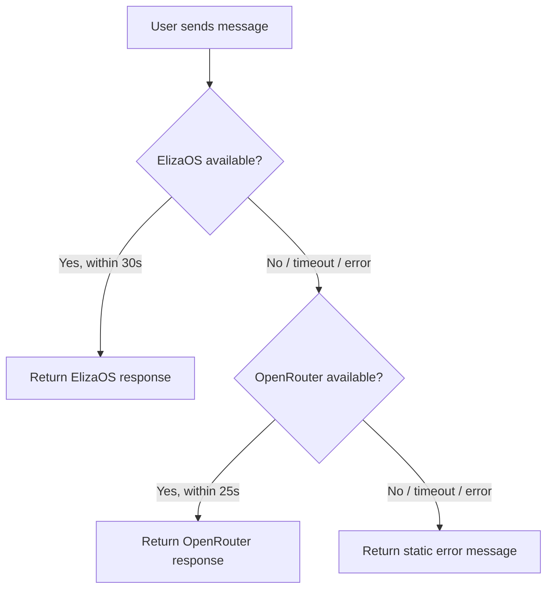

# ADR-002: Add OpenRouter Fallback to Kaori Bot-Chat

| Field | Value |
|-------|-------|
| **Status** | Accepted |
| **Date** | May 2026 |
| **Deciders** | Wes Huber |

## Context

The `bot-chat` endpoint handled all conversations between users and Kaori (TrickBook's AI companion). This route only attempted to reach **ElizaOS** at `localhost:3001`. When ElizaOS crashed or stopped responding, every user message to Kaori returned a generic "technical difficulties" error.

ElizaOS runs as a separate PM2 process (`kaori-bot`) on the same EC2 instance as the backend. It proved unstable in production -- the process accumulated **34 restarts** over its operational period. Each crash left Kaori completely unavailable until ElizaOS recovered or was manually restarted.

Meanwhile, the DM route (`dm.js`) already had a working fallback pattern that called OpenRouter's `generateKaoriResponse` when ElizaOS was unreachable. The bot-chat route was missing this same resilience pattern.

## Decision

Add a **three-tier fallback chain** to the bot-chat endpoint:

```
1. ElizaOS (primary)      -- 30s timeout
2. OpenRouter/generateKaoriResponse (fallback) -- 25s timeout
3. Static error message   -- last resort
```

### Flow



The OpenRouter fallback uses **Gemini 2.0 Flash** and has access to all Kaori tools:

- Spot search
- Trickipedia lookups
- User trick data queries
- General conversation with Kaori's personality prompt

## Alternatives Considered

### Restart ElizaOS automatically on crash

PM2 already handles automatic restarts, but there is a gap between crash and recovery during which users receive errors. Auto-restart does not eliminate downtime -- it only reduces it. The fallback chain ensures zero downtime from the user's perspective.

### Replace ElizaOS entirely with OpenRouter

ElizaOS provides features beyond what the OpenRouter fallback covers (persistent memory, agent-specific state). Keeping ElizaOS as the primary preserves these capabilities while using OpenRouter as a reliable safety net.

## Consequences

### Positive

- **Kaori is resilient to ElizaOS outages.** Users get responses even when the primary AI process is down.
- **Consistent with existing patterns.** The DM route already used this fallback approach, so the codebase is now uniform.
- **Full tool access on fallback.** The OpenRouter path uses Gemini 2.0 Flash with the same tool definitions, so Kaori can still search spots, look up tricks, and access user data even in fallback mode.

### Negative

- **Potential response quality difference.** ElizaOS and OpenRouter/Gemini may produce subtly different response styles. Users might notice inconsistency if the primary and fallback alternate.
- **Additional API cost.** OpenRouter calls incur per-token costs that ElizaOS (self-hosted) does not. During extended ElizaOS outages, OpenRouter costs accumulate.
- **Two timeout windows.** In the worst case (both ElizaOS and OpenRouter fail), the user waits up to 55 seconds before receiving the static error. In practice, timeouts are rare since failures typically manifest as immediate connection refusals.
