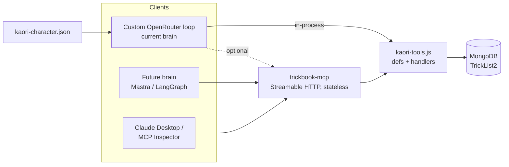

# ADR-003: Kaori Agent Architecture — MCP Tools + Character File, Defer the Framework

| Field | Value |
|-------|-------|
| **Status** | Accepted (incremental path) |
| **Date** | August 2026 |
| **Deciders** | Wes Huber |
| **Supersedes** | — |
| **Related** | [ADR-002: Kaori Fallback Chain](./kaori-fallback-chain) |

## Context

Kaori's "brain" today is a **custom Node.js function** (`kaori-ai-response.js`) that calls **OpenRouter** (`google/gemini-3.5-flash`) with a hand-rolled tool-calling loop. It has:

- **8 tools** (`kaori-tools.js`) that hit MongoDB directly: `search_spots`, `search_trickipedia`, `get_user_tricklists`, `create_tricklist`, `add_trick_to_list`, `update_trick_status`, `lookup_boardsport_knowledge`, `remember_user_info`.
- A lightweight **RAG** step (`kaori-rag/`) + a JSON knowledge file.
- Per-user **memory** in the `companion_profiles` Mongo collection (relationship stage, traits, `memory.userName`/`knownFacts`).
- An **ElevenLabs voice sidecar** (Kith) that streams TTS for the 3D avatar.

Three problems motivated this review:

1. The persona lived in a **~60-line inline system-prompt string** — hard to edit, impossible to reuse, "sloppy."
2. The tools were **hardwired** into the brain — no other client (a future web-Kaori, Claude Desktop, a different orchestrator) could reuse them.
3. Open question: **should we adopt a framework** — LangGraph, ElizaOS, or "Milady" — or keep the custom loop?

We ran a **deep, multi-source, adversarially-verified research pass** (22 sources, 25 claims verified, 23 confirmed / 2 refuted) to answer #3 honestly. Note our own history here: per [ADR-002](./kaori-fallback-chain), we already ran **ElizaOS** as Kaori's primary and it was unstable (34 PM2 restarts), which is why the OpenRouter loop exists as the reliable path.

## Decision

Take the **incremental path**. Specifically:

1. **Build a Node/TypeScript-compatible MCP server** (`mcp/trickbook-mcp.js`) that wraps the existing tools. This is the highest-leverage, framework-agnostic move — every candidate brain consumes MCP.
2. **Decompose the inline prompt into a structured character file** (`kaori-character.json`), composed back into the system prompt at load time. Brain-agnostic; fixes the "sloppy" prompt.
3. **Keep the custom OpenRouter loop as the brain for now.** Do **not** adopt LangGraph, ElizaOS, or Milady wholesale.
4. **Defer the orchestration-framework question** until a concrete need (durable/branching/human-in-the-loop flows) appears. If/when it does, prefer **Mastra** (stays in Node) over a polyglot Python LangGraph service, unless durable checkpointing specifically justifies the latter.

### Target shape

The current loop still calls tools **in-process** (no added latency); the MCP server is an **additive external interface** over the same handlers — one source of truth, no duplicated schema mapping.

## Research summary & decision matrix

| Option | Lang | Memory / persistence | MCP | Migration cost | Verdict |
|---|---|---|---|---|---|
| **MCP server (tools)** | TS/JS | n/a | *is* the layer | **Low** | ✅ Do now — every brain consumes it |
| **Character file (persona)** | any | n/a | n/a | **Low** | ✅ Do now — brain-agnostic |
| **Keep custom loop** | Node | existing Mongo docs | via MCP | none | ✅ Fine as the brain for now |
| Mastra | TS-native | libSQL/Postgres + RAG | native | Low (in-Node) | 🟡 Best framework option *if/when* |
| Vercel AI SDK | TS | you build it | yes | Lowest | 🟡 Lightest; DIY persistence |
| LangGraph (Python) | Python | best-in-class checkpointer + Store | via `langchain-mcp-adapters` | High (polyglot) | 🟠 Only if durable/branching is a real need |
| ElizaOS / Milady | TS | plugin | plugin | — | ❌ Borrow patterns only |

### The honest LangGraph case

**For:** genuine durable **checkpointing** (crash → resume from the exact node, time-travel replay) + a **two-tier memory model** (per-thread checkpointer + cross-thread `Store` for user facts) — a real fit for a "remembers you" companion.

**Against (for us, now):**
- Kaori is **single-agent, no branching, no human-in-the-loop** — the graph abstraction is largely unused; the value collapses to checkpointer + Store, which we already approximate with `companion_profiles`.
- It forces a **polyglot Python service** (we're all-Node). Research refuted the two comforting myths — that migration is "just swap the loop" and that "tools/prompt/model stay identical."
- **Idempotency landmine:** LangGraph node-resume *re-runs* the interrupted node. Our `add_trick_to_list` / `update_trick_status` / `create_tricklist` are **side-effecting writes** — a resume could double-write.

### "Milady" and ElizaOS

- **"Milady" is not a framework** — it's `milady-ai/milady`, an app *built on ElizaOS* (a local-first "AI waifu" with a VRM avatar + voice — conceptually adjacent to Kaori) but with **crypto/DeFi baked into its core** (PancakeSwap trading, auto-generated EVM/Solana wallets). Nothing to borrow beyond what Eliza offers; the crypto defaults are undesirable.
- **ElizaOS** — genuine TS agent framework, but crypto-social origins, and its token was declared "dead" / foundation winding down (Aug 2026). Combined with our own ADR-002 instability history: **borrow the character-file pattern, don't adopt the framework.**

## Implementation (what shipped in this pass)

### 1. Character file — `Backend/kaori-character.json`

The inline `KAORI_SYSTEM_PROMPT` was decomposed into typed fields: `intro`, `voice[]`, `messageExamples[]`, `identityNotes[]`, `knows[]`, `toolGuidance{intro,routes,rules}`, `dont[]`, `laugh`, `vibe`, `stageDemo`. `kaori-ai-response.js` now composes the system prompt via `buildSystemPrompt(character)` — **behavior-equivalent** to the old string (same sections, order, wording), just sourced from editable data. The load-bearing persona (`voice` + `messageExamples`, corpus-mined and adversarially verified in prior work) was preserved verbatim.

### 2. MCP server — `Backend/mcp/trickbook-mcp.js`

- Official `@modelcontextprotocol/sdk` (v1.30), plain CommonJS (matches the Backend).
- Reuses `TOOL_DEFINITIONS` (their JSON schemas *are* valid MCP `inputSchema`) + `executeToolCall` — zero duplication.
- **Streamable HTTP, stateless** (fresh `Server` + transport per request, `sessionIdGenerator: undefined`) — sidesteps the stateful-session/horizontal-scaling gap flagged in the 2026 MCP roadmap.
- Per-request user context via the **`x-trickbook-user-id`** header (`MCP_DEV_USER_ID` for local dev). Runs inside the trusted backend network.
- `npm run mcp` (default port **9101**); `GET /health` reports the tool count.

**Verification:** `mcp/smoke-test.js` connects over Streamable HTTP, lists all 8 tools, and calls a read-only tool (`lookup_boardsport_knowledge`) returning live data. ✅ green.

### 3. Brain — unchanged

The custom OpenRouter loop remains the brain; it loads the character file and (for now) calls tools in-process.

## Consequences

**Positive**
- Persona is now editable structured data, reusable across brain + voice.
- Tools are decoupled and reusable by any MCP client — a future brain swap is cheap.
- No framework lock-in; no new language/service to operate.
- Every door (Mastra, LangGraph) stays open at low future cost.

**Negative / caveats**
- The MCP server is currently **additive** — the brain doesn't consume it yet (avoids added latency). Wiring the brain through MCP is a later step if we want a single call path.
- Remote MCP at scale has known **stateful-session/scaling** caveats (mitigated here by stateless mode) and the spec is **moving fast** (a non-backward-compatible 2026-07-28 revision).
- If we later adopt LangGraph, the **side-effecting tools must be made idempotent** first.

## Future work

1. (Optional) Point the loop at `trickbook-mcp` for a single tool path.
2. Register `trickbook-mcp` with Claude Desktop / MCP Inspector for manual tool testing.
3. Revisit Mastra vs LangGraph **only** when a durable/branching/human-in-the-loop flow (e.g. confirm-before-add-trick) becomes a real requirement.

## Sources

- MCP TypeScript SDK — `github.com/modelcontextprotocol/typescript-sdk`
- `langchain-ai/langchain-mcp-adapters` (how a future LangGraph brain consumes the same MCP server)
- Mastra — durable TypeScript agents (`developersdigest.tech/blog/mastra-durable-typescript-agents`)
- 2026 MCP roadmap — `blog.modelcontextprotocol.io/posts/2026-mcp-roadmap/`
- ElizaOS character-file pattern — `github.com/elizaOS/characterfile`, `docs.elizaos.ai/agents/character-interface`
