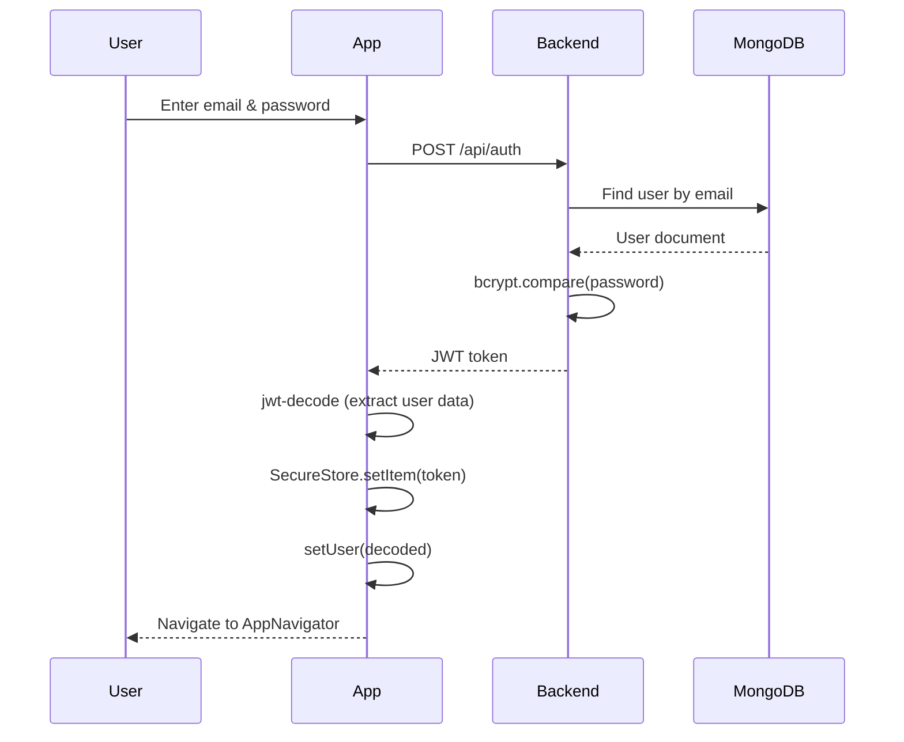
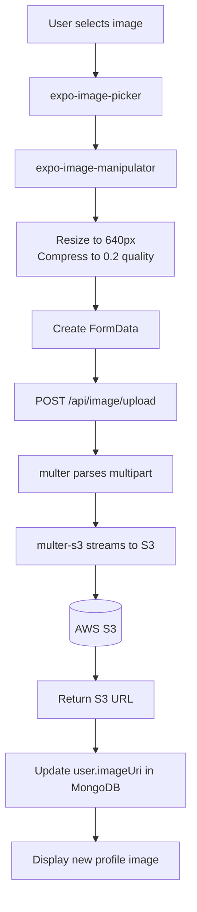
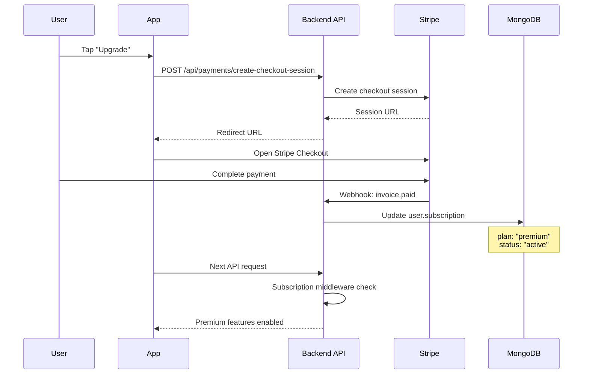

# Data Flow

How data moves through the TrickBook application.

## Authentication Flow



## App Startup Flow

```javascript
// App.js - Simplified
const App = () => {
  const [user, setUser] = useState();
  const [isReady, setIsReady] = useState(false);

  useEffect(() => {
    restoreToken();
  }, []);

  const restoreToken = async () => {
    const token = await authStorage.getToken();
    if (token) {
      const decoded = jwtDecode(token);
      const userProfile = await usersApi.getUser(decoded.email);
      setUser({ ...decoded, ...userProfile.data });
    }
    setIsReady(true);
  };

  if (!isReady) return <SplashScreen />;

  return (
    <AuthContext.Provider value={{ user, setUser }}>
      {user ? <AppNavigator /> : <AuthNavigator />}
    </AuthContext.Provider>
  );
};
```

## Trick List Data Flow

### Creating a Trick List

```
1. User taps "+" button
           │
           ▼
2. CreateTrickListScreen renders
           │
           ▼
3. User enters list name
           │
           ▼
4. Formik validates with Yup schema
           │
           ▼
5. POST /api/listings
   {
     name: "Kickflips to learn",
     user: "userId"
   }
           │
           ▼
6. Backend creates in MongoDB
   db.tricklists.insertOne({...})
           │
           ▼
7. Return { _id, name, tricks: [] }
           │
           ▼
8. Navigate to TrickListScreen
```

### Adding a Trick

```
1. User on TrickListScreen
           │
           ▼
2. Tap "Add Trick" button
           │
           ▼
3. AddTrickScreen modal
           │
           ▼
4. Enter trick name
           │
           ▼
5. PUT /api/listing
   {
     list_id: "listId",
     name: "Kickflip",
     checked: false
   }
           │
           ▼
6. Backend adds to tricks array
           │
           ▼
7. Return updated list
           │
           ▼
8. UI updates with new trick
```

### Checking Off a Trick

```
PUT /api/listing/{trickId}
{
  checked: true
}
           │
           ▼
Update in MongoDB
           │
           ▼
Recalculate completion %
           │
           ▼
Update RoundedLineBar UI
```

## Image Upload Flow



## Subscription Flow



## Guest Mode Data Flow

Guest mode stores data locally without backend sync:

```javascript
// AsyncStorage key: @guest_trick_list
{
  tricks: [
    { id: 1, name: "Kickflip", checked: false },
    { id: 2, name: "Heelflip", checked: true }
  ]
}
```

```
Guest adds trick
       │
       ▼
AsyncStorage.setItem('@guest_trick_list', JSON.stringify(list))
       │
       ▼
On app restart
       │
       ▼
AsyncStorage.getItem('@guest_trick_list')
       │
       ▼
Restore local state
```

## API Request Pattern

All authenticated requests follow this pattern:

```javascript
// app/api/client.js
const apiClient = create({
  baseURL: "https://api.thetrickbook.com/api",
});

// Usage in components
const response = await tricksApi.getTricks(userId);

if (!response.ok) {
  // Handle error
  return;
}

// Use response.data
setTricks(response.data);
```

Response format:
```javascript
{
  ok: true,           // Success indicator
  data: [...],        // Response payload
  status: 200,        // HTTP status
  problem: null       // Error type if failed
}
```
