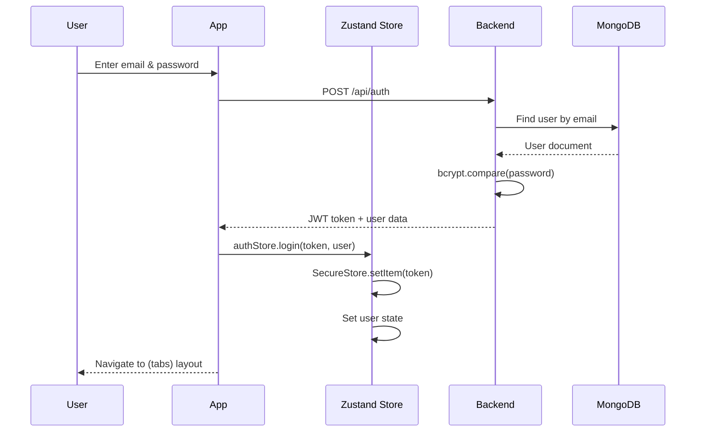
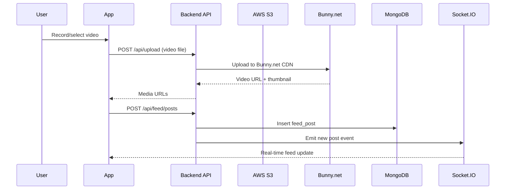
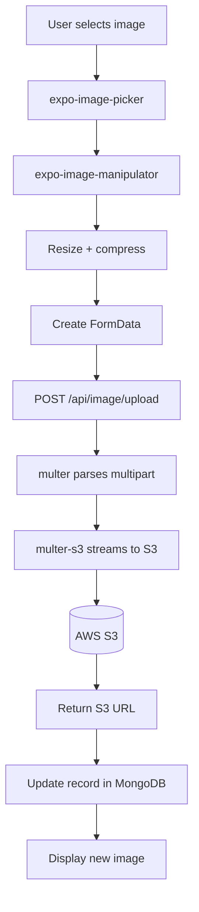
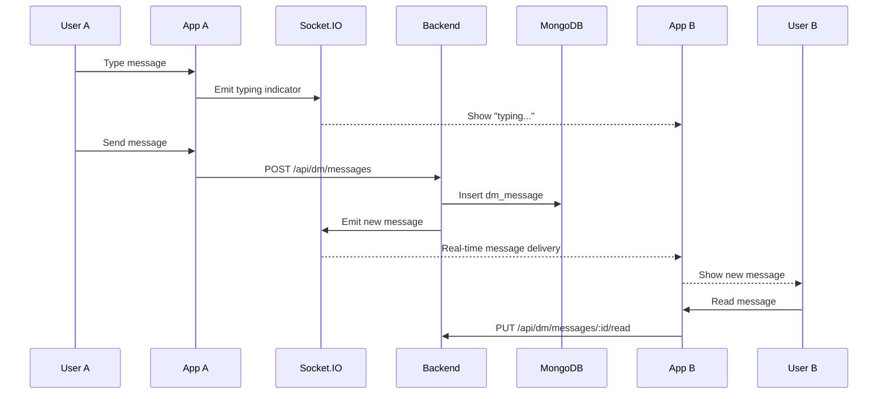
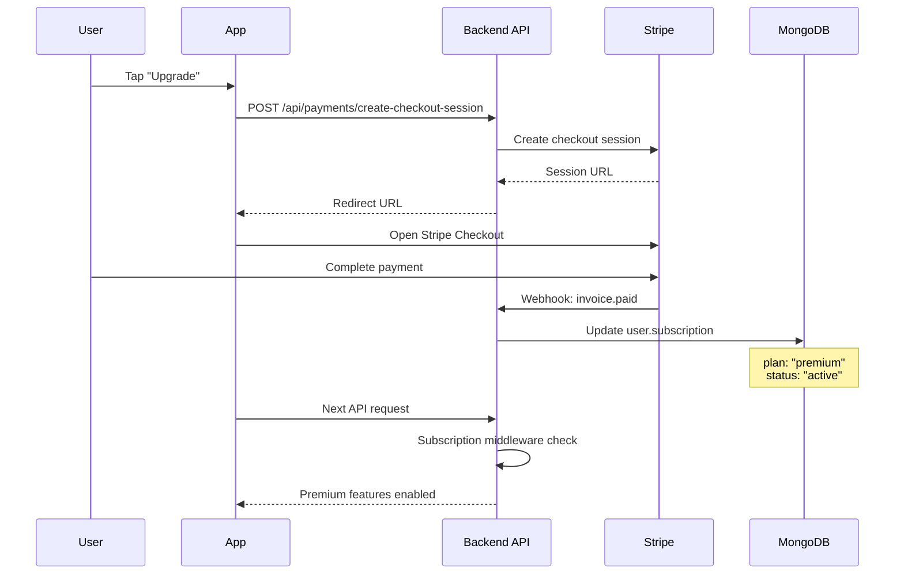

# Data Flow

How data moves through the TrickBook application.

## Authentication Flow



## App Startup Flow

```typescript
// app/_layout.tsx - Simplified
const RootLayout = () => {
  const { user, isLoading, loadStoredAuth } = useAuthStore();

  useEffect(() => {
    loadStoredAuth(); // Restore token from SecureStore
  }, []);

  if (isLoading) return <SplashScreen />;

  return (
    <QueryClientProvider client={queryClient}>
      <ThemeProvider>
        <Stack>
          {user ? (
            <Stack.Screen name="(tabs)" />
          ) : (
            <Stack.Screen name="(auth)" />
          )}
        </Stack>
      </ThemeProvider>
    </QueryClientProvider>
  );
};
```

## Data Fetching with React Query

All API data flows through React Query for caching, deduplication, and automatic refetching.

```typescript
// Example: Fetching trick lists
const { data: trickLists, isLoading, refetch } = useQuery({
  queryKey: ['trickLists'],
  queryFn: () => trickbookApi.getTrickLists(),
  staleTime: 5 * 60 * 1000, // 5 minutes
});

// Example: Creating a trick list (mutation)
const createMutation = useMutation({
  mutationFn: (data: CreateTrickListData) =>
    trickbookApi.createTrickList(data),
  onSuccess: () => {
    queryClient.invalidateQueries({ queryKey: ['trickLists'] });
  },
});
```

```
React Query Cache Flow:

Component mounts → Check cache
    │
    ├── Cache fresh → Return cached data
    │
    ├── Cache stale → Return cached data + refetch in background
    │
    └── No cache → Fetch from API
                       │
                       ▼
                  apiClient.get('/listings')
                       │
                       ▼
                  Auto-inject x-auth-token header
                       │
                       ▼
                  Return data → Cache → Component
```

## Trick List Data Flow

### Creating a Trick List

```
1. User taps "+" button
           │
           ▼
2. Form with React Hook Form + Zod validation
           │
           ▼
3. useMutation → POST /api/listings
   { name: "Kickflips to learn" }
           │
           ▼
4. Backend creates in MongoDB
   db.tricklists.insertOne({...})
           │
           ▼
5. Return { _id, name, tricks: [] }
           │
           ▼
6. Invalidate ['trickLists'] query → auto-refetch
           │
           ▼
7. Navigate to trick list detail screen
```

### Tracking Trick Progress

```
PUT /api/listing/{trickId}
{
  checked: "Landed"  // "Not Started" | "Learning" | "Landed" | "Mastered"
}
           │
           ▼
Update in MongoDB
           │
           ▼
Invalidate query cache
           │
           ▼
Update StatusBadge + ProgressBar UI
```

## Social Feed Data Flow

### Creating a Post



### Feed Algorithm Scoring

```
Feed posts are ranked by a scoring algorithm:

score = (engagement * 0.35) + (recency * 0.25) +
        (completion * 0.25) + (interaction * 0.15)

Homie boost: Posts from friends get 2.5x multiplier
Recency: 48-hour half-life decay
```

## Image Upload Flow



## Direct Messaging Flow



## Subscription Flow



## Real-Time Data Flow

```
Socket.IO Connection Lifecycle:

App Launch
    │
    ▼
Connect to Socket.IO server
    │
    ├── Auth: Pass JWT in handshake
    │
    ├── /feed namespace
    │       │
    │       ├── Join room: user:{userId}
    │       ├── Listen: 'post:update' → update React Query cache
    │       ├── Listen: 'reaction:update' → update reaction counts
    │       └── Listen: 'comment:new' → show notification
    │
    └── /messages namespace
            │
            ├── Join room: user:{userId}
            ├── Listen: 'message:new' → add to conversation
            ├── Listen: 'typing' → show indicator
            └── Listen: 'read' → update read receipts
```

## API Request Pattern

All authenticated requests flow through a custom fetch client:

```typescript
// src/lib/api/client.ts
const apiClient = {
  get: async (url: string) => {
    const token = await SecureStore.getItemAsync('authToken');
    const response = await fetch(`${BASE_URL}${url}`, {
      headers: {
        'x-auth-token': token ?? '',
        'Content-Type': 'application/json',
      },
    });
    return response.json();
  },
  // post, put, delete follow same pattern
};
```

Features:
- Auto-injects auth token from Secure Store
- Retry logic (3 attempts with 1s delay)
- Custom timeouts (30s default, 120s for uploads)
- Environment-aware base URL (dev vs production)
