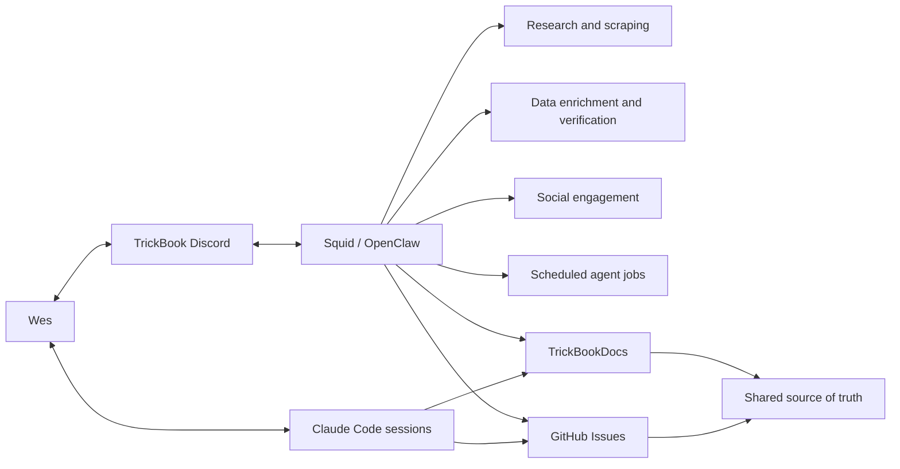

# OpenClaw Operations and Agent Workflow

OpenClaw is TrickBook's primary data-research, scraping, enrichment, verification, and social-engagement system. It runs scheduled jobs, browser automation, local scripts, API workflows, and human-in-the-loop tasks.

## Working Model

### Squid and Discord

The TrickBook Discord server is the collaborative operations surface. Squid is the OpenClaw bot used to request research, scraping, enrichment, audits, implementation planning, and operational work.

The current primary reasoning model for this setup is GPT-5.6. OpenClaw adds durable browser control, code and filesystem access, scheduled jobs, messaging, research, media handling, and repeatable workflows.

### Claude Code and Reconciliation

Wes also uses Claude Code sessions. OpenClaw and Claude Code may work on the same product at different times, so chat history alone is not an acceptable handoff mechanism.

The reconciliation contract:

1. Product and architecture decisions are written to TrickBookDocs.
2. Concrete bugs, gaps, and implementation units are written as GitHub Issues.
3. Code changes reference an issue or documented feature when practical.
4. Conflicting assumptions are documented or raised as issues rather than silently resolved inside one session.

TrickBookDocs is the shared product and technical source of truth. GitHub Issues are the execution queue.

## OpenClaw Capabilities

- Multi-source web research and attribution
- Browser automation for sites without practical APIs
- Structured API and feed ingestion
- Extraction, normalization, geocoding, and deduplication
- Image discovery, visual review, curation, and broken-media audits
- Production enrichment and verification
- Full-page and carousel rendering checks
- Scheduled isolated agent runs
- Discord, Telegram, and supported platform messaging
- Social discovery, commenting, reply handling, and engagement logs
- Git and GitHub issue/PR workflows
- Local and remote scripts, server checks, and deployments
- Repeatable skills and operating procedures

External publishing, outreach, and public messaging remain subject to human authorization and platform-specific safety rules.

## Scheduled Jobs

OpenClaw supports cron expressions and fixed intervals. Jobs can run in isolated sessions or deliver system events into the main session. Each stores status, duration, error counts, and next execution.

The scheduler snapshot inspected on August 23, 2026 contained 41 configured jobs: 21 enabled and 20 disabled. This inventory changes, so the docs track capabilities and important job families rather than private job payloads.

| Job family | Typical cadence | Purpose |
|---|---|---|
| Instagram engagement | Morning, midday, evening | Engage major and emerging skate/snow accounts |
| Instagram comment replies | Three times daily | Inspect replies, prevent duplicates, score responses, and log |
| Daily user growth game | Daily | Count production users and track acquisition streaks |
| Weekly growth review | Weekly | Summarize progress and set a target |
| Content engine and reminders | Daily/weekly | Plan and draft TrickBook and portfolio content |
| X engagement | Three times daily | Join relevant technical and product conversations |
| LinkedIn engagement | Three times daily | Read messages and engage professional posts |
| LinkedIn draft rotation | Weekdays | Draft build-in-public, technical PM, and project posts |

These complement manual scraping programs such as geographic skatepark enrichment.

## Cron Job Design Standard

Every durable TrickBook job documents:

- Unique name and owner
- Purpose and expected output
- Schedule and timezone
- Isolated or main-session execution
- Sources and required credentials
- Allowed external actions
- Idempotency and duplicate prevention
- Timeout, retry, and checkpoint behavior
- Delivery destination
- Success metric and failure alert
- Pause, replay, and retirement process

Secrets, tokens, private targets, and channel identifiers must not be committed to documentation.

## Events Application

OpenClaw is the primary ingestion and research operator for Events while stable partner connectors are developed.

Initial workflows:

- Scheduled checks of approved organizer calendars
- Raw snapshots and change detection
- Sport and discipline classification
- Geocoding and Spot links
- Duplicate candidate detection
- Cancellation, postponement, registration, and stream-state checks
- Admin review queues
- Coverage reports by sport, geography, and level

Browser scraping is a bridge and fallback. Licensed APIs, partner feeds, iCalendar, RSS, JSON, and schema.org data are preferred.

## Operating Boundaries

- OpenClaw is the primary data scraper and social media engager.
- TrickBookDocs records durable decisions and capabilities.
- GitHub Issues track implementation and reconciliation work.
- Claude Code and OpenClaw can both implement work, but private session context is not project state.
- Public data retains source provenance and respects access, display, attribution, and retention terms.
- Automated engagement avoids duplicate comments and uses the approved TrickBook voice.
- Production mutations require validation and an audit trail.

## Handoff Checklist

1. Update the relevant feature or architecture page.
2. Create or update the GitHub Issue.
3. Link affected repositories and files.
4. Record decisions, unresolved questions, validation, and deployment state.
5. Never store secrets or personal data in docs or issues.

