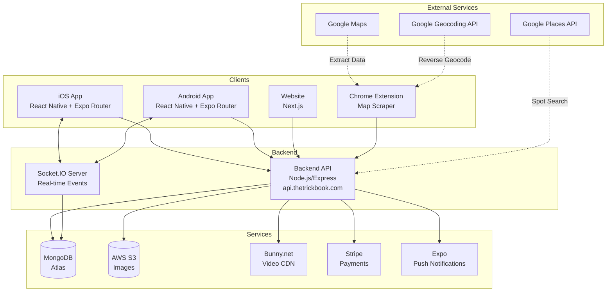

# Architecture Overview

TrickBook follows a client-server architecture with a shared backend serving the mobile app, website, and Chrome extension. Real-time features are powered by Socket.IO.

## System Diagram



## Components

### Mobile App (TrickList)

The React Native application built with Expo SDK 54 and TypeScript. Uses Expo Router for file-based navigation and NativeWind for Tailwind CSS styling.

**Key Features:**
- Trick list management (create, edit, track progress)
- Trickipedia (global trick encyclopedia)
- Spot discovery with map view, reviews, and ratings
- Homies (friend system with requests and profiles)
- Social feed with video/photo uploads, reactions, and comments
- The Couch (curated action sports video library)
- Direct messaging (real-time via Socket.IO)
- User profiles with stats and activity feed
- Stripe subscription management

### Chrome Extension (Map Scraper)

A Chrome extension that extracts skate spot data from Google Maps and syncs it to TrickBook.

**Key Features:**
- One-click spot extraction from Google Maps
- Automatic geocoding for city/state
- Tag categorization (bowl, street, lights, etc.)
- Spot list management
- Bulk sync to TrickBook backend
- CSV export for offline use

See [Chrome Extension](/docs/chrome-extension/overview) for full documentation.

### Backend API

Express.js REST API with Socket.IO for real-time features. Handles all business logic, data persistence, and third-party integrations.

**Responsibilities:**
- User authentication (JWT + Google SSO + Apple Sign-In)
- CRUD operations for all resources
- Social feed with algorithmic scoring
- Real-time messaging and feed updates (Socket.IO)
- Image upload to AWS S3
- Video streaming via Bunny.net CDN
- Stripe subscription management
- Push notifications via Expo
- Google Places spot search

### Real-Time Layer (Socket.IO)

WebSocket server providing real-time features via namespaces.

**Namespaces:**
- `/feed` - Live post updates, reaction counts, comment notifications
- `/messages` - Real-time message delivery, typing indicators, read receipts

### Database (MongoDB Atlas)

Cloud-hosted MongoDB database storing all application data.

**Collections:**
- `users` - User accounts, subscriptions, homie connections
- `tricklists` - User's personal trick lists
- `tricks` - Individual tricks in lists
- `trickipedia` - Global trick encyclopedia
- `spotlists` - User's spot collections
- `spots` - Skate spot locations
- `spot_reviews` - User reviews and ratings for spots
- `feed_posts` - Social feed posts with media
- `reactions` - Love/respect reactions on posts
- `feed_comments` - Comments on feed posts
- `saved_posts` - User bookmarked posts
- `conversations` - Direct message conversations
- `dm_messages` - Individual messages
- `blog` - Website blog content
- `categories` - Trick categories
- `expoPushTokens` - Push notification tokens

### AWS S3

Object storage for user-uploaded images.

**Buckets:**
- `trickbook` - Profile images, trick images, spot images

### Bunny.net CDN

Video streaming and delivery for media content.

**Features:**
- Video library management
- Signed URL generation for protected content
- CDN delivery via b-cdn.net

### Stripe

Payment processing for premium subscriptions.

**Products:**
- Free tier (limited spot lists and spots)
- Premium monthly subscription ($10/month - unlimited access)
- Premium yearly subscription

## Data Flow

### Authentication Flow

```
User → Login Screen → POST /api/auth
                           │
                           ├── Email/Password
                           ├── Google SSO (OAuth2)
                           └── Apple Sign-In
                           │
                           ▼
                    Verify Credentials
                           │
                           ▼
                    Generate JWT Token
                           │
                           ▼
            Store in Expo Secure Store (Zustand)
                           │
                           ▼
               Navigate to Main App (Tabs)
```

### Real-Time Connection Flow

```
App Launch → Connect Socket.IO
                 │
                 ├── /feed namespace
                 │       ├── Join user room
                 │       ├── Listen for post updates
                 │       └── Listen for reaction changes
                 │
                 └── /messages namespace
                         ├── Join user room
                         ├── Listen for new messages
                         └── Emit typing indicators
```

## Shared Backend Considerations

The backend serves multiple clients:

| Client | Base URL | Auth | Real-time |
|--------|----------|------|-----------|
| iOS App | api.thetrickbook.com | JWT (x-auth-token) | Socket.IO |
| Android App | api.thetrickbook.com | JWT (x-auth-token) | Socket.IO |
| Website | api.thetrickbook.com | JWT | N/A |
| Chrome Extension | api.thetrickbook.com | JWT | N/A |

**Important:** Any API changes must maintain backwards compatibility with all clients.
