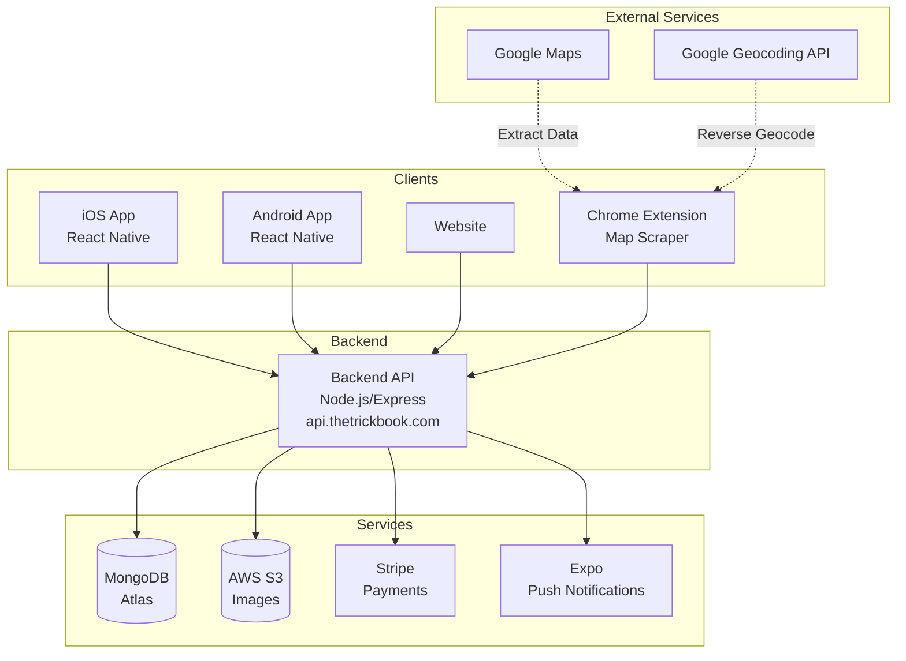

# Architecture Overview

TrickBook follows a client-server architecture with a shared backend serving both the mobile app and website.

## System Diagram



## Components

### Mobile App (TrickList)

The React Native application built with Expo SDK 51. Supports both iOS and Android from a single codebase.

**Key Features:**
- Trick list management (create, edit, track progress)
- Trickipedia (global trick encyclopedia)
- Spot lists (skate spot locations)
- User profiles with image upload
- Guest mode (offline functionality)
- Spin the wheel (random trick selector)

### Chrome Extension (Map Scraper)

A Chrome extension that extracts skate spot data from Google Maps and syncs it to TrickBook.

**Key Features:**
- One-click spot extraction from Google Maps
- Automatic geocoding for city/state
- Tag categorization (bowl, street, lights, etc.)
- Spot list management
- Bulk sync to TrickBook backend
- CSV export for offline use

See [Chrome Extension](/docs/chrome-extension/overview) for full documentation.

### Backend API

Express.js REST API handling all business logic, data persistence, and third-party integrations.

**Responsibilities:**
- User authentication (JWT + Google SSO)
- CRUD operations for all resources
- Image upload to AWS S3
- Stripe subscription management
- Push notifications via Expo

### Database (MongoDB Atlas)

Cloud-hosted MongoDB database storing all application data.

**Collections:**
- `users` - User accounts and subscriptions
- `tricklists` - User's personal trick lists
- `tricks` - Individual tricks in lists
- `trickipedia` - Global trick encyclopedia
- `spotlists` - User's spot collections
- `spots` - Skate spot locations
- `blog` - Website blog content
- `categories` - Trick categories

### AWS S3

Object storage for user-uploaded images.

**Buckets:**
- `trickbook` - Profile images, trick images

### Stripe

Payment processing for premium subscriptions.

**Products:**
- Free tier (limited features)
- Premium subscription (unlimited access)

## Data Flow

### Authentication Flow

```
User → Login Screen → POST /api/auth
                           │
                           ▼
                    Verify Credentials
                           │
                           ▼
                    Generate JWT Token
                           │
                           ▼
            Store in Expo Secure Store
                           │
                           ▼
                    Navigate to App
```

### Trick List Flow

```
User Creates List → POST /api/listings
                         │
                         ▼
                  Save to MongoDB
                         │
                         ▼
               Return List with ID
                         │
                         ▼
User Adds Trick → PUT /api/listing
                         │
                         ▼
             Update tricks array
```

## Shared Backend Considerations

The backend serves multiple clients:

| Client | Base URL | Auth |
|--------|----------|------|
| iOS App | api.thetrickbook.com | JWT |
| Android App | api.thetrickbook.com | JWT |
| Website | api.thetrickbook.com | JWT |
| Chrome Extension | api.thetrickbook.com | JWT |

**Important:** Any API changes must maintain backwards compatibility with all clients.
