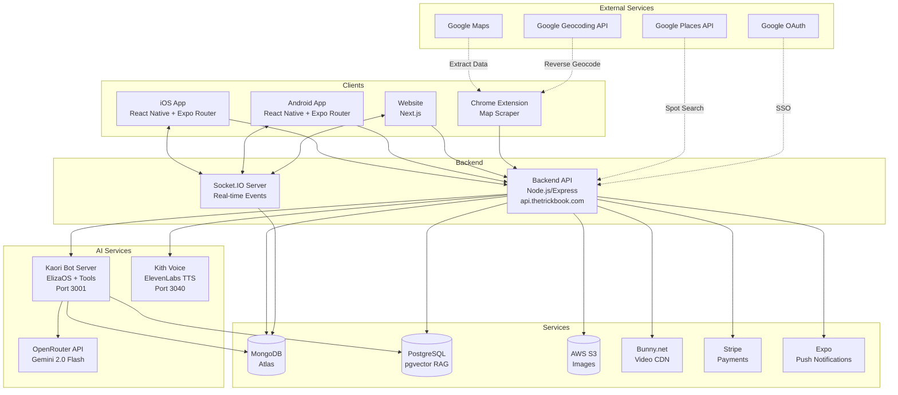
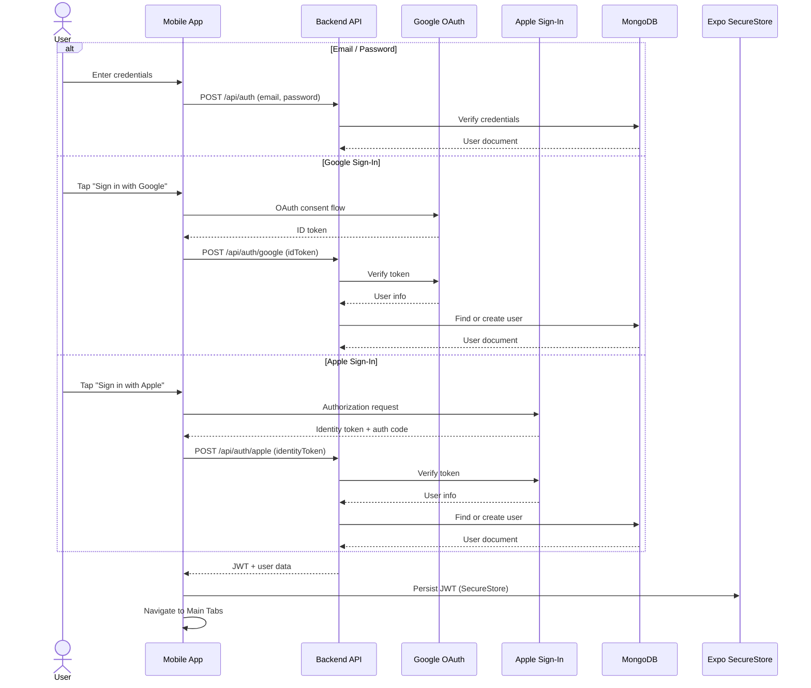
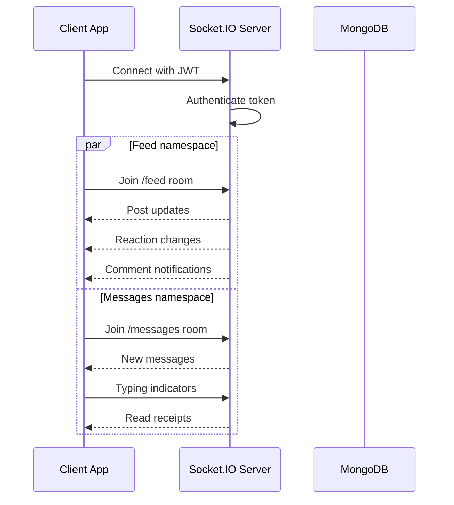

# Architecture Overview

TrickBook follows a client-server architecture with a shared backend serving the mobile app, website, and Chrome extension. Real-time features are powered by Socket.IO, and an AI companion layer (Kaori) provides conversational assistance via tool-calling, RAG, and text-to-speech.

## System Diagram

```mermaid
flowchart TB
    subgraph Clients
        iOS[iOS App<br/>React Native + Expo Router]
        Android[Android App<br/>React Native + Expo Router]
        Web[Website<br/>Next.js]
        Extension[Chrome Extension<br/>Map Scraper]
    end

    subgraph External["External Services"]
        GoogleMaps[Google Maps]
        GeoAPI[Google Geocoding API]
        GooglePlaces[Google Places API]
        GoogleOAuth[Google OAuth]
    end

    subgraph AI["AI Services"]
        KaoriBot[Kaori Bot Server<br/>ElizaOS + Tools<br/>Port 3001]
        OpenRouter[OpenRouter API<br/>Gemini 2.0 Flash]
        KithVoice[Kith Voice<br/>ElevenLabs TTS<br/>Port 3040]
    end

    subgraph Backend
        API[Backend API<br/>Node.js/Express<br/>api.thetrickbook.com]
        SocketIO[Socket.IO Server<br/>Real-time Events]
    end

    subgraph Services
        MongoDB[(MongoDB<br/>Atlas)]
        Postgres[(PostgreSQL<br/>pgvector RAG)]
        S3[(AWS S3<br/>Images)]
        Bunny[Bunny.net<br/>Video CDN]
        Stripe[Stripe<br/>Payments]
        Expo[Expo<br/>Push Notifications]
    end

    iOS --> API
    iOS <--> SocketIO
    Android --> API
    Android <--> SocketIO
    Web --> API
    Web <--> SocketIO
    Extension --> API

    GoogleMaps -.->|Extract Data| Extension
    GeoAPI -.->|Reverse Geocode| Extension
    GooglePlaces -.->|Spot Search| API
    GoogleOAuth -.->|SSO| API

    API --> KaoriBot
    KaoriBot --> OpenRouter
    KaoriBot --> MongoDB
    KaoriBot --> Postgres
    API --> KithVoice

    API --> MongoDB
    API --> Postgres
    API --> S3
    API --> Bunny
    API --> Stripe
    API --> Expo
    SocketIO --> MongoDB
```

## Components

For cross-repo service boundaries and endpoint ownership, see [Repo Dependency Map](/docs/architecture/repo-dependency-map).

### Mobile App (TrickList)

The React Native application built with Expo SDK 54 and TypeScript. Uses Expo Router for file-based navigation and NativeWind for Tailwind CSS styling.

**Key Features:**
- Trick list management (create, edit, track progress)
- Trickipedia (global trick encyclopedia)
- Spot discovery with map view, reviews, and ratings
- Homies (friend system with requests and profiles)
- Social feed with video/photo uploads, reactions, and comments
- The Couch (curated action sports video library)
- Direct messaging (real-time via Socket.IO)
- Kaori AI companion chat with voice responses
- User profiles with stats and activity feed
- Stripe subscription management

### Chrome Extension (Map Scraper)

A Chrome extension that extracts skate spot data from Google Maps and syncs it to TrickBook.

**Key Features:**
- One-click spot extraction from Google Maps
- Automatic geocoding for city/state
- Tag categorization (bowl, street, lights, etc.)
- Spot list management
- Bulk sync to TrickBook backend
- CSV export for offline use

See [Chrome Extension](/docs/chrome-extension/overview) for full documentation.

### Backend API

Express.js REST API with Socket.IO for real-time features. Handles all business logic, data persistence, and third-party integrations.

**Responsibilities:**
- User authentication (JWT + Google OAuth + Apple Sign-In)
- CRUD operations for all resources
- Social feed with algorithmic scoring
- Real-time messaging and feed updates (Socket.IO)
- Image upload to AWS S3
- Video streaming via Bunny.net CDN
- Stripe subscription management
- Push notifications via Expo
- Google Places spot search
- Kaori AI companion with tool-calling (search spots, trickipedia, user data)

### Kaori AI Services

The AI companion layer consists of three services that work together to provide conversational, tool-augmented interactions. See [Kaori Architecture](/docs/architecture/kaori) for a deep dive.

**Kaori Bot Server (Port 3001):**
- ElizaOS-based agent with a defined character and personality
- Tool-calling loop: searches spots, queries trickipedia, reads user tricklists, remembers user info
- Relationship tracking via `companion_profiles` (adjusts tone based on friendship stage)
- RAG context injection from PostgreSQL (boardsport knowledge base)

**OpenRouter API:**
- Routes LLM requests to Gemini 2.0 Flash
- Handles the tool-calling protocol (function definitions, tool results, multi-turn)

**Kith Voice (Port 3040):**
- Text-to-speech sidecar using ElevenLabs via Pipecat runtime
- WebSocket bridge: browser connects via WS, backend sends text via HTTP POST
- Per-session subprocess model for isolated audio streaming

### Real-Time Layer (Socket.IO)

WebSocket server providing real-time features via namespaces.

**Namespaces:**
- `/feed` -- Live post updates, reaction counts, comment notifications
- `/messages` -- Real-time message delivery, typing indicators, read receipts

### Databases

TrickBook uses a dual-database architecture: MongoDB for application data and PostgreSQL for vector search (RAG).

:::tip Dual-database rationale
MongoDB handles all transactional application data (users, tricks, spots, feed, messages). PostgreSQL with pgvector provides embedding-based semantic search for the Kaori AI knowledge base, which requires vector similarity queries that MongoDB does not natively support.
:::

#### MongoDB Atlas

Cloud-hosted MongoDB database storing all application data.

**Collections:**
- `users` -- User accounts, subscriptions, homie connections
- `tricklists` -- User's personal trick lists
- `tricks` -- Individual tricks in lists
- `trickipedia` -- Global trick encyclopedia
- `spotlists` -- User's spot collections
- `spots` -- Skate spot locations
- `spot_reviews` -- User reviews and ratings for spots
- `spot_trick_history` -- Tricks landed at specific spots
- `feed_posts` -- Social feed posts with media
- `reactions` -- Love/respect reactions on posts
- `feed_comments` -- Comments on feed posts
- `saved_posts` -- User bookmarked posts
- `conversations` -- Direct message conversations
- `dm_messages` -- Individual messages
- `bot_chats` -- AI companion chat messages
- `companion_profiles` -- AI companion relationship tracking
- `blog` -- Website blog content
- `categories` -- Trick categories
- `expoPushTokens` -- Push notification tokens

#### PostgreSQL (pgvector)

Vector database for Kaori's retrieval-augmented generation (RAG) pipeline.

**Tables:**
- Boardsport knowledge embeddings (magazine articles, trick guides, culture content)
- Queried at chat time to inject relevant context into Kaori's system prompt

### AWS S3

Object storage for user-uploaded images.

**Buckets:**
- `trickbook` -- Profile images, trick images, spot images

### Bunny.net CDN

Video streaming and delivery for media content.

**Features:**
- Video library management
- Signed URL generation for protected content
- CDN delivery via b-cdn.net

### Stripe

Payment processing for premium subscriptions.

**Products:**
- Free tier (limited spot lists and spots)
- Premium monthly subscription ($10/month -- unlimited access)
- Premium yearly subscription

## Data Flow

### Authentication Flow

```mermaid
sequenceDiagram
    actor User
    participant App as Mobile App
    participant API as Backend API
    participant Google as Google OAuth
    participant Apple as Apple Sign-In
    participant DB as MongoDB
    participant Store as Expo SecureStore

    alt Email / Password
        User->>App: Enter credentials
        App->>API: POST /api/auth (email, password)
        API->>DB: Verify credentials
        DB-->>API: User document
    else Google Sign-In
        User->>App: Tap "Sign in with Google"
        App->>Google: OAuth consent flow
        Google-->>App: ID token
        App->>API: POST /api/auth/google (idToken)
        API->>Google: Verify token
        Google-->>API: User info
        API->>DB: Find or create user
        DB-->>API: User document
    else Apple Sign-In
        User->>App: Tap "Sign in with Apple"
        App->>Apple: Authorization request
        Apple-->>App: Identity token + auth code
        App->>API: POST /api/auth/apple (identityToken)
        API->>Apple: Verify token
        Apple-->>API: User info
        API->>DB: Find or create user
        DB-->>API: User document
    end

    API-->>App: JWT + user data
    App->>Store: Persist JWT (SecureStore)
    App->>App: Navigate to Main Tabs
```

### Real-Time Connection Flow

```mermaid
sequenceDiagram
    participant App as Client App
    participant Socket as Socket.IO Server
    participant DB as MongoDB

    App->>Socket: Connect with JWT
    Socket->>Socket: Authenticate token

    par Feed namespace
        App->>Socket: Join /feed room
        Socket-->>App: Post updates
        Socket-->>App: Reaction changes
        Socket-->>App: Comment notifications
    and Messages namespace
        App->>Socket: Join /messages room
        Socket-->>App: New messages
        App->>Socket: Typing indicators
        Socket-->>App: Read receipts
    end
```

## Shared Backend Considerations

The backend serves multiple clients:

| Client | Base URL | Auth | Real-time |
|--------|----------|------|-----------|
| iOS App | api.thetrickbook.com | JWT (x-auth-token) | Socket.IO |
| Android App | api.thetrickbook.com | JWT (x-auth-token) | Socket.IO |
| Website | api.thetrickbook.com | JWT | Socket.IO |
| Chrome Extension | api.thetrickbook.com | JWT | N/A |

:::warning
Any API changes must maintain backwards compatibility with all clients. The website now uses Socket.IO for direct messaging, so changes to the `/messages` namespace affect three platforms (iOS, Android, Web).
:::
