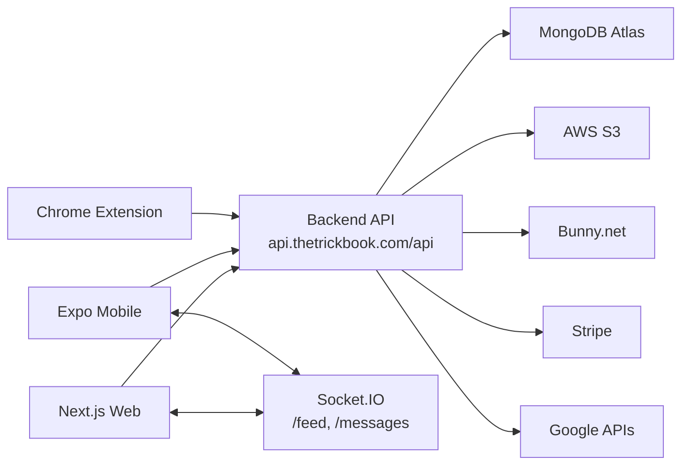

# Repo Dependency Map

This page is the implementation-level dependency map for TrickBook across repositories.

## Repositories

| Repo | Path | Role |
|------|------|------|
| Web (Next.js) | `/Users/weshuber/Documents/TrickBookNextJS/TrickBookWebsite` | Website UI + NextAuth + admin/content workflows |
| Mobile (Expo RN) | `/Users/weshuber/Reactnative/TrickList` | iOS/Android app + typed API layer + feature UIs |
| Backend (Express) | `/Users/weshuber/Reactnative/Backend` | Shared REST API + Socket.IO + integrations |
| Docs (Docusaurus) | `/Users/weshuber/Reactnative/docs` | Internal technical documentation |

## Runtime Topology

## Client To Backend Contracts

### Web App -> Backend

Primary source files:
- `lib/api*.js`
- `lib/socket.js`
- `pages/api/auth/[...nextauth].js`

| Web module | Backend route group | Notes |
|------------|---------------------|-------|
| `lib/api.js`, `lib/apiTrickipedia.js` | `/api/trickipedia`, `/api/categories`, `/api/blog`, `/api/trickImage` | Trickipedia/blog/admin content |
| `lib/apiTrickLists.js` | `/api/listings`, `/api/listing` | User trick lists and list tricks |
| `lib/apiSpots.js` | `/api/spots`, `/api/spotlists`, `/api/spot-reviews` | Spot discovery, lists, moderation |
| `lib/apiHomies.js` | `/api/users/*` | Homie network and requests |
| `lib/apiMessages.js` | `/api/dm/*` | Direct messages |
| `lib/apiFeed.js` | `/api/feed/*` | Feed posts/comments/reactions |
| `lib/apiMedia.js` | `/api/couch/*` | Curated media library |
| `lib/apiUpload.js` | `/api/upload/*` | Video/image upload flow |
| `lib/apiPayments.js` | `/api/payments/*` | Stripe subscription actions |
| `lib/socket.js` | Socket namespaces `/feed`, `/messages` | Real-time comments and DM events |

### Mobile App -> Backend

Primary source files:
- `src/constants/api.ts`
- `src/lib/api/*.ts`
- `src/lib/api/client.ts`

| Mobile module | Backend route group | Notes |
|---------------|---------------------|-------|
| `auth.ts`, `user.ts` | `/api/auth`, `/api/users`, `/api/user` | Email+password, Google, Apple, profile |
| `trickbook.ts` | `/api/trickipedia`, `/api/listings`, `/api/listing`, `/api/categories` | Trickipedia + personal lists |
| `spots.ts`, `spotlists.ts`, `spotReviews.ts` | `/api/spots`, `/api/spotlists`, `/api/spot-reviews` | Maps, spot lists, reviews |
| `homies.ts` | `/api/users/*` | Social graph |
| `messages.ts` | `/api/dm/*` | Conversations/messages |
| `feed.ts` | `/api/feed/*` | Feed operations |
| `couch.ts` | `/api/couch/*` | Curated video library |
| `upload.ts` | `/api/upload/*` | Bunny video + S3 image support |

## Auth And Session Contracts

| Concern | Contract |
|---------|----------|
| REST auth header | `x-auth-token: <jwt>` |
| Socket auth | `socket.handshake.auth.token = <jwt>` |
| Web sign-in | NextAuth provider callback posts to `/api/auth` and `/api/auth/google-auth` |
| Mobile sign-in | API layer posts to `/api/auth`, `/api/auth/google-auth`, `/api/auth/apple-auth` |

## Socket Event Contracts

### `/feed` namespace
- Join/leave: `join:post`, `leave:post`
- Server push: `comment:new`, `comment:deleted`, `comment:loved`

### `/messages` namespace
- Join/leave: `join:conversation`, `leave:conversation`
- Client emit: `typing:start`, `typing:stop`
- Server push: `message:new`, `messages:read`, typing events

## External Service Dependencies

| Service | Used By | Primary backend code |
|---------|---------|----------------------|
| MongoDB Atlas | All features | route handlers + middleware |
| AWS S3 | Images (profile, tricks, spots, blog) | `services/s3Upload.js`, `routes/image.js`, `routes/trickImage.js`, `routes/blogImage.js` |
| Bunny.net | Media upload/streaming | `services/bunnyStream.js`, `routes/upload.js`, `routes/couch.js`, `routes/feed.js` |
| Stripe | Premium subscriptions | `routes/payments.js`, `config/stripe.js` |
| Google Places/Geocode | Spot enrichment/search | `services/googlePlaces.js`, `routes/spots.js` |
| Google Drive API | Couch sync/admin | `routes/couch.js` |
| Expo Push | Device notifications | `routes/expoPushTokens.js` |

## Current Drift To Watch

1. Web mixes environment-based URLs with hardcoded production URLs in API modules.
2. Mobile still contains legacy `app/api/*` while new work is in `src/lib/api/*`.
3. Some docs examples still show older endpoint shapes; backend route files are source of truth.
4. Development host for mobile is pinned in `src/constants/api.ts` (`DEV_API_HOST`).

## Change Management Rules

1. Treat backend route contracts as shared public API.
2. For any endpoint change, verify callers in both web and mobile repos before merge.
3. Keep auth header behavior stable (`x-auth-token`) unless all clients are migrated.
4. For socket event changes, update web and mobile listeners/emitters in the same release.
