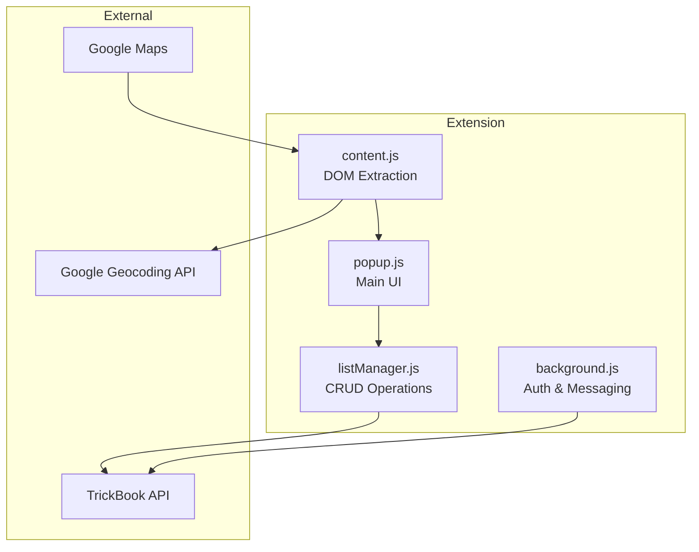
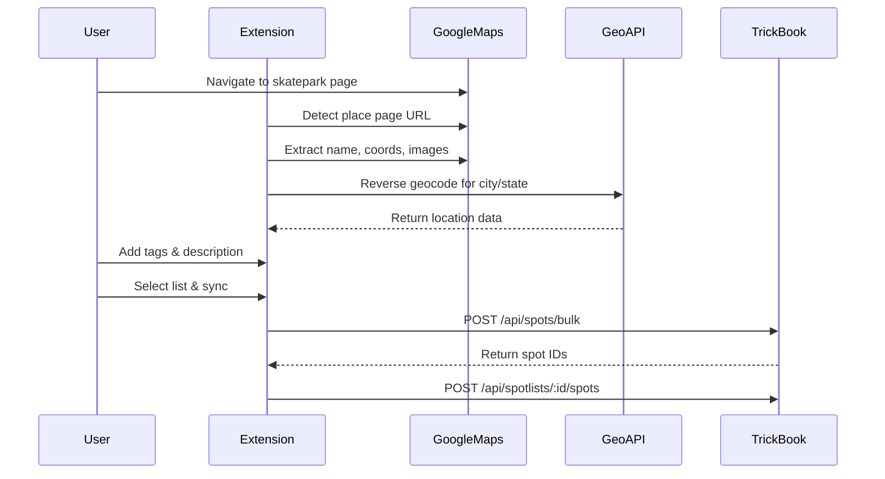

# Chrome Extension Overview

The **Skatepark Extractor for Google Maps** is a Chrome extension that enables users to extract skate spot information directly from Google Maps and sync it to their TrickBook account.

## Purpose

The extension bridges the gap between discovering spots on Google Maps and saving them to TrickBook, providing a seamless workflow for building spot collections.

## Key Features

- **One-Click Extraction** - Automatically extracts spot data from Google Maps place pages
- **Smart Data Parsing** - Extracts name, coordinates, images, city, and state
- **Tag System** - Categorize spots (bowl, street, lights, indoor, beginner, advanced)
- **List Management** - Create and organize multiple spot lists
- **Cloud Sync** - Sync spots directly to TrickBook backend
- **Dual Auth** - Email/password and Google OAuth support
- **CSV Export** - Export spots for offline use

## Technical Stack

| Component | Technology |
|-----------|------------|
| Manifest | Chrome Extension Manifest v3 |
| UI | HTML/CSS/Vanilla JS |
| Auth | Chrome Identity API + JWT |
| Storage | chrome.storage.local |
| API | TrickBook REST API |

## Extension Architecture



## File Structure

```
map-scraper/
├── manifest.json          # Extension configuration
├── background.js          # Service worker
├── content.js             # Google Maps DOM interaction
├── popup.html/js          # Main extension UI
├── login.html/js          # Authentication UI
├── listManager.js         # Spot list CRUD operations
├── auth.js                # Auth utilities
├── utils.js               # Helper functions
├── config.js              # API & OAuth configuration
└── style.css              # Styling
```

## Data Extraction Flow



## Permissions Required

```json
{
  "permissions": [
    "activeTab",      // Access current tab
    "storage",        // Persist data locally
    "scripting",      // Inject content scripts
    "identity",       // Google OAuth
    "windows"         // Login popup window
  ],
  "host_permissions": [
    "*://www.google.com/maps/*",
    "https://api.thetrickbook.com/*",
    "https://maps.googleapis.com/*"
  ]
}
```

## Quick Start

### Installation (Development)

1. Clone the map-scraper repository
2. Navigate to `chrome://extensions/`
3. Enable "Developer mode"
4. Click "Load unpacked"
5. Select the `map-scraper` folder

### Usage

1. Navigate to any skatepark on Google Maps
2. Click the TrickBook extension icon
3. Review extracted data (name, location, image)
4. Add tags and description
5. Select or create a list
6. Click "Add to List" or "Sync to TrickBook"

## API Integration

The extension uses the existing TrickBook API endpoints:

| Operation | Endpoint | Method |
|-----------|----------|--------|
| Auth | `/api/auth` | POST |
| Google Auth | `/api/auth/google-auth` | POST |
| Get Lists | `/api/spotlists` | GET |
| Create List | `/api/spotlists` | POST |
| Bulk Sync Spots | `/api/spots/bulk` | POST |
| Add to List | `/api/spotlists/:id/spots` | POST |

See [API Endpoints](/docs/backend/api-endpoints) for full documentation.
