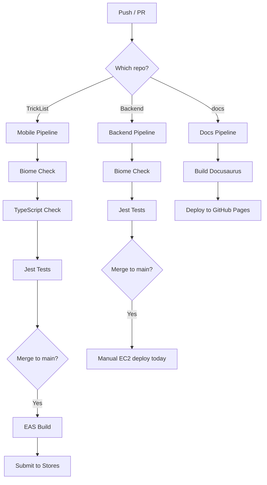

# CI/CD Pipeline

Automated quality gates and deployment status for TrickBook repositories. The website and documentation deploy automatically from their production branches. The backend currently requires a guarded EC2 deployment after its production promotion; OIDC/SSM automation is planned.

## Pipeline Overview


```mermaid
graph TD
    A[Push / PR] --> B{Which repo?}
    B -->|TrickList| C[Mobile Pipeline]
    B -->|Backend| D[Backend Pipeline]
    B -->|docs| E[Docs Pipeline]

    C --> C1[Biome Check]
    C1 --> C2[TypeScript Check]
    C2 --> C3[Jest Tests]
    C3 --> C4{Merge to main?}
    C4 -->|Yes| C5[EAS Build]
    C5 --> C6[Submit to Stores]

    D --> D1[Biome Check]
    D1 --> D2[Jest Tests]
    D2 --> D3{Merge to main?}
    D3 -->|Yes| D4[Manual EC2 deploy today]

    E --> E1[Build Docusaurus]
    E1 --> E2[Deploy to GitHub Pages]
```

## Quality Gates (All Repos)

Every PR must pass these checks before merge:

| Gate | Tool | Blocks Merge? |
|------|------|:---:|
| Lint | Biome | Yes |
| Format | Biome | Yes |
| Type Check | TypeScript (mobile only) | Yes |
| Tests | Jest | Yes |
| Coverage | Jest (threshold) | Yes |

## GitHub Actions Workflows

### Mobile App (`TrickList/.github/workflows/ci.yml`)

```yaml
name: Mobile CI

on:
  push:
    branches: [main]
  pull_request:
    branches: [main]

jobs:
  validate:
    runs-on: ubuntu-latest
    steps:
      - uses: actions/checkout@v4

      - name: Setup Node.js
        uses: actions/setup-node@v4
        with:
          node-version: 20
          cache: npm

      - name: Install dependencies
        run: npm ci

      - name: Lint & Format Check
        run: npx biome check .

      - name: Type Check
        run: npx tsc --noEmit

      - name: Run Tests
        run: npm test -- --coverage --ci

      - name: Upload Coverage
        if: always()
        uses: actions/upload-artifact@v4
        with:
          name: coverage
          path: coverage/

  build:
    needs: validate
    runs-on: ubuntu-latest
    if: github.ref == 'refs/heads/main'
    steps:
      - uses: actions/checkout@v4

      - name: Setup Node.js
        uses: actions/setup-node@v4
        with:
          node-version: 20
          cache: npm

      - name: Setup Expo
        uses: expo/expo-github-action@v8
        with:
          eas-version: latest
          token: ${{ secrets.EXPO_TOKEN }}

      - name: Install dependencies
        run: npm ci

      - name: Build iOS (TestFlight)
        run: eas build --platform ios --profile testflight --non-interactive

      - name: Build Android (Play Store)
        run: eas build --platform android --profile playstore --non-interactive
```

### Backend (`TB-Backend/.github/workflows/ci.yml`)

```yaml
name: Backend CI

on:
  push:
    branches: [main]
  pull_request:
    branches: [main]

jobs:
  validate:
    runs-on: ubuntu-latest
    steps:
      - uses: actions/checkout@v4

      - name: Setup Node.js
        uses: actions/setup-node@v4
        with:
          node-version: 20
          cache: npm

      - name: Install dependencies
        run: npm ci

      - name: Lint & Format Check
        run: npx biome check .

      - name: Run Tests
        run: npm test -- --coverage --ci --forceExit
        env:
          NODE_ENV: test
          JWT_SECRET: test-jwt-secret-for-ci-only
          PORT: 5001

      - name: Upload Coverage
        if: always()
        uses: actions/upload-artifact@v4
        with:
          name: coverage
          path: coverage/

  # Deployment is currently a separate guarded EC2 procedure after
  # staging -> master promotion. OIDC + SSM automation is planned.
```

### Docs Site (already deployed)

The docs site CI/CD is already configured and deploying to GitHub Pages at `docs.thetrickbook.com`. See `.github/workflows/deploy.yml` in the TrickBookDocs repo.

## Required GitHub Secrets

| Secret | Repo | Description |
|--------|------|-------------|
| `EXPO_TOKEN` | TrickList | Expo access token for EAS builds |
| `SENTRY_DSN` | Both | Sentry error tracking DSN |

### Getting Tokens

```bash
# Expo token
# Go to: https://expo.dev/accounts/[username]/settings/access-tokens

```

## Branch Protection Rules

Configure on GitHub (`Settings > Branches > Branch protection rules`):

**Branch:** `main`

- [x] Require pull request before merging
- [x] Require status checks to pass before merging
  - Required checks: `validate`
- [x] Require branches to be up to date before merging
- [x] Do not allow bypassing the above settings

This means:
- No direct pushes to main
- Every change goes through a PR
- Every PR must pass lint + typecheck + tests
- Stale PRs must rebase before merge

## Local Development Workflow

```bash
# 1. Create feature branch
git checkout -b feat/add-trick-sharing

# 2. Make changes, commit (pre-commit hook runs Biome)
git add .
git commit -m "feat: add trick sharing"

# 3. Run full validation locally before pushing
npm run validate  # biome check + tsc + jest

# 4. Push and create PR
git push -u origin feat/add-trick-sharing
gh pr create

# 5. CI runs automatically on PR
# 6. After review + CI pass, merge to main
# 7. Follow the platform runbook; backend deployment is currently manual
```

## Monitoring Deployments

### EAS Build Status

```bash
eas build:list --limit 5
```

### Backend Health Check

```bash
curl https://api.thetrickbook.com/api/health
```

### Sentry Dashboard

After Sentry is configured, monitor errors at:
`https://[org].sentry.io/projects/`
