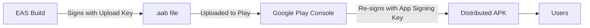

# Google Play Deployment (Android)

Guide for deploying TrickBook to the Google Play Store via EAS Build and EAS Submit.

## Current Status

| Item | Status |
|------|--------|
| Package Name | `com.thetrickbook.trickbook` |
| Latest Version | 2.1.0 (versionCode 15) |
| Google Play | **Submitted** -- Closed Alpha (internal track, draft) |
| Build Profile | `playstore` (AAB, store distribution) |
| Service Account | `trickbook-couch@trickbook.iam.gserviceaccount.com` |
| Version Source | Remote (`appVersionSource: "remote"` in eas.json) |

## Build and Submit Pipeline

### Quick Deploy (standard flow)

```bash
cd ~/Documents/TrickBook/repos/TrickList

# Build AAB for Play Store (versionCode auto-increments)
eas build --profile playstore --platform android

# Wait for build to finish (~15-30 min on free tier)

# Submit the latest build to Google Play
eas submit --platform android --profile playstore --latest
```

### EAS Submit Configuration

The `eas.json` submit profile handles Play Store authentication and track selection:

```json
{
  "submit": {
    "playstore": {
      "android": {
        "serviceAccountKeyPath": "../../secrets/trickbook-0fd5cf54c409.json",
        "track": "internal",
        "releaseStatus": "draft"
      }
    }
  }
}
```

| Field | Value | Notes |
|-------|-------|-------|
| `serviceAccountKeyPath` | `../../secrets/trickbook-0fd5cf54c409.json` | Relative to TrickList root |
| `track` | `internal` | Closed Alpha testing track |
| `releaseStatus` | `draft` | Requires manual promotion in Play Console |

:::warning
The service account key JSON must never be committed to git. It is stored in `/Documents/TrickBook/secrets/` which is outside the repo and gitignored in TrickList.
:::

### Build Profile

The `playstore` build profile in `eas.json`:

```json
{
  "playstore": {
    "distribution": "store",
    "node": "20.18.0",
    "android": {
      "buildType": "app-bundle",
      "image": "latest",
      "autoIncrement": true
    },
    "env": {
      "EXPO_NO_DOTENV": "1",
      "NODE_ENV": "production"
    }
  }
}
```

Key settings:
- **`buildType: "app-bundle"`** -- produces `.aab` (required by Play Store)
- **`autoIncrement: true`** -- versionCode increments automatically on each build
- **`EXPO_NO_DOTENV: "1"`** -- prevents loading local `.env` in CI builds
- **`NODE_ENV: "production"`** -- npm installs production deps only

## Signing and OAuth

### Android Signing Keys

EAS manages the upload keystore remotely. Google Play App Signing re-signs the APK with Google's own key before distribution.



This means **two SHA-1 fingerprints** matter for Google OAuth:

| Key | SHA-1 Prefix | Used By |
|-----|--------------|---------|
| **Upload key** | `60:74:90:D9:...` | Dev builds, EAS preview builds |
| **App signing key** | `A2:9D:C9:0E:...` | Play Store distributed installs |

Both are registered as separate Android OAuth clients in Google Cloud Console. See [ADR-001: Native Google Sign-In](/docs/architecture/adrs/native-google-signin) for the full decision record.

### Finding SHA-1 Fingerprints

In Google Play Console: **Release** > **Setup** > **App Integrity**

- **Upload key certificate** -- your EAS keystore fingerprint
- **App signing key certificate** -- Google's re-signing key fingerprint

## After Submission: Play Console Steps

Once `eas submit` completes, the AAB lands as a **draft** on the internal track. To publish:

1. **Play Console** > **Closed testing - Alpha** > **Edit release**
2. Review the release, click **Next** > **Save**
3. **Publishing overview** > **Send for review**
4. Google reviews (1-7 days for closed test)
5. After approval, click **Publish** in Publishing overview (managed publishing is enabled)

:::tip
Existing opted-in testers auto-upgrade when a new version is published. They do not need to re-opt-in, and the tester count is preserved.
:::

## Play Store Requirements Checklist

### Before First Production Release

- [x] Create developer account
- [x] Complete identity verification
- [x] Accept Developer Distribution Agreement
- [x] App name and package configured
- [x] Build and submit AAB
- [x] Service account key configured
- [ ] Store listing (title, description, screenshots, feature graphic)
- [ ] Content rating (IARC questionnaire)
- [ ] Data safety form
- [ ] Privacy policy URL (page exists at `thetrickbook.com/privacy-policy`)
- [ ] Target age group

### Graphics Assets

| Asset | Dimensions | Required |
|-------|------------|----------|
| App icon | 512 x 512 | Yes |
| Feature graphic | 1024 x 500 | Yes |
| Phone screenshots | 1080 x 1920 (portrait) | 2-8 required |
| Tablet screenshots | Variable | Optional |

### Data Safety Declaration

| Data Type | Collected | Shared | Purpose |
|-----------|-----------|--------|---------|
| Email | Yes | No | Account creation |
| Name | Yes | No | Profile |
| Location | Yes | No | Spot discovery (nearby) |
| Photos/Videos | Yes | No | Profile picture, feed posts |
| App activity | Yes | No | Analytics |

## Version Management

Versions are managed remotely by EAS (`appVersionSource: "remote"` in eas.json). The `versionCode` in `app.config.js` is ignored for builds.

```bash
# Check current remote version
eas build:version:get --platform android

# Manually set version (if needed)
eas build:version:set --platform android --version-code 16
```

## Troubleshooting

### "Build is expired"

EAS builds expire after 30 days. If a build has expired, create a new one:

```bash
eas build --profile playstore --platform android
```

### Version Code Conflicts

If Play Store rejects a versionCode that's already been used:

```bash
eas build:version:set --platform android --version-code <next-number>
eas build --profile playstore --platform android
```

### Google Sign-In Error 400

If users see "Access blocked: invalid_request" when signing in with Google, the SHA-1 fingerprint is likely wrong. Verify the app signing key SHA-1 is registered in Google Cloud Console. See [ADR-001](/docs/architecture/adrs/native-google-signin).

## Build History

| Date | Version | versionCode | Build ID | Notes |
|------|---------|-------------|----------|-------|
| May 13, 2026 | 2.1.0 | 15 | `d085fbe6` | Native Google Sign-In, map pin fix |
| May 1, 2026 | 2.1.0 | 14 | `fc614c87` | First successful Play Store submission |
| Feb 8, 2026 | 2.0.0 | 12 | `ff2d405d` | Initial playstore build (expired) |
