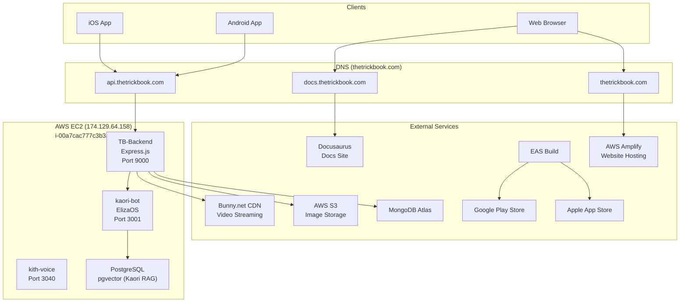
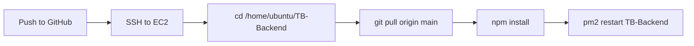

# Infrastructure Overview

Production deployment topology for the TrickBook platform.

## System Diagram



## EC2 Instance

| Property | Value |
|----------|-------|
| Instance ID | `i-00a7cac777c3b3a4e` |
| Public IP | `174.129.64.158` |
| OS | Ubuntu |
| App directory | `/home/ubuntu/TB-Backend/` |
| Env file | `/home/ubuntu/TB-Backend/.env` |

### PM2 Processes

Three Node.js processes run under PM2:

| Process Name | Port | Purpose |
|-------------|------|---------|
| `TB-Backend` | 9000 | Main Express.js API server (REST + Socket.IO) |
| `kaori-bot` | 3001 | ElizaOS agent for Kaori AI companion |
| `kith-voice` | 3040 | Voice processing service |

### SSH Access

```bash
ssh -i ~/.ssh/weshuber.pem ubuntu@174.129.64.158
```

:::danger

The SSH private key (`weshuber.pem`) must never be committed to any repository or shared in plaintext. Store it in `~/.ssh/` with permissions set to `600`.

:::

### PM2 Commands

NVM must be sourced before running PM2 commands on the server:

```bash
# Source NVM (required in non-interactive shells / scripts)
. ~/.nvm/nvm.sh

# Restart the backend
pm2 restart TB-Backend

# View logs
pm2 logs TB-Backend

# View logs for all processes
pm2 logs

# Check process status
pm2 status

# Restart all processes
pm2 restart all
```

## DNS Configuration

| Domain | Target | Service |
|--------|--------|---------|
| `api.thetrickbook.com` | EC2 (`174.129.64.158`) | Backend API |
| `thetrickbook.com` | AWS Amplify | Website (Next.js) |
| `docs.thetrickbook.com` | Docusaurus hosting | Documentation site |

## External Services

### MongoDB Atlas

Cloud-hosted MongoDB cluster. Connection string is stored in the `ATLAS_URI` environment variable on the EC2 instance.

:::danger

The `ATLAS_URI` connection string contains database credentials. It must only be stored in the server's `.env` file or in platform secret managers, never in source code.

:::

### PostgreSQL (pgvector)

Runs directly on the EC2 instance. Used by the `kaori-bot` process for RAG (Retrieval-Augmented Generation) -- storing and querying vector embeddings for Kaori's knowledge base.

### AWS S3

Used for image storage (profile photos, trick media). Access credentials (`AWS_KEY`, `AWS_SECRET`) are configured in the backend `.env` file.

### Bunny.net CDN

Handles video streaming for trick clips. The backend uploads videos to Bunny.net's stream library and serves playback URLs to clients. Configured via `BUNNY_API_KEY`, `BUNNY_LIBRARY_API_KEY`, and `BUNNY_STREAM_TOKEN_KEY`.

### AWS Amplify

Hosts the Next.js website at `thetrickbook.com`. Deployments are triggered by pushes to the website repository.

### EAS Build

Expo Application Services builds the React Native mobile app for distribution:

- **iOS**: Builds are submitted to Apple App Store / TestFlight
- **Android**: Builds are submitted to Google Play Store

## Deployment Flow

### Backend



Step-by-step:

```bash
# 1. SSH into the server
ssh -i ~/.ssh/weshuber.pem ubuntu@174.129.64.158

# 2. Navigate to the app directory
cd /home/ubuntu/TB-Backend

# 3. Pull latest changes
git pull origin main

# 4. Install any new dependencies
npm install

# 5. Source NVM and restart
. ~/.nvm/nvm.sh && pm2 restart TB-Backend

# 6. Verify the process is running
pm2 status

# 7. Check logs for errors
pm2 logs TB-Backend --lines 50
```

### Website

Pushes to the website repository trigger automatic deployment via AWS Amplify.

### Mobile App

Builds are triggered manually via EAS CLI:

```bash
# iOS (TestFlight)
eas build --profile testflight --platform ios

# Android (Play Store)
eas build --profile playstore --platform android
```

See [App Store Deployment](./app-store.md) and [Google Play Deployment](./google-play.md) for detailed submission guides.
