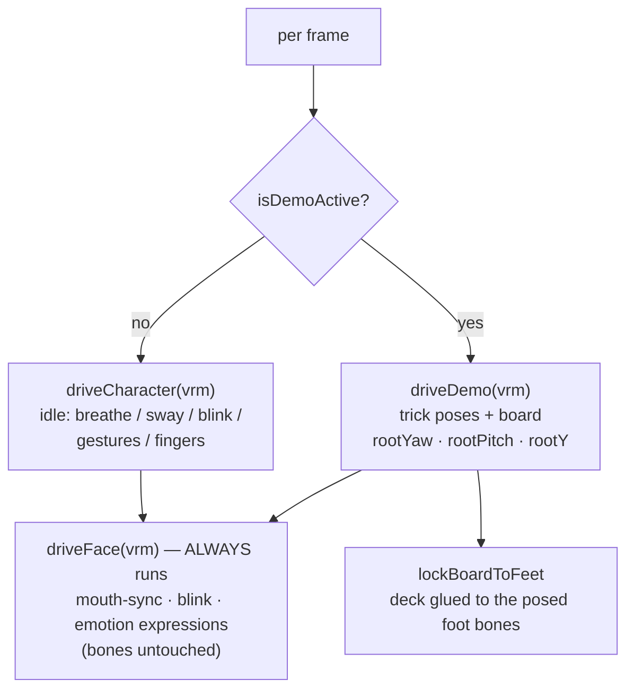

# The Animation System — Fundamentals, Tricks, Choreography

Status: **Audited against code 2026-07-28** · files: `TrickList/src/components/companion/`

How Kaori's body works: the layered animation architecture, the reusable rider-motion vocabulary, the trick timeline registry, the speech-synced choreography — and an honest audit of whether this design scales to "every trick of every sport."

:::tip[Related pages]
Hub: [AI Companions](/docs/features/ai-companions) · Metadata evolution: [Motion Framework](/docs/features/ai-companions/motion-framework) · The board: [Board Model](/docs/features/ai-companions/board-model) · Scaling motion with mocap: [Motion Capture Pipeline](/docs/features/ai-companions/motion-pipeline)
:::

## Architecture: two layers, one owner at a time



- **Idle/conversation layer** (`driveCharacter` in `KaoriStage.tsx`): procedural breathing, sway, head drift, hip weight-shift, finger curl, listening/thinking body language, and a 6-pose speaking gesture cycle — the same motion language as the web stage.
- **Demo layer** (`driveDemo` in `trickAnimations.ts`): owns the whole body during a trick-demo session; the idle system resumes when the stance weight blends back out.
- **Face layer** (`driveFace`): runs in *both* modes — she keeps narrating, blinking, and emoting while riding. Crucially it only touches VRM *expressions* (morphs), never humanoid bones. **This separation is what makes mocap clips layerable later** — a clip can own the skeleton while speech/lip-sync keeps running unchanged.

State flows through **mutable refs, not React state**: `CompanionVoiceState` (mode/emotion from the voice hook) and `TrickDemoState` (session/action/stance/outputs) are read by the frame loop directly.

## Mobile rendering workarounds

The stage runs on `three@0.170` + `@react-three/fiber@9.6.1` (`/native` entry — its import installs the Hermes polyfills) + `expo-gl` + `@pixiv/three-vrm@3.5.2`. Four hard-won, device-verified workarounds live in `KaoriStage.tsx` — do not remove any of them:

1. **`navigator.userAgent` shim** — three r170's GLTFLoader probes it; RN's navigator lacks it.
2. **Texture rebake** — fiber's texture polyfill + three's `texStorage2D` upload path silently produces *empty* textures on expo-gl; every texture is re-decoded through EXGL's native `texImage2D({localUri})` path, read back via framebuffer, and rebuilt as a `DataTexture`.
3. **MToon → `MeshBasicMaterial`** — three-vrm's MToon shader doesn't survive expo-gl's compiler (silent program failure on device, SIGBUS on simulator). Unlit is the closest match to MToon's anime look.
4. **Device gate** — `!Device.isDevice` renders a fallback card; the iOS Simulator's GL shader JIT hard-crashes on standard three shaders. The 3D stage is physical-device-only, including in CI.

Plus `frustumCulled = false` everywhere (skinned meshes keep rest-pose bounds and vanish mid-animation otherwise) and a `frameloop='never'` toggle when the screen loses focus.

## riderFundamentals.ts — the motion vocabulary

The reusable building blocks every board trick is composed from. All values were visually tuned on-device against Kaori's VRM 1.0 VRoid rig (character facing +Z, left side +X).

**The core abstraction is `RiderPose` — 14 normalized channels, not bone rotations:**

```ts
interface RiderPose {
  spin: number;          // 0→1 progress × the trick's totalSpin (yaw)
  pitch: number;         // 0→1 progress × the trick's totalFlip (flips)
  height: number;        // jump arc height
  crouch: number;        // 0 straight → 1 full squat
  coil: number;          // torso wind-up; negative = wound against the spin
  tuck: number;          // knees-to-chest in the air
  balance: number;       // arms out on landing
  headLead: number;      // head leading/holding gaze through rotation (yaw)
  headSpot: number;      // chin pitch — spotting the landing
  headRoll: number;      // head tilt over the leading shoulder
  backLegLift: number;   // stylish variants: tail-side leg raise
  frontLegLift: number;  // stylish variants: nose-side leg raise
  boardTilt: number;     // reserved; board angle now derives from the feet
  dir: number;           // +1 frontside / −1 backside mirror switch
}
```

Appliers translate channels into normalized-humanoid bone rotations: `applyLegs` (thigh/knee/foot with stance splay + asymmetric leg lifts), `applyTorsoAndHead` (coil distributed hips 0.35 → spine 0.5 → chest 0.45 → neck 0.4, mirrored by `dir`), `applyArms` (rest/wind-up/whip/air-wrap/tuck/balance blending with lead/trail arm asymmetry), composed by `applyRiderPose(humanoid, pose, stanceWeight)`. Every channel scales by the stance weight so the body eases in/out at the idle↔demo handoff with no snap.

Key pieces:

- **Stance constants:** `STANCE_YAW = -1.05` (board across camera, chest quartered), `STANCE_CROUCH = 0.18`, `STANCE_SPREAD = 0.25`.
- **`hipDropFor(crouch)`** — trigonometric hip sink from thigh/shin segment lengths, so folded knees keep the soles planted on the deck. This is what makes knee bends *read* correctly.
- **`jumpArc(u, height)`** — parabolic air.
- **`DOWNHILL_LOOK` / `DOWNHILL_CHIN`** — the resting downhill riding gaze every trick starts from and settles back to.
- **Segment mini-demos** — `windUpDemoPose` (2.6s), `popDemoPose` (1.6s), `landDemoPose` (1.8s): self-contained coaching fragments reused by every trick's spoken phases.

## trickAnimations.ts — the TRICKS registry

A trick is a timeline over the fundamentals:

```ts
interface TrickTimeline {
  duration: number;      // seconds
  totalSpin: number;     // radians of yaw; + = frontside (CCW from above) for regular
  totalFlip?: number;    // radians of whole-body pitch; − = backflip, + = frontflip
  poseAt: (t: number) => RiderPose;
}
```

**Five tricks ship today**, all on a shared five-phase skeleton (setup 0–1.5s → pop → air → land → settle, 4.2s total) with velocity-matched phase boundaries (the `0.08·pop + 0.84·ease(air) + 0.08·land` rotation envelope):

| Trick | Rotation | How it reuses the core |
|-------|----------|------------------------|
| `frontside-360` | `totalSpin = +2π` | The base spin timeline: sink→explode crouch, coil −0.7 → +0.5 whip, head-spotting |
| `backside-360` | `totalSpin = −2π` | Same `spin360PoseAt` core with `dir = −1` — mirrors wind, head, and arm wrap; coil stays frontside-signed so the load→whip *timing* is preserved |
| `frontside-360-stylish` | `totalSpin = +2π` | Base FS360 + asymmetric leg lifts: tail up for ¾ of the spin, swap to nose-up for a tail-first landing |
| `wildcat` | `totalFlip = −2π` | Backflip — reuses the phase skeleton but drives `pose.pitch`; no Y-coil (stays on-axis), tighter tuck, bigger air, head thrown back with a late blind re-spot |
| `tamedog` | `totalFlip = +2π` | Frontflip — same flip core with `dir = +1`: head throws down early, re-fixates the landing cleanly ~2/3 through |

**Head-spotting** is the signature technique read: the body sweeps the full rotation while the neck counter-rotates to hold the downhill gaze up to the anatomical neck cap (~75°), then the head whips around fast and re-fixates the landing — one continuous curve, no snaps. Flips swap the yaw-hold for pitch throws (wildcat late/blind, tamedog early), per how the real tricks are coached.

**Whole-body rotation** is composed at the scene root in `KaoriStage`: `q = qYaw(rootYaw) × qPitch(rootPitch)` pivoted at her center of mass (`COM_LOCAL_Y = 0.85`), so flips orbit her hips, and the yaw/pitch channels never fight (spins keep pitch 0; flips keep spin 0).

**The board is locked to her feet** (`lockBoardToFeet`): after the skeleton is posed each frame, the deck's long axis is re-aimed down the line between the two foot bones with body-derived "up", so bindings stay under the soles through inversions, and lifting a leg tilts that end of the board — the stylish variant's board angle is *emergent from the legs*, not animated separately.

The demo runs as an on-board **session**: stance weight eases in (board and the `SnowWorld` alpine environment crossfade with it), the full trick auto-loops with 0.9s stance breathers while she talks, spoken cues can interrupt with segment demos, full runs are never cut mid-air (a `startAction` guard), and a grace-hold (`BOARD_HOLD_SECONDS`) keeps the board up through between-sentence audio gaps so it never vanishes mid-demo.

### Adding a trick today — the honest step count

In practice it's four edits:

1. Add the id to the `TrickId` union.
2. Write `poseAt(t)` composing the fundamentals (~40 lines of phase math — or a variant wrapper like the stylish 360's ~25).
3. Add the `TRICKS` entry (duration + signed totalSpin / totalFlip).
4. **Edit the stage screen** — `detectTrickId` (which user phrasings name it) and possibly `actionForSentence` (the phase cue regexes). Without this the trick can never be requested.

Step 4 is the design smell: trick detection is a client regex, invisible to the LLM. The fixes are the server-side `demo_trick` tool (so the *brain* decides to demo and names the trick) and registry-derived cue vocabulary — see [Motion Framework](/docs/features/ai-companions/motion-framework).

## Sentence cues

The choreography is synchronized to speech by construction, not by timers:

1. When the request carries a live `x-kith-session`, the backend appends `STAGE_DEMO_PROMPT` to the brain — instructing short sentences, a "watch this" sentence, then one imperative sentence per phase using the exact keywords **wind up / pop / spin / land**.
2. Kith speaks the reply **one sentence per turn cycle**; the voice hook counts assistant `turn_start`s and fires `onAssistantSentence(index)`.
3. The screen matches `sentences[index]` against cue regexes: *watch this / let me show / spin / 360* → full trick · *wind, coil, crouch* → setup segment · *pop, jump, snap* → pop hop · *land, absorb, stomp* → landing absorb. Unmatched sentences: she keeps talking in stance.

So "watch this" is literally the moment her body throws the trick. Two coupling risks to know:

- The client splits sentences with a regex that must match Kith's server-side chunker 1:1; divergence silently mis-indexes cues.
- The cue regexes are **global, not per-trick** — "pop" appears in almost every trick explanation, and "spin" fires the *current* trick on flip explanations too. Tolerable at 5 tricks; collides hard at 20. Per-trick cue tables generated from the registry (or cue markers emitted by the brain) are the fix — designed in [Motion Framework](/docs/features/ai-companions/motion-framework).

## Direction audit — is this the right foundation?

**Verdict: yes for what it is, with a known ceiling.** The audit's conclusions:

**What's right and worth keeping:**
- `RiderPose` is effectively a hand-rolled parametric blend tree — the exact structure game animation systems converge on (verified lineage in [Motion Framework](/docs/features/ai-companions/motion-framework)). The channels are *coaching parameters* ("sink deeper", "wind up more") that mocap clips can't offer.
- The rotation-split design (`pose.spin`/`pose.pitch` progress × signed `totalSpin`/`totalFlip` applied at the scene root) is exactly the mitigation the mocap research recommends — one captured body-mechanic serves 180/360/540 variants, and it's how backside and both flips shipped as near-free variants of the 360 core.
- The face/body layer separation makes clip playback a drop-in addition, not a rewrite.
- Speech-synced segment demos are genuinely novel coaching UX and are the part clips are *bad* at (clips aren't parameterizable or loopable mid-sentence).

**Where procedural-only hits its ceiling:**
- **Authoring cost:** each trick core is ~40 lines of hand-tuned phase math with magic numbers, no preview/scrub tooling, no tests. Variants are cheap (backside ~10 lines, flips ~70 for both) but each new *family* (grabs, presses, butters) is bespoke — and style tricks are much harder to fake convincingly than rotations.
- **Fidelity:** real trick *style* — the exact arm swing, the counter-rotation timing — is what riders will judge. Hand-tuned sine-and-lerp motion reads as "close enough" for coaching, not as *her riding*.

**The recommended evolution** (metadata: [Motion Framework](/docs/features/ai-companions/motion-framework) · clips: [Motion Capture Pipeline](/docs/features/ai-companions/motion-pipeline)): keep the procedural system for coaching segments and stance idles, wrap the registry in tagged phase/trick metadata, and grow it into a discriminated union — `{ kind: 'procedural', poseAt } | { kind: 'clip', vrmaUrl, totalSpin, phaseMarkers }` — where full-trick showcases come from CDN-hosted `.vrma` clips and `phaseMarkers` keep the sentence cues and board renderer working against clips.

## What's hardcoded

The parameterization debt to burn down before more tricks/companions ship:

| Assumption | Where | Breaks when |
|------------|-------|-------------|
| Regular stance, frontside = +Y CCW | `STANCE_YAW`, spin convention | Coaching a goofy rider (roadmap: stance onboarding) |
| Board follows the feet (`lockBoardToFeet`) | `KaoriStage` | Skateboarding — a kickflip is **unexpressible**; the board needs its own rotation channels decoupled from the feet ([board model](/docs/features/ai-companions/board-model)) |
| Cue regexes shared across tricks | stage screen | Overlapping keywords at ~20 tricks; frontside always upgrades to the stylish variant by design |
| Trick detection = client regex | `detectTrickId` | Any trick the regex doesn't name; fix = server-side `demo_trick` tool |
| Kaori-only stage | `KAORI_MODEL` require, camera target 0.95, leg-length fractions, `COM_LOCAL_Y = 0.85`, expression name candidates, board colors | Tony — needs model/colors/trick-library parameterization per companion |
| Client sentence split ≈ Kith chunker | stage screen | Any chunker divergence (abbreviations, emoji) |
| 13MB VRM bundled in the app binary | `assets/models/kaori.vrm` | Second companion/outfit — move models to CDN first (roadmap) |

## PRD deltas

What shipped inverted much of `prd/3d-companions-prd.md` (Jul 3 2026): Kaori/snowboard shipped instead of Tony/skateboard; fully procedural motion instead of Blender/Draco clips + Bunny CDN + a backend `trick_animations` collection; voice shipped despite being a PRD non-goal; and the scrub player / slow-mo / step chips / premium gating / Trickipedia entry points remain unbuilt. Treat the PRD as historical context — but note the clip/CDN/`demo_trick`-tool ideas it contains are exactly where the scaling plan lands anyway.
