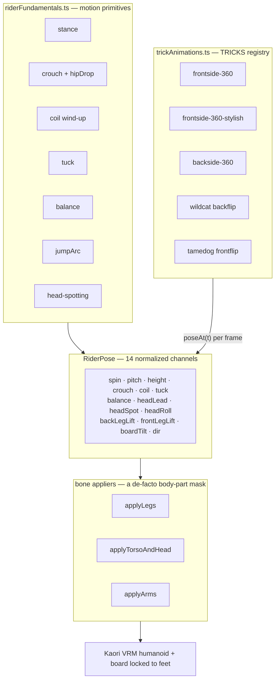
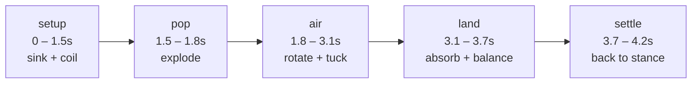
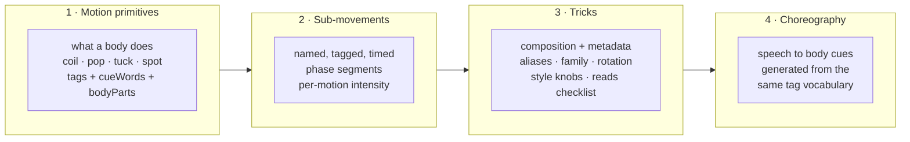
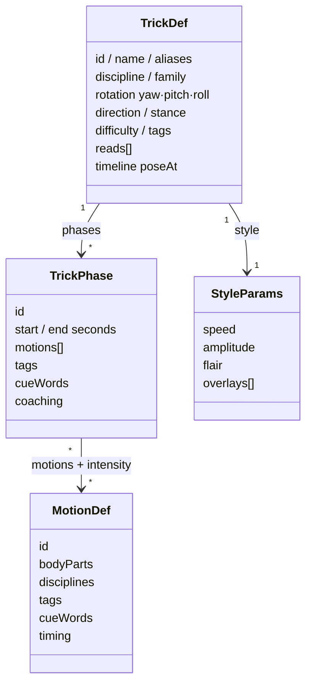

# The Motion Framework — Sub-Movements, Tags, and Timing

Status: **Designed 2026-07-28** · code audited against `TrickList/src/components/companion/` · game-industry claims adversarially verified (20 confirmed / 5 refuted, sources inline)

The foundation for making companions *intelligent about how the body moves* — snowboarding first for Kaori, transferable to skateboarding for future companions. This page defines the taxonomy (fundamentals → sub-movements → tricks), the tag/keyword metadata every motion carries, and the timing/style documentation conventions, grounded in how shipped games actually did it.

:::tip[Related pages]
Current implementation audit: [Animation System](/docs/features/ai-companions/animation-system) · Board rotation channels for skate: [Board Model](/docs/features/ai-companions/board-model) · Mocap scaling: [Motion Capture Pipeline](/docs/features/ai-companions/motion-pipeline)
:::

## What shipped games teach us (verified)

Deep research on SSX / Tony Hawk's Pro Skater and modern animation architecture, with adversarial fact-checking. What survived:

| Finding | Source | Lesson for us |
|---------|--------|---------------|
| **THPS1 trick animations were hand-keyed, not mocap.** The Tony Hawk mocap shoot was too late and used only as reference/marketing. | Neversoft producer Scott Pease (Ringer oral history); Tony Hawk himself (Kotaku 2019) | Our fully-procedural approach has shipped-classic precedent. Hand-authored motion made THPS *read* right. |
| **Trick correctness came from expert review, not motion data.** Hawk iterated per-trick: "this needs to flip faster, this needs to look more pointed like a melon grab." | Ringer oral history (first-person) | Every trick needs documented **"reads"** — the visual criteria a rider would judge (we already do this informally in code comments; formalize it as metadata). |
| **Parametric blend trees with normalized weights + per-joint "feather blending"** (partial-body masks) are the foundational architecture (Edsall, MechWarrior 4, 2003). | Game Developer (primary) | Our `RiderPose` scalar-channel system *is* a hand-rolled parametric blend tree; the applier split (legs/torso/arms/head) *is* bone masking. Keep it — formalize it. |
| **Transition clips author ~1s of header/trailer overlap; a FIFO state machine waits for sync positions** before blending. | Same | Our stance-in/stance-out easing and "full runs are never cut" guard follow this; phase boundaries need velocity-matching (we already do this — e.g. the 0.08/0.84/0.08 spin envelope). |
| **UE Anim Notifies (point events), Notify States (duration sub-phases), Sync Markers (named-tag alignment)** are the industry-standard clip metadata. | Epic UE5 docs (primary) | This is exactly the "sub-movement separation" we want: named, tagged, time-bounded phase segments as *data*, not buried constants. |
| **For Honor: annotate, don't chop.** Animators tag raw takes with timed markers + metadata tags ('Tired', 'Heavy Attack') and variables (stance, range, outcome); the gameplay state machine runs in parallel with motion selection. | GDC 2016 (Clavet), gameanim.com | Tags/keywords on motions are a proven authoring pattern. Our choreography cues should read from the same tag vocabulary as the motion registry — one source of truth. |
| **Additive layering collapses combinatorial explosion** (10×3×4×2 = 240 clips → ~19 with layers); upper-body masks split just above the pelvis (`spine_01` ≈ VRM `spine`). | Epic/Unity docs, corroborated vendor guide | Style variants = overlays, not forks. Our `frontside-360-stylish` (leg-lift overlay on the base 360) already proves the pattern. |
| **three.js natively supports this**: one `AnimationMixer`, base + additive actions (`AnimationUtils.makeClipAdditive`), crossfade/weight/timeScale per action, and a name-suffix (`_pose`) tagging convention in the official example. | three.js source + official example (primary) | When mocap clips arrive ([motion pipeline](/docs/features/ai-companions/motion-pipeline)), the layering/tagging model transfers without a rewrite. |

**Honest gaps:** No SSX-specific engineering claims survived verification — how EA BIG actually built the über-trick system remains undocumented in accessible sources (GDC postmortems / EA Canada interviews are the next place to mine). Also refuted: "THPS used mocap in-game" (0-3), and the oft-quoted "3-5 animation layers is the mobile budget" (0-3) — no verified mobile layer budget exists; ours needs on-device benchmarking.

## Where the code is today

Five tricks ship in `trickAnimations.ts` — `frontside-360`, `frontside-360-stylish`, `backside-360`, `wildcat` (backflip), `tamedog` (frontflip) — composed from `riderFundamentals.ts` primitives over a 14-channel `RiderPose`. The separation the framework needs **already exists implicitly**:



Every trick runs the same five-phase skeleton, but the boundaries are **buried constants** (`FS360_SETUP_END = 1.5` …), not addressable data:



What's *missing* is that none of it is **addressable data**: phases are unnamed const boundaries inside pose functions, tags/keywords live as regexes in the stage screen (`actionForSentence`, `detectTrickId`), speeds are magic numbers, and style is comment prose. The system is architecturally right and metadata-poor.

## The framework: four layers, one vocabulary





### 1. Motion primitives — tagged fundamentals

Every reusable movement gets a registry entry with tags. The tags serve three consumers: sentence-cue detection, the LLM brain (tool descriptions), and future companions' shared libraries.

```ts
interface MotionDef {
  id: string;                    // 'coil', 'pop', 'tuck', 'spot', 'absorb', …
  bodyParts: BodyPart[];         // ['torso','arms'] — the applier mask it drives
  disciplines: Discipline[];     // ['snowboard','skateboard'] — transferability
  tags: string[];                // ['rotation','load','upper-body','power']
  cueWords: string[];            // ['wind','coil','crouch','load'] — ONE vocabulary
  description: string;           // coaching language: what it is, why it matters
  timing: { typicalDuration: number; easing: EasingName };
}
```

Seed set (all exist in code today): `stance`, `crouch`, `coil`, `pop`, `tuck`, `grab` (future), `spot` (head-spotting), `balance`, `absorb`, `legLift`.

**Transferability is a first-class field.** Crouch/pop/tuck/spot/absorb are board-sport universal — a skateboard companion reuses them untouched. `coil` transfers with different magnitudes. What does *not* transfer is board coupling: a snowboard is strapped to the feet; a kickflip needs independent board rotation channels ([board model](/docs/features/ai-companions/board-model)).

### 2. Sub-movements — phases as data (our Notify States)

Each trick declares named, time-bounded, tagged phases instead of const boundaries. This is the UE Notify State / Sync Marker pattern in plain data:

```ts
interface TrickPhase {
  id: PhaseId;                   // 'setup' | 'pop' | 'air' | 'land' | 'settle' | custom
  start: number; end: number;    // seconds on the trick timeline
  motions: Array<{               // which primitives are active and how hard
    motion: string;              // MotionDef id
    intensity: number;           // peak amount, 0→1 (crouch depth, coil angle…)
    easing?: EasingName;         // defaults to the motion's own
  }>;
  tags: string[];                // ['load','rotation-source'] — phase-level semantics
  cueWords: string[];            // sentence keywords that demo THIS phase
  coaching: string;              // one sentence: what to tell a learner here
}
```

The five-phase skeleton (setup → pop → air → land → settle) is shared by every trick today and is velocity-matched at boundaries (the `0.08·pop + 0.84·ease(air) + 0.08·land` envelope). That stays — phases only become *named and queryable*.

### 3. Tricks — composition plus metadata

```ts
interface TrickDef {
  id: TrickId;
  name: string;                  // display: "Frontside 360"
  aliases: string[];             // ['fs 360','fs3','front 360','three-sixty'] — feeds detection
  discipline: Discipline;        // 'snowboard' (Kaori) | 'skateboard' (future)
  family: TrickFamily;           // 'spin' | 'flip' | 'grab' | 'jib' | 'butter'
  rotation: { yaw: number; pitch: number; roll: number };   // signed radians
  direction: 'frontside' | 'backside' | null;
  stance: 'regular' | 'goofy';   // authored stance; mirror for the other
  difficulty: 1|2|3|4|5;
  tags: string[];                // ['rotation','inverted','beginner-plus',…]
  phases: TrickPhase[];
  style: StyleParams;            // see below — the documented speed/style knobs
  reads: string[];               // THPS lesson — review criteria, e.g.:
                                 // "head holds downhill gaze ~half the spin, then whips"
                                 // "backside reads: winds opposite, blind landing"
  timeline: TrickTimeline;       // the existing poseAt machinery, unchanged
}
```

`reads` is the expert-review checklist made explicit — the knowledge currently living in code comments ("the small asymmetry is physical, not a bug") becomes reviewable, testable documentation. When Wes checks a new trick on-device, `reads` is the checklist.

### 4. Choreography — cues derive from the registry

Today `actionForSentence` and `detectTrickId` are hand-kept regexes in the stage screen — the known collision risk at 5+ tricks. Under the framework they are **generated** from the registry: trick detection from `name + aliases`, phase cues from each phase's `cueWords`, scoped to the active trick. One vocabulary, no drift. (Server-side `demo_trick` tool remains the end-state so the brain names the trick; the registry's tags/aliases become the tool's enum + docs.)

## Speed & style: the documented knobs

Animation speed and style stop being magic numbers and become per-trick parameters with defaults:

```ts
interface StyleParams {
  /** Global time multiplier — 1.0 = authored speed. Slow-mo coaching = 0.35. */
  speed: number;
  /** Air amplitude multiplier (jump height, tuck tightness). */
  amplitude: number;
  /** How aggressively she styles it — drives overlays like leg lifts, tweaks. */
  flair: number;               // 0 = clean/textbook, 1 = full style
  /** Named overlays this trick supports (additive, body-part-masked). */
  overlays: string[];          // ['tail-lift','shifty'] — 'stylish' = base + overlay
}
```

Conventions (from the verified research):

- **Easing standard:** all phase transitions use the smoothstep `easeInOut` (already universal in code); anything else must be named in the phase data. Envelope boundaries stay velocity-matched — a phase may not introduce a speed discontinuity (the "no pops" rule; Edsall's 1s header/trailer overlap is the clip-era equivalent).
- **Style variants are overlays, not forks.** `frontside-360-stylish` today is a fork of the base function; under the framework it's the base trick + a `tail-lift` overlay at `flair ≥ 0.5`. This is the additive-layer lesson: N tricks × M styles = N + M authored pieces, not N × M.
- **Speed is uniform time-scaling; physics reads stay.** Scaling `speed` scales the whole timeline (the jump arc stays parabolic in scaled time). Per-phase speed hacking is not allowed — it breaks the velocity matching.
- **Every duration is documented at the definition** — phase bounds in the `TrickDef`, primitive typical durations in `MotionDef`. The current buried consts (`FS360_SETUP_END` etc.) become the first registry entries.

## Migration path (incremental, no rewrite)

The pose-function machinery (`poseAt`, appliers, `RiderPose`) is validated on-device and stays byte-identical. The framework wraps it in metadata:

1. **Extract phase constants to data** — `TRICKS` entries gain `phases[]` with the existing boundaries; pose functions read bounds from the def instead of module consts. Pure refactor, zero visual change.
2. **Add trick metadata** — `aliases`, `family`, `rotation`, `tags`, `reads`, `style` per trick (content mostly exists in comments today).
3. **Create the `MotionDef` registry** for the ~9 existing primitives with tags + cue words.
4. **Generate cue matching from the registry** — delete the screen regexes; scope phase cues to the active trick.
5. **Implement `style.speed`** (uniform timeline scale — this also gives slow-mo coaching for free) and convert `-stylish` into the first overlay.
6. **Later:** the discriminated union for `.vrma` clips ([motion pipeline](/docs/features/ai-companions/motion-pipeline)) slots in as `timeline: { kind: 'clip', … }` with `phases[]` acting as the sync-marker layer over clips — the metadata model is identical for procedural and captured motion, which is the entire point.

## Open questions

- **SSX's actual trick pipeline** remains unverified — worth mining GDC Vault postmortems before designing the grab/tweak overlay system it pioneered.
- **Mobile animation budget:** no verified layer/action budget exists for three.js + VRM on phones; benchmark on-device before stacking overlays (current system is single-pass procedural — very cheap; the risk arrives with clip layering).
- **Goofy stance mirroring:** the registry's `stance` field implies a mirror transform (`dir` flip + leg swap) that is designed but unbuilt.
