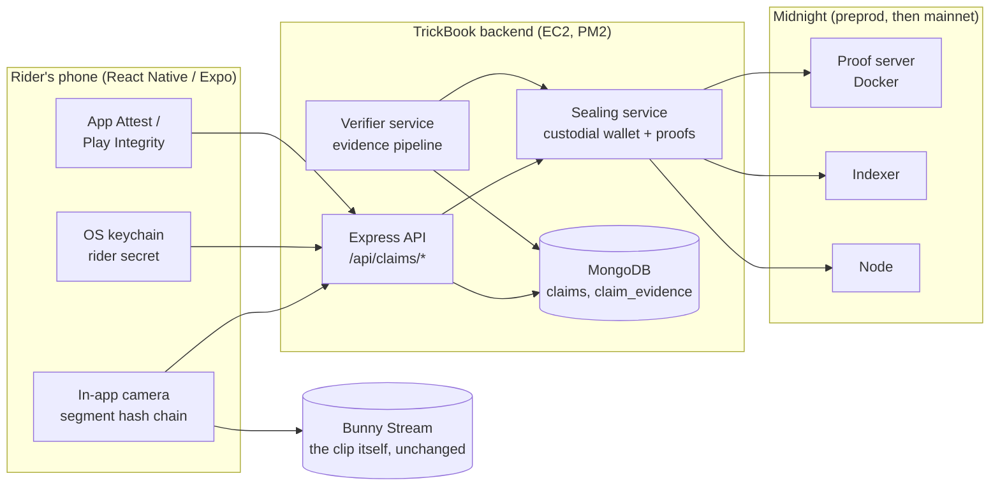
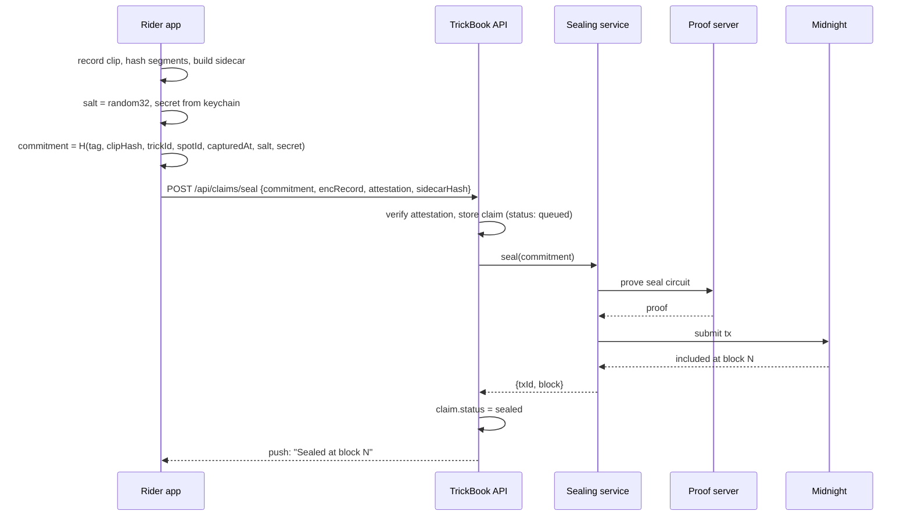
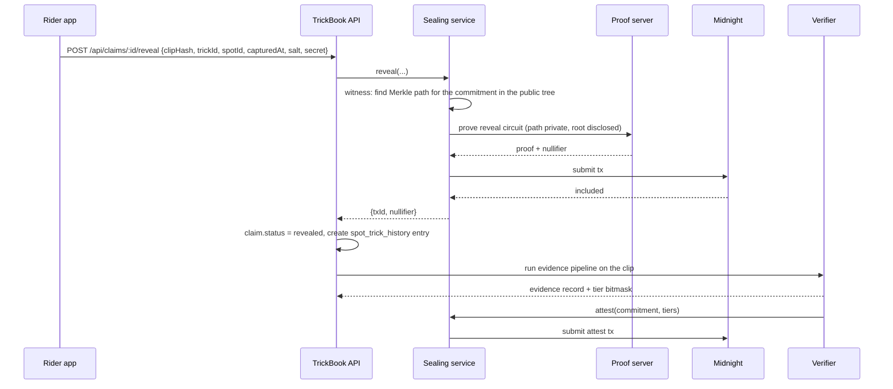

# Claimed: Architecture

How a clip becomes a commitment on Midnight, how it is revealed, and what runs where. Read the [PRD](/docs/features/claimed) first for the why. The contract in this page is a sketch derived from the working `vouched` contract; it has to be compiled against the current Compact compiler before any of it is treated as final.

## 1. Components



| Component | Exists today | Change |
|-----------|--------------|--------|
| In-app camera | No. The mobile app only picks images with `expo-image-picker`; clips are uploaded on the website from a file picker. | New: `expo-camera` recording, per-segment hashing, capture sidecar |
| Rider secret in keychain | No | New: 32 random bytes generated on first seal, stored with `expo-secure-store` |
| Device attestation | No | New: App Attest on iOS, Play Integrity on Android, verified server-side |
| Express API | Yes, 30+ route modules | New route module `routes/claims.js` |
| Sealing service | No. The pattern exists in vouched's demo backend (`server.ts`), which wraps wallet, proof provider, indexer provider, and private state behind a small HTTP API so the client never touches Midnight libraries. | New process, same pattern, production hardening |
| Verifier service | No | New, see [Verification pipeline](./verification-pipeline) |
| Proof server | No | New container next to the API, or a dedicated box |
| Spot trick history | Yes, admin-verified | Reveals create entries with `source: "claimed"` |

## 2. Trust boundaries

Three boundaries, stated plainly because the product principles say trust is sacred.

1. **Device to TrickBook.** The device computes the clip hash and holds the rider secret. In v1 the secret is sent to the backend for proof generation, over TLS, encrypted at rest, never logged. This is the custodial boundary. Riders are told this in the feature's settings screen. Removing it is the v2 track (on-device proving through a mobile proof path).
2. **TrickBook to Midnight.** The chain only ever sees commitment leaves, nullifiers, disclosed reveal fields, and attestation tiers. It never sees clips, rider ids, GPS, or model outputs.
3. **Verifier to chain.** Only TrickBook's verifier can anchor an attestation, enforced by a sealed ledger field and hash-based authentication inside the circuit, not by an off-chain check.

## 3. Sequence: seal



The `seal` circuit only inserts the commitment. The rider's device is the only place the pre-image is assembled, which is why the seal request can carry no clip and still bind the clip.

## 4. Sequence: reveal



## 5. Sequence: priority proof (no reveal)

The rider proves "a claim for trick T at spot S was sealed no later than block B" and nothing else.

1. The rider picks a date D. The service maps D to the last block B at or before D and fetches the tree root that was current at B from the indexer.
2. The circuit takes the claim pre-image as private input, recomputes the commitment, and proves a Merkle path to **that historic root**. `HistoricMerkleTree.checkRoot` accepts any past root the tree has recorded, so proving membership under the root as of B proves the leaf was inserted at or before B.
3. Disclosed: `trickId`, `spotId`, the root. Not disclosed: `clipHash`, `capturedAt`, `salt`, the leaf, the path.
4. The verification link shows the disclosed values, the block the root belongs to, and re-verifies the proof.

This is the part of the design that matters most. **Priority is established by chain time, not by the device clock.** `capturedAt` is a self-reported field bound into the commitment for later evidence; the thing that cannot be faked is the block at which the root existed.

:::warning[Verify before relying on it]
The retention rule for historic roots in `HistoricMerkleTree` must be confirmed against the current ledger ADT documentation. If the tree keeps a bounded window of roots, the service must snapshot roots per block off-chain and the priority proof design needs a checkpoint circuit. This is the first item in the M2 exit criteria.
:::

## 6. Contract

Sketch, Compact 0.23 style, ported from `vouched.compact`. Tree depth 16 gives 65,536 leaves, which is years of seals at current scale; pick the depth against proving cost with the Nite ZK profiler before deploy.

```compact
// claimed: proof of priority for creative work on Midnight
pragma language_version 0.23;

import CompactStandardLibrary;

// One leaf per sealed claim. Only the commitment is ever public.
export ledger claims: HistoricMerkleTree<16, Bytes<32>>;
export ledger claimCount: Counter;

// Spent nullifiers: one reveal per claim.
export ledger revealed: Set<Bytes<32>>;
export ledger revealTrick: Map<Bytes<32>, Bytes<32>>;
export ledger revealSpot: Map<Bytes<32>, Bytes<32>>;
export ledger revealClipHash: Map<Bytes<32>, Bytes<32>>;
export ledger revealCapturedAt: Map<Bytes<32>, Uint<64>>;

// Evidence tiers anchored by the verifier, keyed by commitment.
export ledger attestations: Map<Bytes<32>, Uint<8>>;

// Hash of the verifier's secret, fixed at deploy.
export sealed ledger verifierKeyHash: Bytes<32>;

witness riderSecret(): Bytes<32>;
witness findClaimPath(commitment: Bytes<32>): MerkleTreePath<16, Bytes<32>>;
witness verifierSecret(): Bytes<32>;

constructor(vkHash: Bytes<32>) {
  verifierKeyHash = vkHash;
}

// Anyone (in practice the sealing service) may insert a commitment.
export circuit seal(commitment: Bytes<32>): [] {
  claims.insert(disclose(commitment));
  claimCount.increment(1);
}

// The rider proves knowledge of a pre-image whose commitment is in the tree,
// spends the nullifier, and discloses the claim body.
export circuit reveal(
  clipHash: Bytes<32>,
  trickId: Bytes<32>,
  spotId: Bytes<32>,
  capturedAt: Uint<64>,
  salt: Bytes<32>
): [] {
  const secret = riderSecret();
  const c = claimCommitment(secret, salt, clipHash, trickId, spotId, capturedAt);
  const path = findClaimPath(c);
  assert(claims.checkRoot(disclose(merkleTreePathRoot<16, Bytes<32>>(path))), "no sealed claim matches");
  const nul = disclose(claimNullifier(secret, salt));
  assert(!revealed.member(nul), "claim already revealed");
  revealed.insert(nul);
  revealTrick.insert(nul, disclose(trickId));
  revealSpot.insert(nul, disclose(spotId));
  revealClipHash.insert(nul, disclose(clipHash));
  revealCapturedAt.insert(nul, disclose(capturedAt));
}

// Proves a claim for (trickId, spotId) exists under a historic root
// without spending the nullifier or disclosing the clip.
export circuit provePriority(
  clipHash: Bytes<32>,
  trickId: Bytes<32>,
  spotId: Bytes<32>,
  capturedAt: Uint<64>,
  salt: Bytes<32>
): [] {
  const secret = riderSecret();
  const c = claimCommitment(secret, salt, clipHash, trickId, spotId, capturedAt);
  const path = findClaimPath(c);
  assert(claims.checkRoot(disclose(merkleTreePathRoot<16, Bytes<32>>(path))), "no sealed claim matches");
  // trickId and spotId are disclosed by the caller's transaction context;
  // clipHash, capturedAt, salt and the leaf stay private.
  const _t = disclose(trickId);
  const _s = disclose(spotId);
}

// Only the holder of the verifier secret can anchor evidence tiers.
export circuit attest(commitment: Bytes<32>, tiers: Uint<8>): [] {
  const vs = verifierSecret();
  assert(persistentHash<Vector<2, Bytes<32>>>([pad(32, "tb:verifier:"), vs]) == verifierKeyHash, "not the verifier");
  attestations.insert(disclose(commitment), disclose(tiers));
}

export circuit claimCommitment(
  secret: Bytes<32>, salt: Bytes<32>, clipHash: Bytes<32>,
  trickId: Bytes<32>, spotId: Bytes<32>, capturedAt: Uint<64>
): Bytes<32> {
  const meta = persistentHash<Vector<3, Bytes<32>>>([trickId, spotId, pad(32, "")]);
  // capturedAt is folded through a second hash so the vector stays Bytes<32>-typed.
  const timeHash = persistentHash<Uint<64>>(capturedAt);
  return persistentHash<Vector<6, Bytes<32>>>([pad(32, "tb:claim:v1"), clipHash, meta, timeHash, salt, secret]);
}

export circuit claimNullifier(secret: Bytes<32>, salt: Bytes<32>): Bytes<32> {
  return persistentHash<Vector<3, Bytes<32>>>([pad(32, "tb:nul:v1"), salt, secret]);
}
```

Design notes on the contract:

- **Salt per claim.** Two claims by one rider must be unlinkable. The secret is constant per rider; the salt is fresh per claim, so commitments and nullifiers never repeat. This is the "never reuse randomness across commitments" rule from Midnight's security guidance.
- **Nullifier over (secret, salt), not over the clip.** The same clip can legitimately be claimed by a rider and co-signed by a filmer; each has its own secret and salt.
- **Domain separation.** `tb:claim:v1`, `tb:nul:v1`, `tb:verifier:` are distinct prefixes so no hash can be replayed in another role.
- **Disclosure discipline.** Every circuit parameter that flows into a ledger write is wrapped in `disclose()` at the point of use, including public-looking ones like `trickId`, because the compiler cannot know a caller did not pass witness data. Membership checks with witness-derived keys are disclosure points too. Both rules were learned the hard way on vouched, which took five compile iterations to get right.
- **Verifier authority.** Midnight's guidance says not to use `ownPublicKey()` for caller verification. The sealed `verifierKeyHash` field plus a witness-held secret is the recommended hash-based authentication pattern. A round counter should be added so attest transactions are not linkable to each other; omitted from the sketch for clarity.
- **Witnesses are not verified.** `findClaimPath` reads the public tree state and returns a path; the circuit does not trust it, it recomputes the root and checks it. `riderSecret` is trusted only insofar as the commitment recomputation binds it.

## 7. Witnesses and private state

Port of vouched's `witnesses.ts`:

```typescript
export type ClaimsPrivateState = {
  readonly riderSecret: Uint8Array;      // per rider, from the device keychain (v1: relayed)
  readonly verifierSecret?: Uint8Array;  // only in the verifier's process
};

export const witnesses = {
  riderSecret: ({ privateState }) => [privateState, privateState.riderSecret],
  verifierSecret: ({ privateState }) => [privateState, privateState.verifierSecret!],
  findClaimPath: ({ privateState, ledger }, commitment) => {
    const path = ledger.claims.findPathForLeaf(commitment);
    if (path === undefined) throw new Error("no sealed claim on-chain for this pre-image");
    return [privateState, path];
  },
};
```

Two mechanism lessons from vouched carry over unchanged:

- The level private-state provider takes an exclusive lock per operation. Read private state once and share the promise; serialize contract calls through a queue.
- The witnesses type expects a mutable tuple return; `as const` fails the generated type.

## 8. Data model

New collections in the existing MongoDB.

```javascript
// claims
{
  _id: ObjectId,
  userId: String,
  commitment: String,            // hex, the on-chain leaf
  status: "queued" | "sealed" | "revealed" | "failed",
  tier: Number,                  // evidence bitmask, mirrors on-chain attestation
  captureSource: "in-app" | "import",
  encRecord: String,             // rider-encrypted {clipHash, trickId, spotId, capturedAt, salt}
  sidecarHash: String,           // hash of the capture sidecar (GPS, sensors, clocks)
  attestation: { platform, verifiedAt, keyId },
  seal:   { txId, block, at },
  reveal: { txId, nullifier, block, at },
  feedPostId: ObjectId,          // set on publish
  spotTrickHistoryId: ObjectId,  // set on reveal
  cosigns: [ObjectId],           // other claims over the same clipHash
  createdAt, updatedAt
}

// claim_evidence
{
  _id: ObjectId,
  claimId: ObjectId,
  tier: Number,
  checks: [{
    name: "attestation" | "ai-generated" | "trick-match" | "landing" | "spot-match" | "witness",
    verdict: "pass" | "fail" | "inconclusive",
    confidence: Number,
    model: String,               // name@version
    signals: Object,             // raw outputs, admin-only
    at: Date
  }],
  reviewedBy: String,            // admin override, optional
  createdAt
}
```

Changes to existing collections:

- `feed` posts gain `claimId`.
- `spot_trick_history` entries gain `claimId`, `evidenceTier`, and use `source: "claimed"`; `verified` becomes derived (tier 3 or higher, or admin override).

## 9. API surface

All under the existing JWT auth middleware.

| Method | Path | Who | Purpose |
|--------|------|-----|---------|
| POST | `/api/claims/seal` | rider | Body: commitment, encRecord, attestation token, sidecarHash, captureSource. Returns claim id, status queued. |
| GET | `/api/claims` | rider | Own claims with status, block, tier. |
| POST | `/api/claims/:id/reveal` | rider | Body: pre-image fields. Generates proof, submits reveal, creates spot trick history entry, kicks off evidence pipeline. |
| POST | `/api/claims/:id/priority-proof` | rider | Body: date. Returns a proof id and a public verify URL. |
| GET | `/api/claims/verify/:proofId` | public | Disclosed values, block, re-verification result. |
| POST | `/api/claims/:id/cosign` | filmer | Seal a second commitment over the same clipHash. |
| GET | `/api/claims/:id/evidence` | rider or admin | Evidence record; raw signals admin-only. |
| PUT | `/api/claims/:id/evidence/override` | admin | Manual tier override with reason. |

## 10. Hashing on the device

- **Clip hash.** While recording, each finished segment (for example every 2 seconds of encoded output) is hashed with SHA-256 and chained: `h_i = SHA256(h_{i-1} || segment_i)`. `clipHash = h_n`. The chain is computed over the encoder's output, so any re-encode, trim, or re-mux produces a different hash. The final file uploaded to Bunny is the same bytes.
- **Sidecar.** JSON with capture start and end (wall clock and monotonic), GPS fix and accuracy, accelerometer and gyroscope samples at 10 Hz, device model, app version, camera id. `sidecarHash = SHA256(sidecar)`. Stored in the claim record, used by the evidence pipeline, never on-chain.
- **Commitment.** Assembled on the device exactly as the circuit computes it, so the backend never needs the pre-image to seal. The rider-encrypted record travels alongside so the rider can recover the pre-image on a new phone.

## 11. Sealing service operations

- **Wallet.** One app wallet per environment (preprod, mainnet). Seed in the secrets manager, never in `.env`. Funded with DUST; a balance alarm at the equivalent of one week of seals.
- **Serialization.** One queue per wallet. The private-state lock and transaction nonce ordering both require it.
- **Idempotency.** Seal requests are idempotent on commitment; a retry after a timeout must not insert a second leaf.
- **Failure states.** Midnight unreachable: claims stay `queued`, the UI never says Sealed. Proof server down: reveals and priority proofs return 503 with a retry-after; seals still queue.
- **Deployment.** A PM2 process next to the API on the existing EC2 box, plus the proof server container. Move to a dedicated box if proof generation contends with the API. The Kith voice sidecar already runs this way.
- **Observability.** Log every transaction id and block with the claim id. Emit `claim.sealed`, `claim.revealed`, `claim.attested`, `claim.failed` analytics events.

## 12. Open-source split

TrickBook is proprietary. The awesome-dapps submission rules require an open-source, original, fresh-clone-buildable project with a real privacy feature. So:

| Repository | Visibility | Contents |
|------------|------------|----------|
| `claimed` (new) | Public | `contract/` (Compact, witnesses, tests), `service/` (sealing and proving service with a generic HTTP API), `demo/` (minimal web UI: seal a file, reveal, prove priority), README with fresh-clone instructions, e2e against the standalone devnet |
| `TB-Backend` | Private | `routes/claims.js`, evidence pipeline, integration with feed and spot trick history; depends on `claimed/service` as a package |
| `TrickBookFrontend` | Private | Capture, hashing, keychain, attestation, seal and reveal UI |

The public repository is the thing reviewed for the Midnight quests and the Aliit dossier; TrickBook is its first, and for now only, production integrator.
