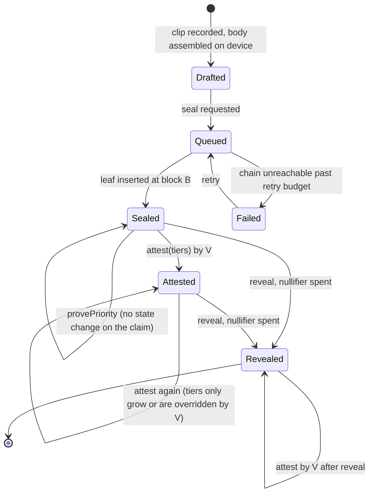

# Claimed: Formal Specification

A precise statement of what the protocol guarantees, a model-checkable specification of its state machine, the obligations each circuit discharges, the threat model, and the test plan that ties them together. Written so a reviewer can find the load-bearing assumption in under five minutes.

:::note[Scope of "formal"]
Formal methods here means three concrete things: a TLA+ model of the claim lifecycle checked with TLC, a table of proof obligations per Compact circuit that the tests enforce, and an explicit list of cryptographic assumptions. It does not mean the Compact compiler proves the contract correct (it enforces disclosure discipline and type safety, nothing more), and it does not cover physical truth or the honesty of the custodian. Those are addressed by the [verification pipeline](./verification-pipeline) and the trust boundaries in [Architecture](./architecture#2-trust-boundaries).
:::

## 1. Roles and objects

| Symbol | Meaning |
|--------|---------|
| Rider `r` | Holder of a secret `k_r`, generated on the device |
| Claim body `b` | `(clipHash, trickId, spotId, capturedAt)` |
| Salt `s` | Fresh 32 random bytes per claim |
| Commitment `c` | `H(tag_c, b, s, k_r)`, the only thing sealed on-chain |
| Nullifier `n` | `H(tag_n, s, k_r)`, spent on reveal |
| Tree `T` | Historic Merkle tree of commitments; `root(T, B)` is the root as of block `B` |
| Verifier `V` | TrickBook's evidence service, holds `k_V` with `H(tag_v, k_V)` fixed at deploy |
| Block `B` | Chain height, the only clock the protocol trusts |

## 2. Claim lifecycle



Only three transitions touch the chain: `seal`, `reveal`, `attest`. `provePriority` produces a proof but changes nothing. Everything else is TrickBook-side bookkeeping.

## 3. Invariants

| ID | Name | Statement | Enforced by |
|----|------|-----------|-------------|
| I1 | Single reveal | A commitment is revealed at most once | `assert(!revealed.member(n))` then `revealed.insert(n)` in `reveal`; nullifier is deterministic in `(s, k_r)` |
| I2 | Binding | A reveal that verifies discloses exactly the body `b` that was sealed | Commitment recomputed in-circuit from disclosed `b` and private `(s, k_r)`; collision resistance of `H` |
| I3 | Hiding | Before reveal, the chain state gives no information about `b` or `r` beyond the existence of a leaf | Leaf is `H(...)` over inputs including 32 bytes of fresh salt; preimage resistance of `H` |
| I4 | Priority soundness | If a priority proof verifies against `root(T, B)`, the claim was sealed at a block no later than `B` | Merkle membership under a historic root; roots are only ever appended |
| I5 | Ownership | Only the holder of `k_r` can reveal or prove priority for a claim sealed with `k_r` | Commitment recomputation requires `k_r` as witness; ZK soundness |
| I6 | Unlinkability | Two claims by the same rider, and a priority proof and its later reveal, are unlinkable on-chain | Fresh salt per claim; only the root is disclosed in membership proofs; nullifier appears only at reveal |
| I7 | Attestation authority | Only `V` can write `attestations` | `assert(H(tag_v, verifierSecret()) == verifierKeyHash)`; `verifierKeyHash` is a sealed ledger field |
| I8 | Attestation targets | An attestation can only be anchored to an existing commitment | Enforced off-chain in v1 (service checks the leaf exists); on-chain enforcement would require a membership proof in `attest`, listed as an M2 decision |
| I9 | No silent failure | The UI never shows Sealed unless a transaction with the commitment is confirmed | Sealing service sets `sealed` only from an indexer-confirmed inclusion |

I8 is the one invariant the sketch does not fully enforce on-chain. It is called out rather than hidden.

## 4. Cryptographic assumptions

Everything above reduces to these. If one fails, the corresponding invariant fails.

1. `persistentHash` (SHA-256) is collision resistant and preimage resistant. Needed by I2, I3.
2. Midnight's proof system is sound and zero-knowledge for the compiled circuits. Needed by I2, I4, I5, I6.
3. Merkle path verification is sound: a valid path to a recorded root implies the leaf was inserted before that root was computed. Needed by I4.
4. The device's random number generator produces unpredictable salts and secrets. Needed by I3, I6.
5. The sealed ledger field cannot be modified after deploy. Needed by I7. This is a Compact language guarantee.

## 5. TLA+ model

The model abstracts hashing away (a claim is an opaque id, ownership is a field) so that TLC can check the state machine's safety properties: no double reveal, no reveal without seal, priority proofs only against roots that postdate the seal, attestations only on sealed claims. The cryptographic properties are assumptions, listed above; the model checks that the protocol logic does not break the guarantees the cryptography provides.

```tla
---------------------------- MODULE Claimed ----------------------------
EXTENDS Naturals, FiniteSets, Sequences

CONSTANTS Riders, ClaimIds, MaxBlock, Tiers

VARIABLES
  block,        \* current block height
  sealed,       \* set of [id, rider, atBlock] records
  revealed,     \* set of ids whose nullifier has been spent
  revealCount,  \* id -> number of reveal transactions accepted
  attested,     \* id -> set of tiers anchored
  roots         \* roots[b] = set of ids present in the tree when block b was produced

vars == <<block, sealed, revealed, revealCount, attested, roots>>

SealedIds == { s.id : s \in sealed }

Init ==
  /\ block = 0
  /\ sealed = {}
  /\ revealed = {}
  /\ revealCount = [i \in ClaimIds |-> 0]
  /\ attested = [i \in ClaimIds |-> {}]
  /\ roots = <<>>

\* A block is produced: the tree root as of this block is recorded forever.
Tick ==
  /\ block < MaxBlock
  /\ block' = block + 1
  /\ roots' = Append(roots, SealedIds)
  /\ UNCHANGED <<sealed, revealed, revealCount, attested>>

\* seal(commitment): insert a leaf. Anyone may call it.
Seal(r, i) ==
  /\ i \notin SealedIds
  /\ sealed' = sealed \cup {[id |-> i, rider |-> r, atBlock |-> block]}
  /\ UNCHANGED <<block, revealed, revealCount, attested, roots>>

\* reveal(...): requires the rider's secret (ownership) and an unspent nullifier.
Reveal(r, i) ==
  /\ \E s \in sealed : s.id = i /\ s.rider = r
  /\ i \notin revealed                       \* the load-bearing guard for I1
  /\ revealed' = revealed \cup {i}
  /\ revealCount' = [revealCount EXCEPT ![i] = @ + 1]
  /\ UNCHANGED <<block, sealed, attested, roots>>

\* provePriority(...): membership under the root recorded at block b. No state change.
ProvePriority(r, i, b) ==
  /\ b \in 1..Len(roots)
  /\ i \in roots[b]
  /\ \E s \in sealed : s.id = i /\ s.rider = r
  /\ UNCHANGED vars

\* attest(commitment, tiers): only the verifier, only on sealed claims.
Attest(i, t) ==
  /\ i \in SealedIds
  /\ attested' = [attested EXCEPT ![i] = @ \cup {t}]
  /\ UNCHANGED <<block, sealed, revealed, revealCount, roots>>

Next ==
  \/ Tick
  \/ \E r \in Riders, i \in ClaimIds : Seal(r, i)
  \/ \E r \in Riders, i \in ClaimIds : Reveal(r, i)
  \/ \E r \in Riders, i \in ClaimIds, b \in 1..MaxBlock : ProvePriority(r, i, b)
  \/ \E i \in ClaimIds, t \in Tiers : Attest(i, t)

Spec == Init /\ [][Next]_vars

\* ---- Safety properties checked by TLC ----

\* I1: no commitment is revealed twice.
SingleReveal == \A i \in ClaimIds : revealCount[i] <= 1

\* Reveals only happen for sealed claims.
RevealNeedsSeal == revealed \subseteq SealedIds

\* I4: a claim present in the root recorded at block b was sealed strictly before b.
PrioritySound ==
  \A b \in 1..Len(roots) :
    \A i \in roots[b] :
      \E s \in sealed : s.id = i /\ s.atBlock < b

\* I8: attestations only on sealed claims.
AttestOnlySealed == \A i \in ClaimIds : attested[i] # {} => i \in SealedIds

\* Roots are append-only and monotone: nothing is ever removed from a recorded root.
RootsMonotone ==
  \A b \in 1..(Len(roots) - 1) : roots[b] \subseteq roots[b + 1]

=============================================================================
```

TLC configuration:

```text
SPECIFICATION Spec
CONSTANTS
  Riders   = {r1, r2}
  ClaimIds = {c1, c2, c3}
  MaxBlock = 4
  Tiers    = {1, 2, 3, 4, 5}
INVARIANTS
  SingleReveal
  RevealNeedsSeal
  PrioritySound
  AttestOnlySealed
  RootsMonotone
```

What the model is for, concretely:

- **Mutation test of the contract's guards.** Delete the conjunct `i \notin revealed` from `Reveal` and TLC reports a `SingleReveal` violation in three steps. Delete `s.rider = r` and ownership is gone (the model has no invariant for it because ownership is a cryptographic property; the guard documents where the circuit enforces it). Each guard in the model maps to exactly one `assert` in the Compact circuit, listed in the next section.
- **Priority reasoning.** `PrioritySound` is the statement that the historic-root construction is a correct clock. It holds because `Tick` records the tree contents *before* any seal in the next block, so membership in `roots[b]` implies `atBlock < b`. The implementation must preserve this: the service maps a date to a block and uses the root that was current at the *end* of that block.
- **Growing the model.** The v2 items (on-device proving, on-chain enforcement of I8, filmer co-signs over the same clip hash) are added as new actions and re-checked before implementation.

## 6. Circuit obligations

For each circuit: what it must check before writing, what it discloses, which witnesses it consumes, and what a verifying proof establishes. The test suite has one negative test per assertion row.

| Circuit | Preconditions (asserts) | Disclosed | Witnesses | A valid proof establishes |
|---------|-------------------------|-----------|-----------|---------------------------|
| `seal(c)` | none | `c` | none | A leaf `c` was inserted at this block |
| `reveal(b, s)` | root of the witness path is a recorded root; nullifier not spent | root, nullifier, `b` | `riderSecret`, `findClaimPath` | The prover knows `k_r` such that `H(tag_c, b, s, k_r)` is in the tree; `n = H(tag_n, s, k_r)` is now spent; `b` is the sealed body (I1, I2, I5) |
| `provePriority(b, s)` | root of the witness path is a recorded root | root, `trickId`, `spotId` | `riderSecret`, `findClaimPath` | The prover knows `k_r` for a leaf under that root with that trick and spot (I4, I5); nothing else about `b` is revealed (I6) |
| `attest(c, tiers)` | `H(tag_v, verifierSecret()) == verifierKeyHash` | `c`, `tiers` | `verifierSecret` | The verifier anchored `tiers` to `c` (I7) |
| `claimCommitment`, `claimNullifier` | none (pure) | nothing | none | Deterministic, domain-separated hashes; the two domains cannot collide |

Disclosure audit rule, from Midnight's guidance and from vouched's compile history: every parameter that flows into a ledger write is wrapped in `disclose()` at the point of use; membership tests with witness-derived keys are disclosure points; the root of a witness-supplied path is disclosed exactly once. The audit is a grep over the contract for ledger writes and `member` calls, with each hit paired to a `disclose`.

## 7. Threat model

| # | Attacker goal | Attack | Layer that stops it | Residual risk |
|---|---------------|--------|---------------------|---------------|
| T1 | Claim priority for a trick never landed | Seal a synthetic or someone else's clip | Nothing on-chain. Tier 1 provenance (in-app capture, attestation) and tiers 2 to 5 in the [verification pipeline](./verification-pipeline) | Real. The chain seals bytes, not truth; badges say exactly what was checked |
| T2 | Backdate a claim | Set the device clock earlier | Priority is by block height (I4); `capturedAt` is evidence only | None for priority; evidence tier may flag clock skew |
| T3 | Steal a rider's claim | Reveal someone else's commitment | Reveal needs `k_r` (I5) | Custodian compromise in v1 (see T7) |
| T4 | Reveal twice to double-list a trick | Replay a reveal | Nullifier (I1) | None |
| T5 | Link a rider's claims, or a priority proof to its reveal | Chain analysis | Fresh salt, root-only disclosure (I6) | Timing correlation between a rider's off-chain activity and on-chain transactions; mitigated by batching seals |
| T6 | Forge a Trick match or Spot match badge | Write to `attestations` | `verifierKeyHash` gate (I7) | Verifier key compromise; rotate by redeploy, attestations are re-anchored |
| T7 | Custodian abuse | TrickBook reveals or seals on a rider's behalf without consent | Not stopped on-chain in v1; policy, audit logs, encrypted secrets | Real and disclosed to riders. v2 removes it with on-device proving |
| T8 | Deny service | Flood seals to exhaust the app wallet's DUST | Per-user seal rate limit, wallet balance alarm | Cost, not integrity |
| T9 | Spoof spot photos | Upload fake gallery photos so tier 4 matches | Gallery photos are moderated; tier 4 also needs GPS | Low value to an attacker |
| T10 | Film a screen playing a fake | Pass tier 1 with a real device | Sidecar motion and GPS checks, tier 2 artifacts, tier 4 GPS mismatch | Partial; this is the strongest attack against tier 1 and is documented as such |

## 8. Test plan

| Level | What | Tool | Passes when |
|-------|------|------|-------------|
| Model | State machine invariants, guard mutations | TLC on the module above | All invariants hold; each guard deletion produces the expected violation |
| Circuit | One negative test per assertion row in section 6; wrong secret, wrong salt, wrong body, spent nullifier, non-verifier attest | Compact test harness against the compiled contract | Each fails with exactly the expected assert message and no ledger change |
| Property | For random sequences of seal, reveal, provePriority, attest over random riders and bodies, the TypeScript API's observable ledger state matches the TLA+ model's | fast-check over the API with a model-based test | No counterexample in 1,000 runs per CI job |
| Integration | Seal, reveal, double reveal rejected, priority proof against an older root, attest by verifier, attest by non-verifier rejected | Standalone devnet e2e, same harness vouched used (3 of 3 passing there) | 6 of 6 passing in CI |
| Service | Idempotent seal on retry; queue serialization under concurrent requests; queued state when the chain is down | Jest with a stubbed indexer | No duplicate leaves; no Sealed without confirmation (I9) |
| Evidence | Each tier's check on a labeled clip set (real landed, real bailed, wrong trick, wrong spot, screen-recorded, synthetic) | Offline evaluation script, results in the repo | Published precision and recall per tier before the badge is enabled |

## 9. Mapping to Midnight's security guidance

| Guidance | Where it lands in this design |
|----------|-------------------------------|
| Private by default, explicit `disclose()` | Section 6 disclosure audit rule; every ledger write paired to a `disclose` |
| Witnesses are not verified | `findClaimPath` output is recomputed to a root and checked; `riderSecret` is bound by commitment recomputation; `verifierSecret` by the hash gate |
| Never reuse randomness across commitments | Fresh salt per claim (I6) |
| Domain-separate nullifiers from commitments | `tb:claim:v1`, `tb:nul:v1`, `tb:verifier:` |
| Do not use `ownPublicKey()` for caller verification | Verifier authority is a sealed hash plus witness secret |
| Sealed ledger fields for immutable configuration | `verifierKeyHash` |
| Error messages must not leak private state | All assert messages are fixed strings |
| Hash-based authentication with round counters against linkability | Listed as a required addition to `attest` before mainnet |

## 10. What this specification does not claim

- That a sealed clip shows a real trick. See the verification pipeline; it produces evidence, never proof.
- That TrickBook, as custodian in v1, cannot misbehave. It can. The mitigation is disclosure to riders, audit logs, and the v2 on-device proving track.
- That the Compact sketch compiles as written. It is a port of a compiling contract and must be compiled, profiled, and tested per section 8 before it is treated as the specification's implementation.
