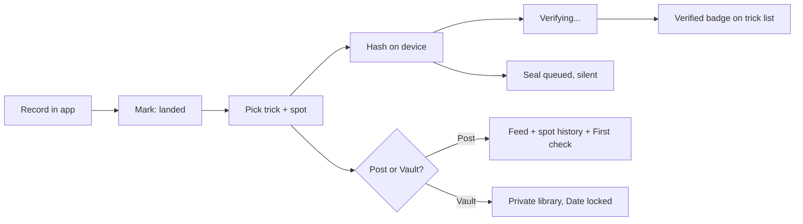

# Claimed: Product Requirements

*Verified. First. Vault. The clip is the proof, and soon it will not be.*

| Field | Value |
|-------|-------|
| **Status** | Draft for review |
| **Owner** | Wes Huber |
| **Date** | September 2026 |
| **Feature name** | Claimed. Inside it riders see three things: Verified, First, Vault. "Sealed claim" stays the technical term for a commitment on-chain. |
| **Related** | [Architecture](/docs/features/claimed/architecture) · [Verification pipeline](/docs/features/claimed/verification-pipeline) · [Formal spec](/docs/features/claimed/formal-spec) · [ADR-004](/docs/architecture/adrs/midnight-claimed) |

:::info[One paragraph]
Skaters already have proof. It is called the clip. This feature keeps that true in a world where AI clips are about to become indistinguishable from real ones, and it turns three things skaters already care about into product: a **Verified** badge for a trick you actually landed, **First** for who did it first at a spot or in a crew, and a **Vault** that locks the date on footage you are saving for an edit. Underneath, every clip recorded in the app is hashed on the device and sealed as a commitment on the Midnight network. That is what makes the three words honest without anyone having to trust TrickBook, including TrickBook. Nobody using the app ever sees a wallet, a token, or the word Midnight.
:::

## 1. What skaters already care about

Four things, in the order a rider at a spot would rank them. None of them is a technology.

1. **"Pics or it didn't happen."** Proof already exists in skate culture, and it is the clip. Every trick list checkbox in TrickBook today is self-reported, which is why a public trick list would be met with "sure you did." The [user feedback log](/docs/feedback/user-feedback-log) has an early adopter asking for public trick lists and for people to get inspired by each other's tricks. The moment lists go public, the credibility question arrives with them.
2. **Firsts.** Not NBDs at a famous stair set. Firsts among homies: first to land it at the local park, first of the crew to get the rail, first this month. That is the same priority problem the pros have, at the scale normal people live in.
3. **The vault.** Anyone filming for an edit sits on clips, not just sponsored riders. The number of people saving footage for an Instagram part is far bigger than the number of people with a video part in a magazine. Posting early to prove you did it burns the clip.
4. **Realness.** This is the one that is about to matter to everyone, and it is why this feature exists now rather than in five years. Within a year, convincing AI clips of skate tricks will be everywhere. The clip stops being proof. A culture that prizes authenticity this hard will want a way to say "this is real footage, filmed here, that day." Whoever gives skaters that first gets to define what "real" means in skating once the clip alone no longer settles it.

The design consequence is simple and it shapes everything below: **the value lives in the badge, the first, and the vault. The chain is plumbing that keeps those three honest.** It is invisible by design, and it ships silently underneath the features riders can see.

## 2. What the rider sees

| Feature | What it says | What backs it | Who wants it |
|---------|--------------|---------------|--------------|
| **Verified** | "Landed. Recorded with TrickBook on this phone, the motion matches the trick, landing detected." | In-app capture, device attestation, trick and landing recognition | Everyone with a public trick list, and everyone looking at one |
| **First** | "First at this spot." "First in your crew." "First this month." With a date nobody can argue with. | The block the sealed commitment landed in, plus spot trick history | Homies, local scenes, anyone running a challenge |
| **Vault** | "Saved. Date locked. Post it when you are ready." | Private clip library, the sealed commitment, reveal on publish | Anyone filming for an edit or a part |

Copy rules: Verified and First are the only words on a badge. Never "sealed," "on-chain," "proof," or "Midnight" in rider-facing copy. The settings screen has one honest paragraph about how it works and what TrickBook holds, for the riders who want to know.

## 3. Why a chain at all

Most of what riders see could be built with a database, and the verification pipeline does most of the work of the Verified badge on its own. The chain adds three things a database cannot:

- **TrickBook cannot backdate or fake a claim, including for its own owner.** Riders do not feel this day to day. Contests, magazines, and any dispute that leaves the app do.
- **The vault works without trusting TrickBook with what the clip means.** The commitment is public; the trick, the spot, the date, and the clip are not, until the rider reveals.
- **The record outlives the app.**

Alternatives, briefly. A signed row in our database proves nothing to anyone who does not trust TrickBook. A plain hash on Bitcoin or in Cardano transaction metadata gives a timestamp but ties every claim to a public account and cannot prove "I sealed this trick at this spot before that date" without publishing the clip. Midnight gives the timestamp, hides everything else, and lets the rider prove statements about the sealed claim without disclosing it. The full comparison is in [ADR-004](/docs/architecture/adrs/midnight-claimed).

Because sealing costs almost nothing once in-app capture exists, it runs from the first day capture ships, silently. Riders get the visible features first; the chain accumulates real claims underneath from day one.

## 4. The problem today

- Trick list completions are checkboxes. There is no way to back one with a clip, and no way for anyone else to tell a real one from a wishful one.
- Spot trick history, the registry of tricks done at each spot, has a `verified` flag that only an admin can set. That is one person, by hand.
- The mobile app cannot record video. Clips are uploaded on the website from a file picker, which means nothing about a clip's origin can be trusted.
- There is no way to hold a clip privately with its date locked. Riders choose between posting early and losing the date.

TrickBook has 315 registered users, 6,261 spots, and 504 trick lists as of September 2026. This is designed to be useful at that scale and to still make sense at 100x.

## 5. Users and jobs to be done

| User | Job | Today | With this feature |
|------|-----|-------|-------------------|
| Park skater with a public trick list | Have my landed tricks believed | A checkbox and my word | Verified badge on the trick |
| Crew or local scene | Know who got it first at our spot | Argue | First on spot history, with a date |
| Rider filming for an edit | Sit on clips without losing the date | Trust and hope | Vault, reveal when the edit drops |
| Filmer | Prove the clip is mine and unedited from capture | Metadata anyone can rewrite | Co-sign the same clip from my phone |
| Anyone watching a clip in 2027 | Know it is real | Nothing | Verified, with "recorded in app" visible |
| Media and contests | Confirm a claimed date and authorship | Ask around | A priority proof, no clip required |
| TrickBook admin | Verify spot history submissions | Manual flag | Evidence tiers replace the flag for most entries |

## 6. Goals

1. A rider who records a trick in the app and lands it gets a Verified badge on their trick list without doing anything else, and without a wallet, seed phrase, or token balance.
2. Firsts at a spot and within a crew are computed from sealed dates and shown on spot history and in the homies feed.
3. A rider can keep a clip in the Vault with its date locked and reveal it later, and nothing about the clip is visible on-chain until they do.
4. Each sealed claim can be revealed at most once, and only by the rider who sealed it.
5. A rider can prove a claim existed by a specific date without revealing which claim it is.
6. The contract, the sealing service, and a minimal demo are open source in their own repository, with TrickBook as the first integrator.

## 7. Non-goals

- **Proving that a trick physically happened.** No chain can do that. The verification pipeline produces evidence and confidence, never proof. This document says so everywhere it matters.
- **User-held wallets in v1.** Riders never see Midnight. TrickBook's backend holds the app wallet and generates proofs. On-device proving is a v2 track.
- **Tokens, rewards, or NIGHT payouts to riders.** Out of scope.
- **Replacing the feed.** Verified, First, and Vault attach to capture and to existing posts. They are not a new content surface.
- **Content moderation.** Reveals go through the same moderation as feed posts.

Instructor/tutorial attribution, expanded rider and instructor profiles, private mastery credentials, and outcome-based creator incentives are specified separately in [Instructor Outcomes](/docs/features/instructor-outcomes). That feature consumes eligible Claimed results; it does not weaken or reinterpret the evidence tiers defined here.

## 8. Success metrics

Rider-facing first, plumbing second.

| Metric | Target at 90 days after launch | Why |
|--------|-------------------------------|-----|
| Trick list completions backed by a Verified clip | 30% or more of new completions | Whether Verified becomes the default meaning of "landed" |
| Spot firsts claimed per week | 10 or more | Whether First is a game people play |
| Clips saved to the Vault per week | 15 or more | Whether the embargo case is real at this scale |
| Reveal rate within 180 days | 30% or more | Vaulted clips are being used, not hoarded |
| Median time from tap to Verified badge | Under 60 seconds | Riders will not wait at the spot |
| Sealed claims per week (plumbing health) | Equal to in-app captures marked landed | Sealing is silent, so its only success metric is that it never lags capture |
| Verification tier 3 or higher on reveals | 60% or more | The evidence pipeline is producing usable badges |
| Disputes resolved by priority proof | Tracked, no target | New capability, measure before targeting |

Instrumentation: every state transition in the claim lifecycle emits an analytics event through the existing `analytics_events` collection, tagged with claim id and tier.

## 9. User stories and acceptance criteria

### US-1 Verified landed

*As a rider, when I record a trick in the app and mark it landed, I want it to show as Verified on my trick list so people believe it.*

- Given the rider recorded the clip with the in-app camera and marked it landed with a trick and a spot, when the capture finishes, then the clip is hashed on the device, the seal is queued silently, and the trick shows "Verifying."
- Given device attestation passes and the trick and landing checks pass, when verification completes, then the trick shows the Verified badge on the rider's list and on the public list if the list is public.
- Given a check is inconclusive, when verification completes, then the trick shows "Recorded in app" without Verified, and the rider is told which check did not pass and why.
- Given the clip was imported from the camera roll, when the rider marks it landed, then it can be attached to the trick but never earns Verified, and the UI says why.

### US-2 First among homies

*As a rider, when I land something at a spot, I want to know if I was first, at the spot or in my crew.*

- Given a Verified clip with a spot, when the seal is confirmed, then spot trick history gains an entry with the trick, rider, and sealed date, and the entry shows "First at this spot" if no earlier sealed entry exists for that trick and spot.
- Given the rider's homies, when the entry is created, then it shows "First in your crew" if no homie has an earlier sealed entry for that trick at that spot.
- Given two riders seal the same trick at the same spot, when their entries are compared, then the earlier block wins, and the device clocks are not consulted.

### US-3 Vault

*As a rider filming for an edit, I want to keep the clip private with the date locked and post it later.*

- Given a Verified capture, when the rider chooses Save to Vault instead of Post, then the clip stays in the rider's private library, the badge shows "Date locked" with the sealed block, and nothing appears in the feed or spot history.
- Given the device is offline, when the rider saves to the Vault, then the hash and metadata are queued locally and sealed on reconnect, and the badge says "Queued" with the local capture time, never "Date locked."
- Given a vaulted clip, when the rider later posts it, then the reveal runs and the spot history entry is created with the original sealed date, not the post date.

### US-4 Reveal on publish

*As a rider, when my part drops, I want to reveal so the spot's trick history shows I did it first.*

- Given a sealed claim, when the rider publishes the clip and chooses Reveal, then a proof is generated that the clip hash, trick, spot, and capture time match the sealed commitment, and the reveal is recorded on-chain with a nullifier.
- Given a claim already revealed, when a reveal is attempted again, then it is rejected with "claim already revealed" and nothing changes on-chain.
- Given a successful reveal, when spot trick history is viewed, then the entry shows the rider, trick, sealed date, and evidence badges from the verification pipeline.

### US-5 Priority proof without reveal

*As a rider in a dispute, I want to prove I sealed this trick at this spot before a date without showing the clip.*

- Given a sealed claim, when the rider requests a priority proof for a date D, then the proof discloses only trick, spot, and a historic tree root that was current at or before D, and verifies without revealing the clip hash, the capture time, or which leaf is the rider's.
- Given several priority proofs for the same claim, when they are compared on-chain, then they cannot be linked to each other or to the eventual reveal by anyone other than the rider.

### US-6 Filmer co-sign

*As a filmer, I want to attach my own sealed commitment to the same clip so the footage is attributed to both of us.*

- Given a rider's claim, when the filmer seals from their device with the same clip hash, then both commitments exist independently and the reveal of one does not reveal the other.

### US-7 Admin evidence review

*As an admin, I want to see the evidence behind a Verified badge instead of trusting my gut.*

- Given a Verified or revealed claim, when an admin opens it, then each evidence check shows its verdict, confidence, model version, and the raw signals that produced it, and the admin can override the tier with a reason.

## 10. Requirements

### Functional

| ID | Requirement |
|----|-------------|
| FR-1 | The mobile app gains in-app video capture (today it only picks images). Capture produces a hash chain over recorded segments so a re-encoded file cannot reproduce the hash. |
| FR-2 | Marking a capture as landed attaches it to a trick on the rider's list and starts verification and sealing without any further rider action. |
| FR-3 | The Verified badge on a trick requires tier 1 (attested in-app capture) and tier 3 (trick and landing) from the verification pipeline. Tier 2 must not have failed. |
| FR-4 | First at a spot and First in a crew are computed from sealed block order, never from device time, and shown on spot trick history and in the homies feed. |
| FR-5 | A seal request contains: commitment, encrypted claim record for the rider, device attestation token, capture sidecar hash. It never contains the clip. |
| FR-6 | The backend sealing service holds the app wallet, submits `seal`, and stores the claim record keyed by commitment. Seal requests are idempotent on commitment. |
| FR-7 | Vault clips live in the rider's private library with the sealed block shown; nothing about them is visible to other riders. |
| FR-8 | Reveal generates a zero-knowledge proof against the current or a historic tree root and submits `reveal` with a nullifier. A reveal creates or updates the spot trick history entry with `source: "claimed"` and the original sealed date. |
| FR-9 | Priority proof generates a proof against a rider-chosen historic root and discloses only trick, spot, and root, with a public verification link. |
| FR-10 | The verifier service can anchor an attestation (tier bitmask) to a commitment on-chain, and only the verifier can. |

### Privacy

| ID | Requirement |
|----|-------------|
| PR-1 | On-chain state before reveal contains only the commitment leaf. No rider id, no trick, no spot, no time. |
| PR-2 | Two claims by the same rider are unlinkable on-chain. Each commitment uses a fresh salt. |
| PR-3 | A reveal does not identify which leaf was revealed; membership is proved by Merkle path, only the root is disclosed. |
| PR-4 | Evidence records (device attestation, model outputs, GPS) stay off-chain in TrickBook's database and are shown only to the rider and admins, with the tier badge public after reveal. |
| PR-5 | The rider secret is generated on the device, stored in the OS keychain, and sent to the backend only for proof generation over TLS (v1 custodial proving). It is never logged. |
| PR-6 | Verified and First badges never expose the evidence behind them to other riders, only the verdict. |

### Security

| ID | Requirement |
|----|-------------|
| SR-1 | Commitments and nullifiers use domain-separated hashes (`tb:claim:` and `tb:nul:` prefixes). |
| SR-2 | The verifier's authority is a sealed ledger field set at deploy and checked with hash-based authentication. |
| SR-3 | All circuit inputs are validated with assertions before any ledger write; assertion messages never include private values. |
| SR-4 | The sealing service serializes contract calls per wallet (the private state provider takes an exclusive lock per operation). |
| SR-5 | Device attestation is verified server-side (App Attest on iOS, Play Integrity on Android) before a claim can earn tier 1, and therefore before a trick can be Verified. |

### Non-functional

| ID | Requirement |
|----|-------------|
| NF-1 | Verified badge under 60 seconds p50 from the end of capture, under 3 minutes p95. Sealing runs in parallel and does not gate the badge. |
| NF-2 | Seal confirmation under 90 seconds p50, under 4 minutes p95, measured queue to block inclusion. |
| NF-3 | Proof generation for reveal under 60 seconds on the backend proof server (vouched measured about 24 seconds on a laptop devnet). |
| NF-4 | The sealing service degrades gracefully: if Midnight is unreachable, claims queue and the Vault badge says "Queued," never "Date locked." Verified does not depend on the chain and keeps working. |
| NF-5 | Cost per claim in DUST is measured on preprod before mainnet and reported in the monthly review. |

## 11. Experience

### Capture, land, Verified

The rider's only decisions are the ones they already make: which trick, which spot, post or keep. Verified appears on its own. Sealing never appears at all.

Copy, first draft:

- Verifying: "Checking the clip. Usually under a minute."
- Verified: "Landed. Recorded with TrickBook on this phone."
- Recorded in app, not Verified: "Recorded in app. We could not confirm the trick from this angle, so no Verified badge. Your homies can still see the clip."
- Import: "Imported clips can be attached, but only clips recorded in the app can be Verified."

### First

On the spot page and in the homies feed: "First at this spot" and "First in your crew" with the date. Tapping shows the sealed date and, for the curious, one line: "Date locked on Midnight at block N. Nobody, including us, can change it."

### Vault

A private tab in the rider's library. Each clip shows "Date locked" with the sealed date, or "Queued" if the seal has not confirmed. Post it later and the spot history entry carries the original date.

### Reveal and priority proof

Reveal is a step in the existing publish flow, on by default when the clip has a sealed claim. Priority proof is a power-user action from a vaulted clip: pick a date, get a shareable verification link that shows trick, spot, and "sealed no later than block N, which was on date D," with a Verify button that re-checks the proof.

## 12. Scope by milestone

Ordered so that the value riders can see ships first and sealing runs silently underneath from the first day capture exists.

| Milestone | Deliverable | Exit criterion |
|-----------|-------------|----------------|
| M0 Spec | This PRD, the [formal spec](/docs/features/claimed/formal-spec) with a model-checked state machine, the threat model | Reviewed; TLC run passes on the spec |
| M1 Capture and Verified | In-app camera, on-device hashing, device attestation, tiers 1 and 2 of the verification pipeline, the Verified badge on trick lists behind a feature flag | Ten Verified tricks from real riders on iOS TestFlight |
| M2 Contract and silent sealing | Compact contract ported from vouched, e2e on the standalone devnet, sealing service with custodial wallet on preprod, every in-app capture marked landed is sealed with no rider-facing change | Seal, double-reveal rejected, priority proof, attest all pass in CI; every M1 capture has a claim |
| M3 First | Spot trick history entries created from Verified captures, First at spot and First in crew computed from block order, homies feed surface | Feature flag on for all users; first disputes settled by block, not argument |
| M4 Vault | Private library with Date locked, offline queue, reveal on later post carrying the original date | Twenty vaulted clips from real riders |
| M5 Trick and spot recognition | Tiers 3 and 4: reference-clip similarity, pose-based landing check, spot matching against galleries | Measured precision and recall on a labeled TrickBook clip set, published before the badge tightens |
| M6 Reveal and priority proofs | Reveal in the publish flow, priority proof share link, filmer co-sign | Used in at least one real dispute or media request |
| M7 Open source | Contract, service, and demo in a public repo; awesome-dapps pull request; demo video of real riders | PR open, video published |

## 13. Risks

| Risk | Impact | Mitigation |
|------|--------|------------|
| Riders do not care about Verified because nobody's list is public yet | Badge without an audience | Ship public trick lists alongside M1; the feedback log already asks for them |
| Trick recognition accuracy in the wild (fisheye lenses, night, occlusion) | Wrong badges lose trust, which the product principles say is sacred | Ship recognition as a signal with confidence, never a verdict; "Recorded in app" is the honest fallback; admins can override |
| Custodial proving means TrickBook sees rider secrets | Trust concentrated in TrickBook for v1 | Secrets encrypted at rest, never logged; publish the trust model plainly; v2 on-device proving |
| Midnight proof latency and DUST cost at scale | Sealing lags capture or costs add up | Sealing is async and never gates Verified; batch seals; measure on preprod; cap per-user seals per day |
| App Store review of a "blockchain" feature | Rejection or delay | No token, no purchase, no wallet UI, no chain vocabulary in the app; it is a timestamping feature; Apple's guidelines permit that |
| App Attest and Play Integrity in Expo | Native module work | Config plugin or a bare native module; Android keeps "Recorded in app" without Verified until Play Integrity lands |
| Small user base makes metrics noisy | Hard to know if it works | Report absolute counts and qualitative feedback in the monthly review |

## 14. Open questions

1. **Names.** The feature is Claimed. Verified, First, and Vault are proposals for the three things inside it. Verified may collide with a future identity-verification meaning. Decide before M1 copy is written.
2. **Should imports be sealable at all?** They cannot be Verified, but sealing them gives the Vault benefit to existing footage. Current answer: allow in the Vault, badge clearly, never Verified.
3. **Who can see a rider's Vault count before reveal?** Proposal: only the rider. A public count leaks activity patterns.
4. **Retention for unrevealed claims.** Proposal: forever on-chain (it is a 32-byte leaf), off-chain claim record kept while the account exists.
5. **Mainnet or preprod at launch.** Preprod costs nothing but proves nothing durable; mainnet requires DUST. Proposal: preprod through M6, mainnet at M7 with a migration that re-seals existing claims and keeps the original capture timestamps in the record.
6. **First in crew when homies are added later.** Proposal: First is computed at the time of viewing, so it can change as a crew grows. Alternative: freeze at seal time. Needs a decision before M3.

## 15. For reviewers from the Midnight ecosystem

This is the TrickBook integration of an open-source Claimed contract that will be submitted to the Midnight awesome-dapps repository. The pieces that matter for that review: a real use case with real users on a live App Store app, a privacy feature that is not "everything disclosed," a README that builds from a fresh clone, and a demo video showing real riders. The things most worth a careful read are the historic-root construction for priority in [Architecture](/docs/features/claimed/architecture), the invariants and TLA+ model in the [formal spec](/docs/features/claimed/formal-spec), and the honesty boundary in the [verification pipeline](/docs/features/claimed/verification-pipeline): the chain proves who committed to what and when, never that the trick happened.
