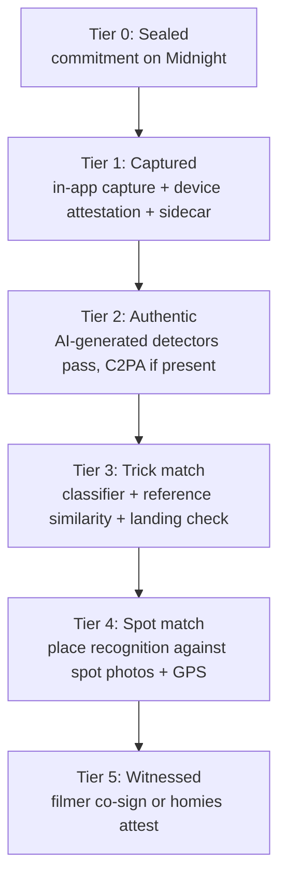

# Was the trick really landed?

The chain proves commitment and time. It cannot prove that a clip shows a real person landing a real trick at a real spot. This page is the honest answer to four questions:

1. Can a computer vision model tell that the trick was landed?
2. How do we know the video is not AI-generated and is authentic user content?
3. Can we match the video to the photos we already have of the spot?
4. Can we use other videos of the same trick to confirm it is the trick being claimed?

Short version: yes to all four as **evidence**, no to all four as **proof**. The design treats every check as a signal with a confidence and a known failure mode, stacks them into tiers, and shows the tiers as badges. The strongest defense against fake video is not detecting fakes after the fact, it is capturing provenance at the moment of recording.

## 1. Evidence tiers

| Tier | Badge | What it establishes | What it does not establish |
|------|-------|---------------------|----------------------------|
| 0 | Sealed | Someone holding the rider secret committed to this exact file by block N | Anything about the file's contents |
| 1 | Captured | The file came out of the TrickBook camera on a genuine app instance on a real device, and the hash was computed before the bytes left the encoder | That the camera was pointed at something real (it could be filming a screen) |
| 2 | Authentic | No detector flagged the clip as synthetic; provenance metadata, if the OS provides it, is intact | That the clip is real. Detectors miss new generators |
| 3 | Trick match | The motion in the clip is consistent with the claimed trick, and a landing is detected | That the trick was clean, or that the label is exactly right for variations |
| 4 | Spot match | Keyframes match the spot's photo gallery and the capture GPS is within range | Uniqueness of the spot; many parks look alike |
| 5 | Witnessed | A second device sealed the same clip hash, or homies attested | Anything beyond what those people are willing to vouch for |

Tiers are a bitmask, not a ladder: a clip can be tier 4 without tier 3 if the trick classifier was inconclusive. The badge row shows exactly which checks passed.

## 2. Tier 1: provenance at capture

This is the layer that does most of the work, and it is the one TrickBook does not have today (uploads come from a file picker on the website; the mobile app cannot record video at all).

**Mechanisms**

- **In-app capture only.** The Captured badge is reserved for clips recorded by the TrickBook camera. Camera-roll imports can still be sealed (tier 0) but never earn tier 1. This single rule removes most of the attack surface, because an AI-generated file has to get into the camera pipeline somehow.
- **Segment hash chain during recording.** Each encoded segment is hashed as it is written and chained. The commitment is over the final chain value. An attacker who wants to substitute a synthetic clip has to do it inside the encoder pipeline on a device that passes attestation, not by swapping a file.
- **Device attestation.** iOS App Attest (DeviceCheck framework) produces a hardware-backed assertion that the request came from an unmodified TrickBook build on a genuine device. Android Play Integrity provides the equivalent verdict. The seal request carries the assertion; the backend verifies it with Apple or Google before granting tier 1. Both need native module work in Expo (a config plugin or a bare module); until Android has it, Android seals cap at tier 0.
- **Capture sidecar.** GPS fix and accuracy, accelerometer and gyroscope traces, wall clock and monotonic clock at start and end, camera id. The sidecar's hash is stored with the claim. Its contents feed tiers 2 and 4: a phone filming a screen has a motion trace that does not follow a skater, and its GPS is wherever the screen is.
- **C2PA Content Credentials where the OS provides them.** As of 2026, Pixel 10 signs captures by default with hardware-backed keys, Samsung signs only AI-edited images, and iPhone ships nothing (Apple is reported to be testing its own scheme in the iOS 27 beta). When a manifest exists, its hash is bound into the sidecar and its assertions are checked; a manifest declaring generative-AI actions fails tier 2 outright. Do not design around C2PA being present; treat it as a bonus signal that will grow.

**Known failure modes**

- Rooted or jailbroken devices with camera injection frameworks. Attestation raises the cost substantially; it does not make this impossible.
- Filming a screen that is playing a synthetic clip. Caught partially by the sidecar (no camera motion coherent with a moving subject), by moiré and refresh artifacts in tier 2, and by tier 4 (GPS does not match the spot).
- Clock manipulation on the device. Irrelevant to priority, which is established by block height, not the device clock.

## 3. Tier 2: is it AI-generated?

**Position.** Post-hoc detection is a negative signal only. A high synthetic probability blocks the higher tiers and flags the claim for review. A low probability never proves authenticity. Detectors are probabilistic, they lag each new generator by months, and they are adversarially fragile.

**Mechanisms, v1**

- **Commercial detector API.** Hive's AI-generated image and video detection runs two models (generated-content and deepfake). Reality Defender offers a developer API with a free tier of 50 detections per month, enough for TrickBook's current volume, and video coverage. Run one at reveal time, store the score and model version in the evidence record.
- **Watermark checks.** Google's SynthID detector only finds content generated by Google's own models; useful, narrow. Run it as a cheap extra.
- **C2PA manifest inspection** when present, per tier 1.
- **Sidecar consistency.** Segment count and durations match the file; monotonic clock delta matches the clip length; accelerometer variance is non-zero during a handheld recording.

**Mechanisms, v2 (research, not committed)**

- Physics plausibility for skateboarding: flight time versus apparent height, board rotation rate for flip tricks, motion blur consistent with the frame rate and shutter. These are cheap to compute from pose and board tracking (tier 3) and hard for generators to get right, but they need a labeled real-clip baseline first.

**What we tell riders.** "Captured" means TrickBook's own camera recorded it. "Authentic" means no detector we run thinks it is synthetic. Neither is a guarantee, and the copy says so.

## 4. Tier 3: is it the claimed trick, and was it landed?

Three independent methods, combined. Each returns a verdict and a confidence; the tier passes when at least two agree with the claimed trick and the landing check passes.

### 4a. Closed-set classifier

Fine-tune a video action-recognition backbone (VideoMAE v2 or an I3D-style two-stream model) on labeled trick clips. Prior work shows the shape of the problem: SkateboardML separated ollies from kickflips on about 220 clips with a CNN plus LSTM; SkateboardAI assembled the first multi-class dataset from social media with 15 fundamental classes (ollie, kickflip, shuvit, hardflip, treflip, impossible, boardslide, 50-50, and so on); an I3D plus audio two-stream approach exists on GitHub. Accuracy on canonical tricks filmed normally is workable; on stance variations, switch, nollie, and fisheye footage it drops. TrickBook has its own labeled data: feed posts already carry a `tricks` array, spot trick history has trick names with video, and Trickipedia has tutorial videos per trick. That is the fine-tuning set.

Output: a probability over trick classes. Verdict passes if the claimed trick is in the top 2 with probability above a threshold set on a held-out TrickBook set.

### 4b. Reference similarity (the "other videos of the same trick" method)

Embed the clip with a video encoder (VideoMAE, InternVideo, or per-frame CLIP pooled over time) and compare against a reference bank: Trickipedia tutorial clips and previously verified spot trick history clips, grouped by trick name. Nearest-neighbor over the bank gives a trick label and a similarity score. Few-shot prompting of a video-capable multimodal model with the reference clips and the Trickipedia definition gives a second opinion and a human-readable explanation for the admin view.

Caveat that decides the design: generic video embeddings capture scene, camera style, and lens as much as they capture the trick. A fisheye clip of a kickflip can sit closer to a fisheye clip of a heelflip than to a long-lens kickflip. So the reference bank is built from **pose and board tracks** (4c), not raw pixels, for the actual decision, with pixel embeddings used only as a fallback.

### 4c. Pose and board tracking, landing detection

This is the method that answers "was it landed" rather than "which trick".

1. **Pose.** 2D human pose per frame (RTMPose or ViTPose class models). Track the rider.
2. **Board.** Skateboard detection per frame (COCO includes a skateboard class, so an off-the-shelf detector is a starting point; fine-tune on TrickBook clips). Track the board, estimate its orientation change over time.
3. **Phases.** Segment the clip into approach, pop, airborne, landing, roll-away using foot-to-board distance and board height.
4. **Trick signature.** Flip tricks differ by board rotation axis and count; shuvits by yaw; grinds and slides by board-to-obstacle contact over time. Compare the signature to the claimed trick's expected pattern.
5. **Landed.** Both feet re-contact the board, the board is wheels-down, the rider stays upright, and roll-away lasts at least half a second without a fall or a foot down. Sketchy landings (one foot down, hand down) are reported as such rather than failed.

Failure modes: occlusion, extreme fisheye, night footage, long-lens footage where the board is a few pixels, filmer following on a board (camera motion). Report "inconclusive" rather than "fail" when tracking quality is below a threshold.

### Combining

| Classifier | Similarity | Landing | Tier 3 verdict |
|-----------|-----------|---------|----------------|
| claimed trick | claimed trick | landed | pass, high confidence |
| claimed trick | other | landed | pass, low confidence, flag label |
| other | other | landed | fail (wrong trick), keep landing evidence |
| any | any | not landed | fail |
| inconclusive | inconclusive | inconclusive | inconclusive, no badge, no penalty |

Every verdict stores model name and version. When a model is upgraded, old evidence is re-run in the background and badges can change; the rider is notified if a badge is removed.

## 5. Tier 4: is it the claimed spot?

TrickBook has photo galleries for its spots: Google Places photos cached to S3, user-submitted photos, and the spot's `imageURL`. That is a visual place recognition problem.

1. **Keyframes.** Sample frames from the approach and roll-away phases, where the background is most visible and least motion-blurred.
2. **Global retrieval.** Compute a place descriptor per keyframe (DINOv2 features with an aggregation such as NetVLAD, CosPlace, or AnyLoc-style pooling). Compare against the claimed spot's gallery and against the galleries of spots within a few hundred meters, so a near-neighbor cannot be mistaken for the claimed one.
3. **Local verification.** For the top gallery matches, run local feature matching (SuperPoint plus LightGlue) and geometric verification (RANSAC inliers on a fundamental matrix or homography). Inlier count is the score.
4. **GPS.** The capture sidecar's fix must fall within the spot's radius plus its reported accuracy. A missing fix is inconclusive, not a fail; a fix at a different city is a fail.
5. **Verdict.** Pass when the claimed spot is the top match with local verification above threshold and GPS agrees, or when GPS agrees and there is no competing spot nearby.

Where it works: street spots with distinctive architecture, ledges, stair sets, handrails. Where it does not: generic skatepark bowls and flat ground. Night clips and fisheye lenses reduce recall. The design accepts this and lets tier 4 be absent without penalizing the claim.

Side benefit: the same pipeline flags gallery photos that do not match the spot at all, which the existing photo-cleanup scripts do by hand today.

## 6. Tier 5: witnesses

- **Filmer co-sign.** A second sealed commitment over the same clip hash from another device and rider secret. On reveal, both are shown. This is the strongest human signal and the cheapest to build, it reuses the seal path.
- **Homies attest.** After reveal, homies who were there can attest. Optional zero-knowledge variant: a homie proves membership in the rider's homies set without revealing which homie, the pattern used by anonymous membership boards on Midnight. Not in v1.
- **Community upvotes** exist already on spot trick history and stay as they are; they are not a tier.

## 7. Evidence record and the on-chain anchor

Everything above lives off-chain in `claim_evidence` (see [Architecture](./architecture#8-data-model)). The verifier service reduces the record to a tier bitmask and anchors it on-chain with `attest(commitment, tiers)`. That gives selective disclosure of "verified at tiers 1, 3, 4" without revealing GPS traces, model outputs, or who the witnesses were. Anyone can check the attestation against the commitment; only TrickBook can create one, enforced in the circuit.

## 8. What each badge is allowed to claim

Copy rules, because a wrong badge costs more trust than no badge.

| Badge | Allowed claim | Not allowed |
|-------|---------------|-------------|
| Sealed | "Sealed on Midnight at block N" | "Verified", "Proven" |
| Captured | "Recorded with the TrickBook camera on a verified device" | "Real", "Not AI" |
| Authentic | "No synthetic-media detector flagged this clip" | "Confirmed real" |
| Trick match | "Motion consistent with a [trick]; landing detected" | "Confirmed [trick]" |
| Spot match | "Matches photos of [spot]" | "Filmed at [spot]" |
| Witnessed | "Co-signed by [n] riders" | anything about what they saw |

## 9. Build order

1. Tier 1 and the evidence record schema (M1). This is where the product value and the security live, and it is what the Verified badge stands on.
2. Tier 2 with a commercial detector and sidecar consistency (M1). One API call, one afternoon of integration.
3. Tier 4 spot matching (M5). We already own the gallery data; the models are off the shelf.
4. Tier 3 (M5). Start with reference similarity over pose tracks and the landing heuristic; add the fine-tuned classifier once the labeled TrickBook set is large enough to hold out a test split. Measure and publish accuracy before turning the badge on.
5. Tier 5 co-sign (M6). Reuses the seal path.

## 10. References

- SkateboardAI dataset and benchmark, arXiv 2311.11467: https://arxiv.org/abs/2311.11467
- SkateboardML, ollie vs kickflip: https://github.com/LightningDrop/SkateboardML
- Skateboard trick classification with I3D plus audio: https://github.com/michaelnation26/skateboard_trick_classification
- Hive AI-generated image and video detection: https://docs.thehive.ai/docs/ai-image-and-video-detection
- Reality Defender developer API: https://www.realitydefender.com/insights/reality-defender-launches-free-access-to-deepfake-detection-api
- Content Credentials (C2PA), official site: https://contentcredentials.org/
- Which phones sign captures with Content Credentials in 2026: https://www.lumethic.com/en/articles/smartphones-c2pa-content-credentials
- Midnight smart contract security guidance: https://docs.midnight.network/compact/smart-contract-security
