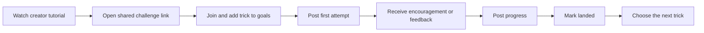

# Creator Progress Challenges

**Status:** Proposed MVP · **Owner:** Product/Growth · **Initial sport:** Skateboarding

Creator Progress Challenges turn a one-way tutorial into a shared progression space. A creator publishes or links a tutorial, TrickBook creates a challenge, and riders post attempts from first try through landing.

The product promise is:

> Turn your tutorial into a challenge where followers can show their attempts and progress.

The objective is not to replace Instagram as a polished content feed. TrickBook should own the useful, supportive space between watching a tutorial and landing the trick.

## Why This Fits TrickBook

Tutorial content usually ends at `watch` or `save`. The creator rarely sees what viewers tried, where they struggled, or whether the lesson worked. Riders also lack a natural place for imperfect attempts.

The challenge loop is:



This reuses TrickBook's existing strengths: trick records and progression, trick lists, profiles, feed video posts, comments, reactions, and deep links.

## MVP Product Boundary

The MVP adds a challenge layer over existing feed and progression systems. It is not an entirely separate social product.

### Included

- Admin-created challenges attributed to an approved creator
- A stable public share link and mobile deep link
- Tutorial URL, featured trick, instructions, creator attribution, and optional dates
- Join/leave action
- Optional addition of the featured trick to a rider's active TrickList
- Submission posts labeled `Trying`, `Progress`, or `Landed`
- A challenge detail page containing participants and linked submission posts
- Creator and participant comments/reactions using existing feed behavior
- Participant, submission, and landed counts
- Basic reporting/moderation using existing feed controls
- Growth attribution from the shared link through signup and first submission

### Explicitly Not Included in MVP

- Self-service creator dashboard
- Cash prizes, judging, brackets, voting, or leaderboards
- Winner-takes-all competition mechanics
- Automatic verification that a trick was landed
- Creator payouts, affiliate accounting, or contracts
- Direct Instagram API ingestion
- Required creator feedback on every clip
- Complex teams, seasons, streaks, or multi-round competitions

Avoiding competition mechanics is intentional. The first version should reward participation and visible improvement, not only the best skater.

## User Experience

### Creator Flow

1. TrickBook and the creator agree on one accessible trick and a 7–14 day pilot.
2. TrickBook staff creates the challenge from an internal/admin form.
3. The creator receives a preview and one shareable link.
4. The creator publishes their tutorial and challenge CTA on Instagram.
5. The creator may react to or comment on submissions but is not obligated to coach every rider.
6. TrickBook sends a short results summary after the challenge.

The share package should contain:

- Primary link: `https://thetrickbook.com/challenges/{slug}`
- Mobile deep link: `trickbook://challenges/{id}`
- Suggested CTA copy
- Story asset or QR code
- Clear dates and expectations
- A statement that attempts and progress are welcome

### Rider Flow

1. Open the creator's link.
2. See the creator, tutorial, featured trick, challenge prompt, dates, and recent attempts before being asked to act.
3. Tap **Join Challenge**.
4. Sign in or create an account only when joining or posting.
5. Optionally add the trick to a new or existing TrickList.
6. Post a clip with one progress label:
   - **Trying** — first attempts or getting started
   - **Progress** — improvement, question, or milestone
   - **Landed** — rider considers the trick complete
7. Return to see responses and post another update.

The composer should default to supportive language such as “Share where you are today.” It should not imply that only landed clips belong.

### Challenge Page

The page should show, in order:

1. Creator identity and attribution
2. Challenge title, featured trick, dates, and status
3. Creator tutorial and original Instagram link
4. Join or post-progress action
5. Rider's personal status and prior submissions
6. Community submissions, filterable by `Trying`, `Progress`, and `Landed`
7. Participant, submission, and landed counts
8. Rules, safety note, and report action

## Challenge Lifecycle

| Status | Meaning |
|---|---|
| `draft` | Internal setup; unavailable from the public link |
| `preview` | Creator can review through an unlisted link |
| `scheduled` | Approved and waiting for `startsAt` |
| `active` | Riders can join and submit |
| `ended` | New submissions are closed; content remains viewable |
| `archived` | Removed from discovery but preserved by direct link |

An admin may pause submissions independently of lifecycle status when moderation or safety requires it.

## Proposed Data Model

### `challenges`

```js
{
  _id: ObjectId,
  slug: "alex-ollie-progress",
  title: "Alex's Ollie Progress Challenge",
  description: "Post the process—not only the make.",
  sport: "skateboarding",
  trickId: ObjectId,
  creatorUserId: ObjectId | null,
  creator: {
    name: "Alex Schreiber",
    handle: "@runwildalex",
    avatarUrl: "https://...",
    instagramUrl: "https://instagram.com/..."
  },
  tutorialUrl: "https://instagram.com/reel/...",
  coverImageUrl: "https://...",
  status: "active",
  startsAt: ISODate,
  endsAt: ISODate,
  submissionLabels: ["trying", "progress", "landed"],
  createdBy: ObjectId,
  createdAt: ISODate,
  updatedAt: ISODate
}
```

Embedded creator attribution allows a pilot before every creator has a TrickBook account. If the creator later claims an account, `creatorUserId` becomes the authoritative identity.

### `challenge_participants`

```js
{
  challengeId: ObjectId,
  userId: ObjectId,
  joinedAt: ISODate,
  status: "joined" | "landed" | "left",
  trickListId: ObjectId | null,
  landedAt: ISODate | null,
  source: "instagram",
  campaign: "runwildalex-ollie-pilot"
}
```

Create a unique index on `{ challengeId: 1, userId: 1 }`.

### Existing `feed_posts` Extension

```js
{
  challengeId: ObjectId,
  challengeProgress: "trying" | "progress" | "landed"
}
```

Keep challenge submissions as normal feed posts. This preserves profiles, media playback, comments, reactions, visibility, and moderation without building a second content system.

## Proposed API

Public/auth-optional reads:

- `GET /api/challenges` — active and recent challenges
- `GET /api/challenges/:slug` — detail, aggregate counts, and current-user state
- `GET /api/challenges/:id/submissions` — paginated linked feed posts

Authenticated rider actions:

- `POST /api/challenges/:id/join`
- `DELETE /api/challenges/:id/join`
- Existing `POST /api/feed` accepts `challengeId` and `challengeProgress`

Admin actions:

- `POST /api/admin/challenges`
- `PATCH /api/admin/challenges/:id`
- `POST /api/admin/challenges/:id/publish`
- `POST /api/admin/challenges/:id/pause-submissions`

The backend must validate that the challenge is active, the linked trick belongs to the challenge's sport, and the progress label is allowed. Client-supplied creator attribution and aggregate counts must never be trusted.

## Link and Attribution Behavior

The web challenge URL is the canonical share target. It must:

- Render a useful preview for logged-out visitors
- Preserve UTM parameters through signup/login
- Open the installed app when supported
- Fall back to the web experience or appropriate app-store page
- Return the rider to the same challenge after authentication

Minimum tracked events:

- `challenge_link_opened`
- `challenge_join_started`
- `challenge_joined`
- `challenge_trick_added`
- `challenge_submission_started`
- `challenge_submission_published`
- `challenge_marked_landed`
- `challenge_creator_engaged`

Core pilot funnel:

`link opens → signups → joins → first submissions → repeat submissions → landed`

## Moderation and Safety

- Existing post visibility and report controls apply to submissions.
- Challenge pages must not promise direct creator feedback.
- Creators can be attributed without receiving moderation authority.
- Staff can remove a submission from the challenge while preserving normal account enforcement workflows.
- Every challenge includes a short safety note appropriate to the trick and terrain.
- Challenges aimed at beginners should avoid dangerous terrain, gaps, rails, or tricks whose prerequisite level is unclear.
- Youth participation continues to follow platform-wide privacy and safety rules.

## Pilot Operating Method

Use a manual concierge process for the first three challenges:

1. Select a warm creator with tutorial/progression fit.
2. Choose one beginner-accessible trick already represented cleanly in Trickipedia.
3. Agree on the tutorial, dates, CTA, and creator participation expectation.
4. Create the challenge in `preview` and send the unlisted link.
5. Publish after creator approval.
6. Monitor submissions daily for safety and response quality.
7. Encourage early posts from a small seed group so the page is not empty.
8. Close after 7–14 days and send the creator a results summary.
9. Interview the creator and at least three participating riders.

Recommended first pilot: an ollie progress challenge with the existing warm partner. The prompt should explicitly invite a first attempt, a practice update, and a final landing.

## Success Criteria

The MVP earns further investment when a small pilot demonstrates behavior, not reach alone.

Suggested initial thresholds:

- At least 20% of authenticated challenge visitors join
- At least 25% of joiners publish one submission
- At least 20% of submitters publish a second progress update
- At least 30% of submissions receive a comment or reaction
- Creator is willing to run or recommend a second challenge
- No unresolved high-severity moderation incidents

Thresholds are hypotheses. Record the actual baseline from the first pilot before treating them as durable targets.

## Implementation Sequence

### Phase 1 — Thin Pilot

- Challenge schema and admin create/edit endpoint
- Public challenge detail/share page
- Join action and attribution persistence
- Challenge fields on existing feed posts
- Filtered submission feed and aggregate counts
- Deep-link/auth return path
- Analytics events and moderation checks

### Phase 2 — Improve Retention

- Personal progress timeline
- Notifications for creator/community responses
- Reminder to post a progress update
- Creator recap and basic results view
- Challenge discovery within TrickBook

### Phase 3 — Creator Self-Service, Only After Validation

- Creator claim/verification
- Draft and preview management
- Self-service challenge creation
- Moderation helpers
- Reusable challenge templates
- Optional commercial terms or affiliate attribution

## Open Decisions

- Whether joining automatically creates a TrickList or asks the rider to select one
- Whether `Landed` also marks the underlying TrickList item complete
- Whether logged-out visitors can watch all submissions or only a preview set
- Whether ended challenges accept late progress updates
- How creator verification and attribution should work before self-service launches
- What notification volume creates encouragement without pressure

## Definition of Done for the First Pilot

The first pilot is ready when an admin can create a challenge, send one stable preview/share link, and a new rider can open that link, authenticate, join, upload a labeled progress clip, see it on the challenge page, receive an interaction, and return to post another update. Attribution must survive the full path, and staff must be able to pause or moderate submissions.

