# Events

Events is a planned multi-sport discovery and notification system for competitions, demos, community sessions, clinics, premieres, and live broadcasts.

## Product Goal

Events should answer three questions for every rider:

1. What is happening near me in the sports I care about?
2. Can I enter, attend, or watch it online?
3. How can I make sure I do not miss it?

TrickBook will initially own discovery, personalization, saving, and notifications. Registration, ticketing, waivers, payments, and streaming remain on the authoritative organizer or platform through clearly labeled external links.

:::info[Initial product boundary]
The first release is an event discovery and subscription layer, not a replacement for LiveHeats, federation registration systems, or ticketing providers.
:::

## User Experience

### Events Home

The default view is a chronological **For You** feed based on a rider's sports and location.

Primary controls:

- Location and search radius
- Date: this week, this weekend, next 30 days, or custom
- Sport and discipline
- Intent: enter, watch in person, watch online, or community
- Level: open, amateur, professional, youth, or all ages
- Registration state: open, opening soon, closing soon, free, or paid
- View: list, map, or calendar

Recommended discovery sections:

- Happening near you
- Registration closing soon
- Watch live this week
- From organizers you follow
- Major events in your sports

The default is a list, not a map. Event discovery is primarily time-sensitive; map and calendar views are secondary tools.

### Event Cards and Details

Cards include the date, local start time, sport, city/distance, organizer, trust badge, event status, and a state-specific action: `Register`, `Get tickets`, `Watch`, or `View details`.

The detail page presents information in decision order:

1. Title, status, date/time, venue, sport, and discipline
2. Sticky primary action and Save control
3. Eligibility, divisions, price, registration deadline, and spectator details
4. Schedule for multi-day events
5. Venue map and linked TrickBook Spot when available
6. Organizer, rules, and authoritative external links
7. Source attribution and last-checked timestamp
8. Similar nearby events

An event can expose multiple actions simultaneously, such as both `Register` and `Watch live`.

## Saving and Subscriptions

Two levels of notification intent are supported:

- **Save this event**: reminders and material changes for one event
- **Create event alert**: a reusable rule such as "Skateboarding contests within 100 miles of Philadelphia"

| Trigger | Default delivery |
|---|---|
| New matching event | Weekly digest; instant is opt-in |
| Registration opens | Instant |
| Registration closes | 72 hours before |
| Saved event | 7 days and 24 hours before |
| Saved event same-day reminder | 2 hours before |
| Time, venue, postponement, or cancellation | Immediate |
| Livestream starts | 10 minutes before or at start |

All notifications respect quiet hours. Recommendation notifications are grouped, and duplicate delivery across push and email is suppressed unless the user requests both.

## Data Pipeline

```mermaid
flowchart LR
    Source[Source connector] --> Raw[Raw snapshot]
    Raw --> Normalize[Normalize and classify]
    Normalize --> Geo[Geocode and link Spot]
    Geo --> Dedupe[Deduplicate and merge]
    Dedupe --> Quality[Trust and quality gate]
    Quality --> Publish[Publish event]
    Publish --> Match[Match subscriptions]
    Match --> Notify[Notify riders]
```



Each connector follows the same interface:

```js
fetchSince(cursor)
normalize(rawRecord)
getStableExternalId(rawRecord)
getSourceUpdatedAt(rawRecord)
```

Connectors may read licensed APIs, partner feeds, JSON, CSV, iCalendar, RSS/Atom, or schema.org Event markup. Page monitoring is used only when permitted and no structured integration exists.

## Canonical Event Model

```js
{
  _id,
  slug,
  title,
  description,
  sports: ['skateboarding'],
  disciplines: ['street'],
  eventKinds: ['competition'],
  intents: ['compete', 'spectate_in_person', 'spectate_online'],
  level: ['open', 'amateur', 'pro', 'youth'],
  status: 'scheduled',
  startAt,
  endAt,
  timezone,
  schedule: [],
  venue: {
    name, address, city, region, country,
    location: { type: 'Point', coordinates: [longitude, latitude] },
    spotId
  },
  organizer: { name, canonicalId, url, verified },
  participation: {
    registrationStatus, registrationOpensAt, registrationClosesAt,
    registrationUrl, priceText, divisions, eligibilityText
  },
  spectating: {
    inPerson, ticketUrl, ticketPriceText,
    streamStatus, streamUrl, broadcaster
  },
  sourceRefs: [{ sourceId, externalId, url, sourceUpdatedAt, fetchedAt, payloadHash }],
  sourceTrust,
  freshness: { lastVerifiedAt, staleAfter, changedAt },
  dedupeKey,
  approvalStatus,
  createdAt,
  updatedAt
}
```

Supporting collections:

- `eventSources`: connector configuration, licensing notes, cursors, polling cadence, and health
- `eventSourceRecords`: raw snapshots for replay and audit
- `eventSubscriptions`: user alert rules
- `eventSaves`: saved, attending, or competing relationships
- `eventChangeLog`: material changes used for notifications
- `eventNotificationJobs`: idempotent scheduled deliveries
- `organizers`: canonical organizer identities and source mappings

Events use GeoJSON and a `2dsphere` index. The optional `spotId` links an event venue to the existing spot catalog.

## API Plan

Public endpoints:

- `GET /api/events`
- `GET /api/events/map-pins`
- `GET /api/events/:slugOrId`
- `GET /api/events/:id/similar`
- `GET /api/events/calendar.ics`

Authenticated endpoints:

- `POST /api/events/:id/save`
- `DELETE /api/events/:id/save`
- `PATCH /api/events/:id/relationship`
- `GET|POST|PATCH|DELETE /api/event-subscriptions`
- `POST /api/events/submit`

Admin capabilities include source status, import review, duplicate resolution, event editing/publishing, and freshness monitoring.

Upcoming events use cursor pagination based on `startAt` and `_id`. Dates are stored in UTC alongside an IANA timezone.

## Deduplication and Trust

Exact identity uses `(sourceId, externalId)`. Cross-source candidates are scored using normalized title, start time, venue proximity, organizer, and matching action URLs.

Only high-confidence matches merge automatically. Ambiguous records enter an admin review queue. Authoritative organizer updates override aggregator copies for cancellations, date changes, and registration status.

User-facing source badges:

- Official organizer
- Registration partner
- Governing body
- Community submitted

Records without a title, date, sport, location or online designation, and authoritative URL are not published.

## Delivery Plan

### Phase 0: Validate Sources

- Confirm API and display rights with initial partners
- Build a source coverage matrix by sport and region
- Assemble 100 representative future events
- Validate that the canonical schema handles at least 95%

### Phase 1: Web MVP

- Event collections, indexes, public API, and admin CRUD/review
- Manual and structured imports plus one production connector
- `/events` and `/events/[slug]`
- Sport, date, location, radius, and intent filters
- Registration, ticket, and watch deep links
- Source trust, freshness, cancellation, and postponement states
- Impression, save, and outbound-action analytics

### Phase 2: Alerts

- Saves, event relationships, and alert rules
- Dedicated event notification preferences
- Matching engine and idempotent notification jobs
- Registration, change, reminder, and live-start alerts
- My Events and iCalendar export

### Phase 3: Scale Ingestion

- Reusable connectors and persisted cursors
- Backoff, health metrics, and replayable raw records
- Automated geocoding and cross-source deduplication
- Admin source-health and duplicate dashboards
- Staleness and expiration jobs

### Phase 4: Personalization and Native Mobile

- Map and calendar views
- Deterministic relevance ranking
- Native location, Events screens, push registration, and deep links
- Organizer profiles and claim/submission workflows

Native checkout or registration is deferred until outbound conversion data proves a specific workflow is worth owning.

## Success Metric

The primary MVP metric is weekly active riders who save an event or click through to register, buy tickets, or watch. Guardrails include duplicate rate, stale or cancelled event exposure, corrections, notification opt-outs, and zero-result searches.

## Research Basis

- [Meetup event discovery](https://help.meetup.com/hc/en-us/articles/39235072484109-Finding-an-event)
- [Meetup event notifications](https://help.meetup.com/hc/en-us/articles/40708711818637-What-notifications-Meetup-can-send)
- [Strava group events](https://support.strava.com/en-us/articles/15401898-group-events-for-clubs)
- [LiveHeats API](https://support.liveheats.com/hc/en-us/articles/360059474652-Using-the-LiveHeats-API)
- [Ticketmaster Discovery API](https://developer.ticketmaster.com/products-and-docs/apis/discovery-api/v2/)

See [Event Source and Coordinator Map](/docs/features/event-sources) for industry ownership and ingestion priorities.

