# Events

Events is a multi-sport discovery feature for competitions, demos, community sessions, clinics, premieres, and live broadcasts. A narrow web MVP and production API are live; alerts, map/calendar discovery, source administration, and the broader ingestion model remain planned.

:::warning[Implementation status: partial MVP]
The production API currently contains 24 records as of August 31, 2026: 13 completed X Games records and 11 upcoming The Boardr records. The default `next 30 days` filter returns five upcoming events.
:::

## Current Implementation

| Layer | Current behavior |
|---|---|
| Web | `/events` list, filters, cards, local-browser saves, and `/events/[slug]` details |
| API | List/detail endpoints and authenticated save/unsave endpoints |
| Data | One `events` collection and one `event_saves` collection |
| Ingestion | X Games WordPress endpoint parser and The Boardr server-rendered Next.js data parser |
| Scheduling | The production records show ingestion running and refreshing `lastSeenAt`; scheduling configuration is operational rather than represented in the application repository |
| Not shipped | Event alerts, source registry, raw snapshots, admin review, map, calendar, similar events, submissions, relationships, mobile UI |

The web frontend can be switched to five curated development fixtures with `NEXT_PUBLIC_EVENTS_USE_FIXTURES=true`. Fixture data is not a production source.

### Current API

- `GET /api/events`
- `GET /api/events/:slugOrId`
- `POST /api/events/:id/save` (authenticated)
- `DELETE /api/events/:id/save` (authenticated)

The list endpoint returns:

```js
{
  events: Event[],
  nextCursor: string | null,
  totalCount: number
}
```

Supported query parameters are `q`, `sport`, `location`, `date`, `intent`, `registration`, and `cursor`. The current cursor is a numeric offset with a fixed page size of 20, despite its name. `radius` is sent by the web client but is not implemented by the API.

### Current Stored Event Shape

This is the shared shape emitted by the active X Games and The Boardr connectors and returned by production. Fields may be absent or empty because there is no schema validator yet. The Boardr connector additionally populates `disciplines`, `eventKinds`, `intents`, `level`, and `sourceTrust`.

```js
{
  _id: ObjectId,
  slug: string,
  title: string,
  description: string,
  sports: string[],
  startAt: Date,
  endAt: Date | null,
  timezone: string | null,
  timeTba: boolean,
  status: 'scheduled' | 'completed',
  isOnline: boolean,
  venue: {
    name: string,
    city: string,
    region: string,
    country: string,
    lat: number | null,
    lng: number | null
  },
  organizer: { name: string, verified: boolean },
  participation: object,
  spectating: {
    inPerson: boolean,
    ticketUrl: string,
    streamUrl: string,
    streamStatus: string
  },
  image: string,
  series: string,
  resultsUrl: string,
  source: string,
  sourceId: string,
  sourceUrl: string,
  dedupeKey: string,
  createdAt: Date,
  updatedAt: Date,
  lastSeenAt: Date
}
```

The save relationship currently stores string IDs rather than MongoDB references:

```js
{ userId: string, eventId: string, createdAt: Date }
```

`event_saves` has a unique compound index on `{ userId, eventId }`. The current `events` indexes cover unique `dedupeKey`, unique `slug`, `startAt`, `sports`, and `status`.

### Current Normalization and Dedupe

- X Games records are read from `https://www.xgames.com/wp-json/xgames/v1/events`.
- The connector parses event-card HTML embedded inside the JSON response.
- `sourceId` is based on the X Games event URL slug.
- `dedupeKey` is `normalized-title|YYYY-MM-DD|normalized-city`.
- The public slug adds a six-character MD5 suffix derived from `dedupeKey`.
- Sport assignment is inferred from month: November through March becomes snowboarding/skiing; all other months become skateboarding/BMX.
- Dates are parsed at noon UTC and `timezone` remains `null`.
- Upserts set `updatedAt` and `lastSeenAt`; inserts also set `createdAt`.

The Boardr connector reads the `eventList` array from the page's server-rendered `__NEXT_DATA__` payload. It uses the numeric Boardr event ID for stable identity and links, parses advertised calendar days at noon UTC with `timeTba: true`, splits U.S. city/region text, and conservatively infers event kind, BMX inclusion, open/invite-only level, and participation intent from the title and description. Upstream-shape changes fail loudly rather than silently producing an empty feed.

This inference is intentionally crude and is the largest current data-quality limitation. It cannot describe per-discipline schedules, mixed seasonal events, accurate local times, or authoritative registration/watch state.

## Audit Findings

1. **The docs previously described the target architecture as if it were current.** The live collections and endpoints are much smaller than the canonical plan below.
2. **Upcoming coverage is narrow but working.** The Boardr supplies 11 upcoming U.S. skateboarding/BMX events through April 2027; five fall within the default 30-day window.
3. **Two connectors produce data.** X Games covers marquee historical records and The Boardr supplies the current upcoming calendar. Other sports and organizers still have no live connector.
4. **Source provenance is thin.** Current records have one flat source, not `sourceRefs`, raw snapshots, payload hashes, source health, or licensing metadata.
5. **Filtering is only partially implemented.** Radius is ignored; `community` searches the `series` text; date windows use UTC calendar boundaries; results are sorted by absolute distance from now and intentionally include historical records.
6. **Frontend and backend saves are disconnected.** The list uses `localStorage`; the detail Save control is disabled even though API save endpoints exist.
7. **The map toggle is a placeholder.** Current venues use `lat`/`lng`, not GeoJSON, and most active records have no coordinates.
8. **No runtime schema validation exists.** The fixture/canonical model contains fields the active connector does not emit, while the connector emits flat fields not represented in the previous canonical example.
9. **One legacy backend working copy is behind production for Events.** Events development now uses an isolated worktree based on the current remote `master`; do not build from the older local checkout until its unpublished spot-enrichment commits are reconciled.

## Product Goal

Events should answer three questions for every rider:

1. What is happening near me in the sports I care about?
2. Can I enter, attend, or watch it online?
3. How can I make sure I do not miss it?

TrickBook will initially own discovery, personalization, saving, and notifications. Registration, ticketing, waivers, payments, and streaming remain on the authoritative organizer or platform through clearly labeled external links.

:::info[Initial product boundary]
The first release is an event discovery and subscription layer, not a replacement for LiveHeats, federation registration systems, or ticketing providers.
:::

## User Experience

### Events Home

The default view is a chronological **For You** feed based on a rider's sports and location.

Primary controls:

- Location and search radius
- Date: this week, this weekend, next 30 days, or custom
- Sport and discipline
- Intent: enter, watch in person, watch online, or community
- Level: open, amateur, professional, youth, or all ages
- Registration state: open, opening soon, closing soon, free, or paid
- View: list, map, or calendar

Recommended discovery sections:

- Happening near you
- Registration closing soon
- Watch live this week
- From organizers you follow
- Major events in your sports

The default is a list, not a map. Event discovery is primarily time-sensitive; map and calendar views are secondary tools.

### Event Cards and Details

Cards include the date, local start time, sport, city/distance, organizer, trust badge, event status, and a state-specific action: `Register`, `Get tickets`, `Watch`, or `View details`.

The detail page presents information in decision order:

1. Title, status, date/time, venue, sport, and discipline
2. Sticky primary action and Save control
3. Eligibility, divisions, price, registration deadline, and spectator details
4. Schedule for multi-day events
5. Venue map and linked TrickBook Spot when available
6. Organizer, rules, and authoritative external links
7. Source attribution and last-checked timestamp
8. Similar nearby events

An event can expose multiple actions simultaneously, such as both `Register` and `Watch live`.

## Saving and Subscriptions

Two levels of notification intent are supported:

- **Save this event**: reminders and material changes for one event
- **Create event alert**: a reusable rule such as "Skateboarding contests within 100 miles of Philadelphia"

| Trigger | Default delivery |
|---|---|
| New matching event | Weekly digest; instant is opt-in |
| Registration opens | Instant |
| Registration closes | 72 hours before |
| Saved event | 7 days and 24 hours before |
| Saved event same-day reminder | 2 hours before |
| Time, venue, postponement, or cancellation | Immediate |
| Livestream starts | 10 minutes before or at start |

All notifications respect quiet hours. Recommendation notifications are grouped, and duplicate delivery across push and email is suppressed unless the user requests both.

## Data Pipeline

```mermaid
flowchart LR
    Source[Source connector] --> Raw[Raw snapshot]
    Raw --> Normalize[Normalize and classify]
    Normalize --> Geo[Geocode and link Spot]
    Geo --> Dedupe[Deduplicate and merge]
    Dedupe --> Quality[Trust and quality gate]
    Quality --> Publish[Publish event]
    Publish --> Match[Match subscriptions]
    Match --> Notify[Notify riders]
```



Each connector follows the same interface:

```js
fetchSince(cursor)
normalize(rawRecord)
getStableExternalId(rawRecord)
getSourceUpdatedAt(rawRecord)
```

Connectors may read licensed APIs, partner feeds, JSON, CSV, iCalendar, RSS/Atom, or schema.org Event markup. Page monitoring is used only when permitted and no structured integration exists.

## Target Canonical Event Model

```js
{
  _id,
  slug,
  title,
  description,
  sports: ['skateboarding'],
  disciplines: ['street'],
  eventKinds: ['competition'],
  intents: ['compete', 'spectate_in_person', 'spectate_online'],
  level: ['open', 'amateur', 'pro', 'youth'],
  status: 'scheduled',
  startAt,
  endAt,
  timezone,
  schedule: [],
  venue: {
    name, address, city, region, country,
    location: { type: 'Point', coordinates: [longitude, latitude] },
    spotId
  },
  organizer: { name, canonicalId, url, verified },
  participation: {
    registrationStatus, registrationOpensAt, registrationClosesAt,
    registrationUrl, priceText, divisions, eligibilityText
  },
  spectating: {
    inPerson, ticketUrl, ticketPriceText,
    streamStatus, streamUrl, broadcaster
  },
  sourceRefs: [{ sourceId, externalId, url, sourceUpdatedAt, fetchedAt, payloadHash }],
  sourceTrust,
  freshness: { lastVerifiedAt, staleAfter, changedAt },
  dedupeKey,
  approvalStatus,
  createdAt,
  updatedAt
}
```

Supporting collections:

- `eventSources`: connector configuration, licensing notes, cursors, polling cadence, and health
- `eventSourceRecords`: raw snapshots for replay and audit
- `eventSubscriptions`: user alert rules
- `eventSaves`: saved, attending, or competing relationships
- `eventChangeLog`: material changes used for notifications
- `eventNotificationJobs`: idempotent scheduled deliveries
- `organizers`: canonical organizer identities and source mappings

Events use GeoJSON and a `2dsphere` index. The optional `spotId` links an event venue to the existing spot catalog.

## Target API

Public endpoints:

- `GET /api/events`
- `GET /api/events/map-pins`
- `GET /api/events/:slugOrId`
- `GET /api/events/:id/similar`
- `GET /api/events/calendar.ics`

Authenticated endpoints:

- `POST /api/events/:id/save`
- `DELETE /api/events/:id/save`
- `PATCH /api/events/:id/relationship`
- `GET|POST|PATCH|DELETE /api/event-subscriptions`
- `POST /api/events/submit`

Admin capabilities include source status, import review, duplicate resolution, event editing/publishing, and freshness monitoring.

The target API should use cursor pagination based on `startAt` and `_id`. Dates should be stored in UTC alongside an IANA timezone. This is not the current offset-based behavior.

## Deduplication and Trust

Exact identity uses `(sourceId, externalId)`. Cross-source candidates are scored using normalized title, start time, venue proximity, organizer, and matching action URLs.

Only high-confidence matches merge automatically. Ambiguous records enter an admin review queue. Authoritative organizer updates override aggregator copies for cancellations, date changes, and registration status.

User-facing source badges:

- Official organizer
- Registration partner
- Governing body
- Community submitted

Records without a title, date, sport, location or online designation, and authoritative URL are not published.

## Delivery Plan

### Phase 0: Validate Sources

- Confirm API and display rights with initial partners
- Build a source coverage matrix by sport and region
- Assemble 100 representative future events
- Validate that the canonical schema handles at least 95%

### Phase 1: Web MVP

- Event collections, indexes, public API, and admin CRUD/review
- Manual and structured imports plus one production connector
- `/events` and `/events/[slug]`
- Sport, date, location, radius, and intent filters
- Registration, ticket, and watch deep links
- Source trust, freshness, cancellation, and postponement states
- Impression, save, and outbound-action analytics

### Phase 2: Alerts

- Saves, event relationships, and alert rules
- Dedicated event notification preferences
- Matching engine and idempotent notification jobs
- Registration, change, reminder, and live-start alerts
- My Events and iCalendar export

### Phase 3: Scale Ingestion

- Reusable connectors and persisted cursors
- Backoff, health metrics, and replayable raw records
- Automated geocoding and cross-source deduplication
- Admin source-health and duplicate dashboards
- Staleness and expiration jobs

### Phase 4: Personalization and Native Mobile

- Map and calendar views
- Deterministic relevance ranking
- Native location, Events screens, push registration, and deep links
- Organizer profiles and claim/submission workflows

Native checkout or registration is deferred until outbound conversion data proves a specific workflow is worth owning.

## Success Metric

The primary MVP metric is weekly active riders who save an event or click through to register, buy tickets, or watch. Guardrails include duplicate rate, stale or cancelled event exposure, corrections, notification opt-outs, and zero-result searches.

## Research Basis

- [Meetup event discovery](https://help.meetup.com/hc/en-us/articles/39235072484109-Finding-an-event)
- [Meetup event notifications](https://help.meetup.com/hc/en-us/articles/40708711818637-What-notifications-Meetup-can-send)
- [Strava group events](https://support.strava.com/en-us/articles/15401898-group-events-for-clubs)
- [LiveHeats API](https://support.liveheats.com/hc/en-us/articles/360059474652-Using-the-LiveHeats-API)
- [Ticketmaster Discovery API](https://developer.ticketmaster.com/products-and-docs/apis/discovery-api/v2/)

See [Event Source and Coordinator Map](/docs/features/event-sources) for industry ownership and ingestion priorities.
