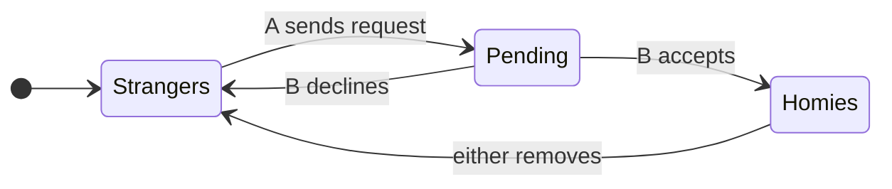

import CodeBlock from '@theme/CodeBlock';
import HomiesSpec from '!!raw-loader!@site/formal/homies/Homies.tla';

# Homies: Formal Specification (TLA+)

The question this project answers precisely: **can the system consider us
homies on your account but strangers on mine?**

Homies is a *mutual* connection — that's the product promise. But in the
database, the friendship is stored **twice**: your user document has a
`homies` array, and so does mine. Every operation that changes the
relationship (send, accept, decline, remove) updates the two documents with
**two separate writes**. MongoDB guarantees each single-document write is
atomic — and guarantees nothing about the pair. Between those two writes,
and permanently if the second write never happens, the two accounts can
disagree about whether we're friends. `GET /users/homie-status` reads only
*your own* document, so any disagreement is directly visible in the app —
and the DM feature authorizes group membership from the caller's `homies`
array, so it isn't just cosmetic.

This page specifies the lifecycle in TLA+ and defines exactly what "correct"
means. The [verification results](./verification-results.md) page shows what
the TLC model checker actually found — including real counterexample traces
against the as-deployed design.

## What was inspected

The model was built from the backend source, not from documentation:
**TB-Backend `master` @ `4e1300a9`** (inspected 2026-09-11), `routes/users.js`:

- send `POST /users/:id/homie-request` (line 475)
- accept `POST /users/:id/accept-homie` (line 591)
- reject `POST /users/:id/reject-homie` (line 635)
- remove `DELETE /users/homie/:id` (line 747)

Findings that shape the model: every handler validates on one snapshot read
(or not at all — reject and remove have no validation read), then issues two
separate, **unconditional** `updateOne` calls; connection inserts use
`$push`, not `$addToSet`, so duplicate array entries are possible; there are
no transactions, no request IDs, no generation counters, and no recovery or
compensation logic anywhere in the homies paths. (Multi-document
transactions are available in this codebase — the rider importer uses one —
just not used here.)

:::note[Documentation drift]
The [main Homies page](/docs/features/homies) predates this work and its
code snippets differ from production (it shows `$addToSet` and different
route shapes). The model follows the inspected source, which is what runs.
:::

## Intended lifecycle

The intended state machine for one pair of riders:



The catch: "Homies" and "Strangers" are each stored as **two** facts (one
per user document), and "Pending" as two more (`received` on B, `sent` on
A). The implementation turns every arrow above into multiple independent
database steps.

## Scope and assumptions

**In scope:** the authoritative request/connection state in the `users`
collection and the four handlers above, including concurrent interleavings,
duplicate/delayed calls, handler crashes between writes, and lost-response
retries.

**Out of scope:** messaging, notifications, feeds, client refresh timing,
the `network` privacy flag (both riders are modeled as accepting requests),
and the bot auto-accept path. Only safety properties are checked — no
liveness claims are made.

**Atomicity model:** one `updateOne` on one document = one atomic step
(MongoDB single-document atomicity). A `$push` and `$pull` in the *same*
`updateOne` commit together — the model preserves this (accept's first
write atomically adds the homie and consumes the request on the acceptor's
document). Different `updateOne` calls are different steps, and a handler
may crash between them with no compensation, because none exists in the code.

**Finite bounds** (documented in `formal/homies/README.md`): 2 riders
(plus a 3-rider configuration), a fixed budget of operation slots
(2 send / 2 accept / 1 reject / 2 remove — a retry is just another slot),
and array multiplicities capped at 2 (enough to represent a duplicate).

## Properties

| Name | Rider-facing meaning | Status of the requirement |
|---|---|---|
| `MutualHomies` | At every committed moment, if you're in my homies I'm in yours. | **Proposed** safeguard — only an atomic pair-write can provide it. |
| `QuiescentMutualHomies` | Whenever no operation is mid-flight, our accounts agree. | **Existing** product expectation ("both users now see each other as homies"). |
| `NoGhostAcceptance` | A connection write only commits while the authorizing request still exists — a declined or consumed request can't create a friendship. | **Existing** intent — the code validates exactly this, just not atomically. |
| `NoDuplicateHomies` | Double-taps and retries never produce duplicate friendship entries. | **Existing** intent — the API returns "Already homies"/"Request already sent" errors. |
| `NoResurrectedConnection` | After you remove someone, a leftover acceptance from the earlier friendship can't silently reconnect you. A genuinely new request + accept still works. | **Proposed** formalization — the product never specified request lifetimes (see ambiguities below). |
| `NoSelfHomies` | You can't become your own homie. | **Existing** — explicit guard at `users.js:483`. |
| `QuiescentRequestSymmetry` | "Pending" looks pending on both phones — no one is stuck with a request the other side can't see or cancel. | **Existing** expectation of the request UI. |

Two additional *reachability probes* (`ReachNeverConnected`,
`ReachNoReconnect`) are deliberately violated to prove the model is not
vacuous: acceptance, removal, and reconnection through a fresh request are
all actually reachable in the checked state spaces.

## Ambiguities made explicit (not silently decided)

- **Crossed requests.** A→B and B→A requests can be pending simultaneously;
  accepting one leaves the other pending. The product defines no behavior
  for the survivor. The model keeps it pending — and the checker then shows
  why that matters (a stale crossed request can outlive a removal and
  resurrect the connection; see the results page).
- **Concurrent accept vs. remove.** If an accept and a remove race, the
  product doesn't say who wins. The model doesn't pick a winner either — it
  only requires the *outcome* to be internally consistent (mutual state, no
  resurrection of a severed lifecycle).
- **Request lifetime after removal** (`NoResurrectedConnection`): the model
  counts severed "lifecycles" per pair (a ghost generation counter) and
  flags any connection write authorized by a request from an earlier
  lifecycle. That is our proposed reading of "removal must stick"; it is
  labeled proposed everywhere it appears.

## The executable model

The model lives at
[`formal/homies/Homies.tla`](https://github.com/wbaxterh/TrickBookDocs/blob/main/formal/homies/Homies.tla)
with 15 TLC configurations beside it. Design switches select the variant:

- **Baseline** (`AtomicOps = FALSE`) — the system as deployed: validate on
  a snapshot, then separate unconditional writes; `$push` semantics;
  crashes between writes allowed (and separately disabled, to show which
  findings need no crash at all).
- **Corrected-Tx** (`AtomicOps = TRUE`) — proposed: each handler is one
  transaction whose guard re-checks the request at commit time
  (conditional write), with `$addToSet` semantics.
- **Corrected-Full** (`+ PurgeOnRemove`) — additionally, removing a homie
  purges any pending requests between the pair. This exists because the
  checker proves the transaction alone is *not* enough (see results).

Each in-flight handler is a small program with a program counter; TLC
interleaves all of them freely, which is exactly what a busy server does.
Ghost variables (generation counters and two latched violation flags)
observe stale authorization without influencing behavior.

### Model ↔ backend mapping

| Model action | Backend operation (`routes/users.js`) |
|---|---|
| `BaseSend` pc1 | validation `findOne` on target (:488–:507) |
| `BaseSend` pc2 | `$push` target's `homieRequests.received` (:510) |
| `BaseSend` pc3 | `$push` sender's `homieRequests.sent` (:523) |
| `BaseAccept` pc1 | validation `findOne` on acceptor (:601) |
| `BaseAccept` pc2 | `$push homies` + `$pull received` on acceptor — one doc, atomic together (:611) |
| `BaseAccept` pc3 | `$push homies` + `$pull sent` on requester (:619) |
| `BaseReject` pc1–2 | two `$pull` updates, no validation (:645, :653) |
| `BaseRemove` pc1–2 | two `$pull` updates, no validation (:757, :762) |
| `Crash` | handler dies between writes; no compensation exists |
| `Atomic*` | proposed corrected design — **not** implemented in the backend |

## Reproduce the checks

```bash
# in the docs repo
bash formal/homies/tools/fetch-tla2tools.sh   # pinned TLA+ tools v1.7.4 (TLC 2.19), sha256-verified
npm run verify:homies
```

The runner executes every configuration and asserts its expected outcome —
expected-fail runs must report the *exact* named invariant violation.
Full TLC logs and counterexample traces land in `formal/homies/out/`.

## The checked specification

The block below is imported directly from the checked file at build time —
it cannot drift from what TLC actually verifies.

<CodeBlock language="tla" title="formal/homies/Homies.tla">{HomiesSpec}</CodeBlock>
