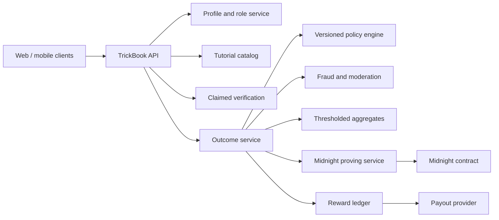
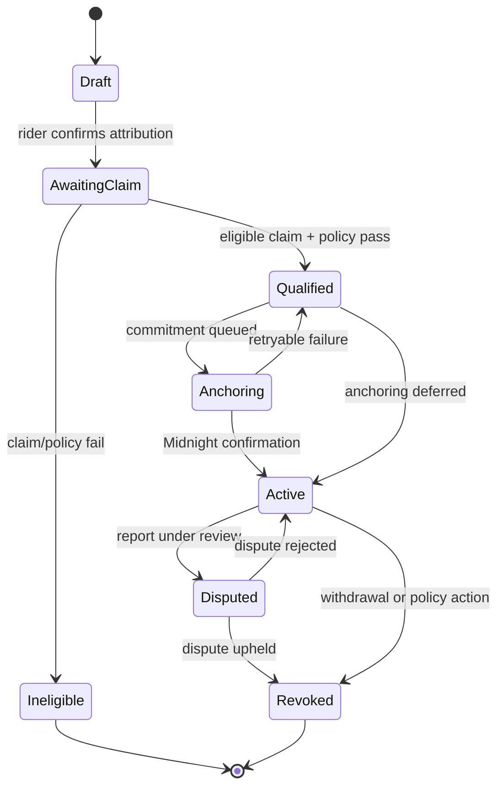
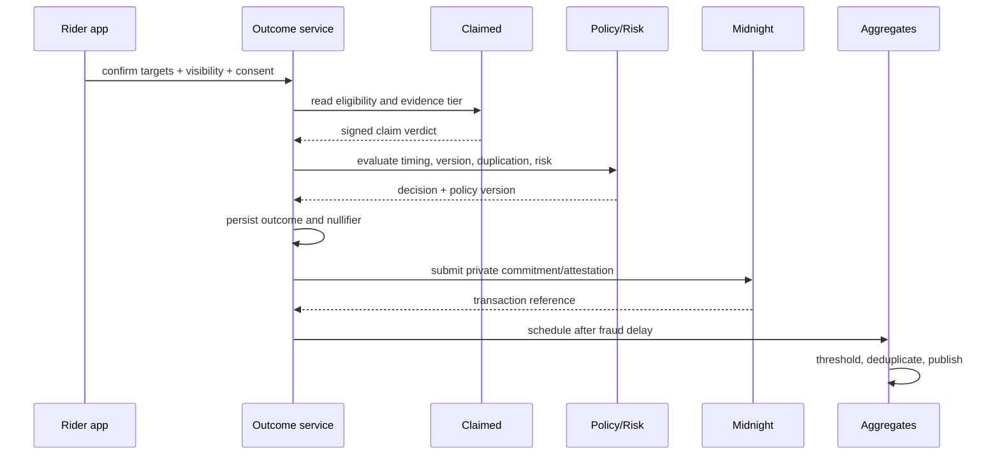

# Instructor Outcomes: Architecture

This design extends [Claimed](/docs/features/claimed). Claimed answers whether a claim was captured, evaluated, and committed under published rules. Instructor Outcomes answers whether the rider consented to credit an eligible learning resource for that claim.

## 1. Components



The reward ledger consumes finalized outcomes but is not part of contract validity. A verification bug or collusion attack must not become an irreversible automatic payout.

## 2. Canonical data model

```typescript
type ProfileRole = 'rider' | 'creator' | 'coach' | 'athlete' | 'filmer' | 'publisher' | 'organization';

interface UserProfile {
  userId: ObjectId;
  handle: string;
  roles: ProfileRole[];
  rider?: RiderProfile;
  instructor?: InstructorProfile;
  visibility: ProfileVisibility;
  blockedUserIds: ObjectId[];
}

interface TutorialVersion {
  tutorialId: ObjectId;
  version: number;
  trickIds: ObjectId[];
  prerequisiteForTrickIds: ObjectId[];
  sourceUrl: string;
  contentHash: string;
  status: 'draft' | 'active' | 'removed' | 'rights-disputed';
  credits: Array<{
    profileId?: ObjectId;
    displayName: string;
    role: 'instructor' | 'performer' | 'filmer' | 'publisher' | 'rights-holder';
    shareBps?: number;
  }>;
  publishedAt: Date;
}

interface LearningOutcome {
  outcomeId: ObjectId;
  claimId: ObjectId;
  riderId: ObjectId;
  trickId: ObjectId;
  targets: Array<{
    tutorialId: ObjectId;
    tutorialVersion: number;
    instructorProfileId: ObjectId;
    creditBps: number;
    source: 'in-app-open' | 'challenge' | 'referral' | 'manual-citation';
  }>;
  evidenceTier: number;
  qualification: 'pending' | 'qualified' | 'ineligible' | 'disputed' | 'revoked';
  visibility: 'private' | 'aggregate-only' | 'homies' | 'public';
  consentVersion: number;
  policyVersion: number;
  attributionNullifier: string;
  commitment?: string;
  midnightTxId?: string;
  publicEligibleAt?: Date;
  createdAt: Date;
}
```

Use ObjectId references internally. Commitments encode stable canonical identifiers, never display names or URLs.

## 3. Outcome state machine



`Active` does not imply public visibility. Visibility is independent consent. Midnight failure changes anchor status, not the off-chain evidence verdict.

## 4. Issuance flow



## 5. Midnight statement design

Conceptual commitment:

```text
outcomeCommitment = H(
  "tb:outcome:v1",
  claimCommitment,
  riderSecret,
  trickCanonicalId,
  tutorialCanonicalId,
  tutorialVersion,
  instructorCanonicalId,
  evidenceClass,
  consentClass,
  policyVersion,
  freshSalt
)
```

No raw TrickBook database identifier is placed on-chain.

### Private mastery possession

Proves the presenter knows an unrevoked outcome whose claim met an accepted evidence class. Sport/trick is disclosed only if the rider chooses.

### Anonymous instructor outcome

Proves an unrevoked qualifying outcome references instructor `I` and tutorial `T`, without disclosing rider, clip, claim leaf, exact time, or other credited resources.

### Aggregate audit

The aggregate service publishes a count plus proof/audit bundle for distinct valid nullifiers in an epoch. V1 may use a signed reproducible report; fully circuit-computed private aggregation follows only after performance measurement.

## 6. Contract responsibilities

- Append an outcome commitment to the outcome tree.
- Authenticate issuance through a sealed verifier key hash.
- Record attestation class without revealing private fields.
- Prevent duplicate issuance with an attribution nullifier.
- Maintain append-only revocation state.
- Verify selective-disclosure presentations against retained roots.
- Rotate authorized keys through explicit governance and epochs.

The contract does not store profiles, URLs, videos, comments, view events, fiat amounts, payment identity, or mutable creator analytics.

## 7. API surface

```text
GET    /api/profiles/:handle
PATCH  /api/profile/roles
POST   /api/instructors/claim
POST   /api/instructors/credentials
GET    /api/instructors/:id/outcomes
POST   /api/tutorials
POST   /api/tutorials/:id/versions
POST   /api/tutorials/:id/credits/accept
POST   /api/claims/:claimId/outcomes
PATCH  /api/outcomes/:id/visibility
POST   /api/outcomes/:id/revoke
POST   /api/outcomes/:id/disputes
GET    /api/outcomes/:id/proof
GET    /api/instructors/:id/aggregate-report
```

Mutations are idempotent. Outcome creation uses `(claimId, consentVersion)` plus the attribution nullifier. Rewards use `outcomeId + settlementVersion`.

## 8. Aggregation rules

For an instructor, trick, and reporting epoch:

1. Include only active outcomes after the fraud delay.
2. Exclude revoked, disputed, self-attributed, duplicate, blocked, and high-risk outcomes.
3. Deduplicate `H(pairwiseRiderId, instructorId, trickId, epochWindow)`.
4. Suppress public output below five distinct consenting riders.
5. Count a unique rider once for “riders helped.”
6. Use fractional target credit for revenue allocation.
7. Recompute with compensating deltas after revocation.

Pairwise rider identifiers are derived per instructor and cannot be joined across reports.

## 9. Failure behavior

- **Midnight unavailable:** qualification remains valid, anchoring retries, proof-backed UI waits.
- **Verification delayed:** attribution stays awaiting claim and never increments counts.
- **Tutorial removed:** historical outcomes remain; new outcomes stop. Rights disputes hide media immediately.
- **Profile deleted:** off-chain personal data is deleted/anonymized; commitments remain unintelligible without deleted secrets.
- **Policy changed:** existing outcomes keep their policy version; migrations are explicit.
- **Fraud surge:** freeze aggregation and payouts while preserving rider progression.

## 10. Build versus reuse

Reuse from Claimed: the app-wallet/DUST sponsorship pattern, commitment tree, historic roots, nullifiers, proof-service isolation, evidence-tier result, queued sealing, and privacy-safe observability.

New work: composable profile roles, instructor/credential review, versioned tutorials and credits, attribution consent, the outcome policy engine, outcome commitments/nullifiers, thresholded reporting, disputes, and a compensating reward ledger.

