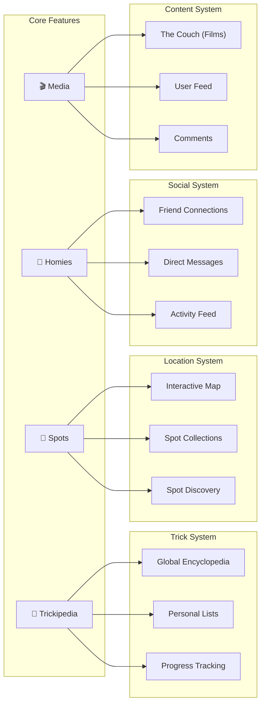

# Features Overview

Comprehensive documentation for TrickBook's core features.

## Platform Features

TrickBook is a platform dedicated to action sports, providing tools for riders to track progress, discover spots, connect with friends, and watch content.



## Feature Summary

| Feature | Description | Status |
|---------|-------------|--------|
| [Trickipedia](/docs/features/trickbook) | Trick encyclopedia and personal lists | ✅ Live |
| [Spots](/docs/features/spots) | Skate spot database with maps | ✅ Live |
| [Homies](/docs/features/homies) | Social connections and messaging | ✅ Live |
| [Media](/docs/features/media) | Video streaming and user content | ✅ Live |

## Recent Updates (January 2026)

### Homepage Redesign
- Updated hero text: "The platform dedicated to Action Sports"
- New feature slider showcasing Trickipedia, Spots, Homies, Media
- Conditional CTAs based on login state
- Emojis matching navigation: 📘 📍 🤝 🎬

### Media Enhancements
- **The Couch:** Admin thumbnail upload (file + URL options)
- **Feed:** Audio enabled by default for videos
- **Video Player:** Fixed double-play issue on The Couch

### Authentication Pages
- Animated input placeholders on login/signup/reset pages
- Icon and text fade out on focus
- Consistent styling across auth flows

### Infrastructure
- S3 bucket public access configured for images
- Bunny.net CDN for video streaming
- HLS adaptive bitrate support

## Architecture Overview

### Frontend Stack

| Platform | Technology | Key Libraries |
|----------|------------|---------------|
| Website | Next.js 14 | React, TailwindCSS, shadcn/ui |
| Mobile | React Native | Expo SDK 51, React Navigation |
| Extension | Chrome Extension | Manifest V3, React |

### Backend Stack

| Component | Technology |
|-----------|------------|
| API Server | Node.js + Express |
| Database | MongoDB Atlas |
| Auth | JWT + Google SSO |
| Storage | AWS S3 (images), Bunny.net (video) |
| Real-time | Socket.IO |
| Payments | Stripe |

### Data Flow

```
┌─────────────┐     ┌─────────────┐     ┌─────────────┐
│   Website   │     │  Mobile App │     │  Extension  │
│  (Next.js)  │     │   (Expo)    │     │  (Chrome)   │
└──────┬──────┘     └──────┬──────┘     └──────┬──────┘
       │                   │                   │
       └───────────────────┼───────────────────┘
                           │
                    ┌──────▼──────┐
                    │   Backend   │
                    │  (Express)  │
                    └──────┬──────┘
                           │
       ┌───────────────────┼───────────────────┐
       │                   │                   │
┌──────▼──────┐     ┌──────▼──────┐     ┌──────▼──────┐
│   MongoDB   │     │    AWS S3   │     │  Bunny.net  │
│   (Data)    │     │  (Images)   │     │  (Video)    │
└─────────────┘     └─────────────┘     └─────────────┘
```

## Mobile Development Notes

When implementing these features on mobile:

### Trickipedia
- Use FlatList with pagination
- Cache trick data in AsyncStorage
- Support offline browsing of cached tricks
- Implement search with debouncing

### Spots
- Use react-native-maps for map view
- Request location permissions
- Cache spot lists for offline access
- Implement nearby spots with geolocation

### Homies
- Integrate push notifications for requests/messages
- Use Socket.IO client for real-time messaging
- Handle background message sync
- Implement typing indicators

### Media
- Use expo-av for video playback
- Support HLS streams natively
- Implement infinite scroll feed
- Handle video upload with progress

## API Base URLs

| Environment | URL |
|-------------|-----|
| Production | `https://api.thetrickbook.com/api` |
| Development | `http://localhost:5000/api` |

## Related Documentation

- [Architecture Overview](/docs/architecture/overview)
- [API Endpoints](/docs/backend/api-endpoints)
- [Mobile Development](/docs/mobile/overview)
- [Deployment](/docs/deployment/backend)
