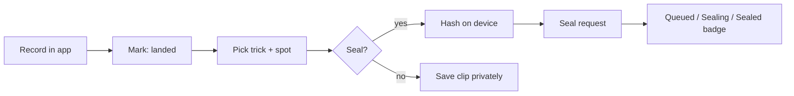

# Sealed Claims: Product Requirements

*Proof of priority for tricks. Seal the clip the moment it is landed, keep it private, prove it later.*

| Field | Value |
|-------|-------|
| **Status** | Draft for review |
| **Owner** | Wes Huber |
| **Date** | September 2026 |
| **Working name** | Sealed Claims (product name TBD, see [Open questions](#11-open-questions)) |
| **Related** | [Architecture](/docs/features/sealed-claims/architecture) · [Verification pipeline](/docs/features/sealed-claims/verification-pipeline) · [Formal spec](/docs/features/sealed-claims/formal-spec) · [ADR-004](/docs/architecture/adrs/midnight-sealed-claims) |

:::info[One paragraph]
When a rider lands a trick, TrickBook hashes the clip on the device and seals a commitment to it on the Midnight network: trick, spot, capture time, clip hash, and a rider secret. Nothing about the clip is public. When the part drops, or when someone disputes who did it first, the rider reveals, and a zero-knowledge proof shows the sealed claim existed by a given block, that it belongs to the rider, and that it has not been claimed twice. The chain never says the trick happened. It says who committed to what, and when. Evidence that the trick really happened is a separate, layered pipeline described in [Verification pipeline](/docs/features/sealed-claims/verification-pipeline).
:::

## 1. Problem

Skateboarding runs on two norms that fight each other.

1. **Priority matters.** NBDs (never been dones) and "first to do X at Y" are the currency of the culture. Disputes are common and are settled by rumor, upload dates, and who has the louder crew.
2. **Footage is embargoed.** A clip filmed today may not be shown for a year or more, because it is being saved for a video part. Posting early to establish priority burns the clip.

Today TrickBook has a spot trick history feature, a registry of "famous tricks done at this spot" with trick, skater, year, and video. Its `verified` flag can only be set by an admin, which means Wes, by hand. That does not scale past a few hundred entries, and it offers riders nothing for the embargo problem.

There is no product in skateboarding that lets a rider prove "I had this clip on this date" without showing the clip. That is exactly what a commitment plus selective disclosure does.

### Why this and not the alternatives

- **A signed row in our database** proves nothing to anyone who does not trust TrickBook, and TrickBook holds the data it would be attesting to.
- **A plain hash on a public chain** (Bitcoin via OpenTimestamps, Cardano transaction metadata) gives the timestamp but ties the hash to a public account, cannot prove properties of the sealed data without revealing it, and cannot enforce one reveal per claim.
- **Midnight** gives the timestamp through the chain, hides the claim's contents and the rider's identity, and lets the rider prove statements about the sealed claim (existence by block, ownership, single use) without disclosing the clip. See [ADR-004](/docs/architecture/adrs/midnight-sealed-claims) for the full comparison.

## 2. Users and jobs to be done

| User | Job | Today | With sealed claims |
|------|-----|-------|--------------------|
| Rider who landed something | Establish that I did it, on this date, without posting the clip yet | Post early or hope nobody else does it first | Seal on capture, reveal when ready |
| Filmer | Prove the clip is mine and unedited from capture | Metadata that anyone can rewrite | Co-sign the same clip hash from my device |
| Spot local | Keep the spot's trick history honest | Upvotes and an admin flag | Reveals land in spot trick history with evidence badges |
| Crew editing a video part | Sit on footage for a year safely | Trust | Sealed claims for every keeper clip, revealed when the part drops |
| Media and contests (Torment, Thrasher, regional video of the year) | Confirm a claimed date and authorship | Ask around | Rider shares a priority proof, no clip required |
| TrickBook admin | Verify submissions | Manual | Evidence tiers replace the manual flag for most entries |

TrickBook has 315 registered users, 6,261 spots, and 504 trick lists as of September 2026. This feature is designed to be useful at that scale and to still make sense at 100x.

## 3. Goals

1. A rider can seal a claim from the mobile app in one tap after recording, with no wallet, seed phrase, or token balance.
2. A sealed claim reveals nothing on-chain about the clip, the trick, the spot, or the rider until the rider chooses to reveal.
3. A rider can prove a claim existed by a specific block without revealing which claim it is.
4. Each sealed claim can be revealed at most once, and only by the rider who sealed it.
5. Reveals populate spot trick history automatically, carrying evidence badges from the verification pipeline.
6. The contract, the sealing service, and a minimal demo are open source in their own repository, with TrickBook as the first integrator.

## 4. Non-goals

- **Proving that a trick physically happened.** No chain can do that. The verification pipeline produces evidence and confidence, never proof. This document is explicit about that boundary everywhere it matters.
- **User-held wallets in v1.** Riders never see Midnight. TrickBook's backend holds the app wallet and generates proofs. On-device proving is a v2 track.
- **Tokens, rewards, or NIGHT payouts to riders.** Out of scope.
- **Replacing the feed.** Sealing is an option on capture and on existing posts, not a new content surface.
- **Content moderation.** Reveals go through the same moderation as feed posts.

## 5. Success metrics

| Metric | Target at 90 days after launch | Why |
|--------|-------------------------------|-----|
| Sealed claims per week | 25 or more | Adoption, with 315 users this is roughly one in twelve active riders sealing weekly |
| Share of in-app captured clips that get sealed | 40% or more | Whether "seal" is understood as a default, not a novelty |
| Reveal rate within 180 days | 30% or more | Claims are being used, not hoarded |
| Median seal latency (tap to confirmed on-chain) | Under 90 seconds | Riders will not wait at the spot |
| Spot trick history entries created by reveal | 50% or more of new entries | The admin flag stops being the bottleneck |
| Verification tier 3 or higher on reveals | 60% or more | The evidence pipeline is producing usable badges |
| Disputes resolved by priority proof | Tracked, no target | New capability, measure before targeting |

Instrumentation: every state transition in the claim lifecycle emits an analytics event through the existing `analytics_events` collection, tagged with claim id and tier.

## 6. User stories and acceptance criteria

### US-1 Seal on capture

*As a rider, when I record a clip in the app and mark it as landed, I want it sealed immediately so the date is locked even if I never post it.*

- Given the rider recorded the clip with the in-app camera and picked a trick and a spot, when they tap Seal, then the app computes the clip hash on device, sends a seal request, and shows "Sealing" within one second.
- Given the seal request is accepted, when the transaction is confirmed, then the clip shows a "Sealed" badge with the block height and the claim stays private (not in the feed, not in spot trick history).
- Given the device is offline, when the rider taps Seal, then the hash and metadata are queued locally and sealed on reconnect, and the badge says "Queued" with the local capture time.
- Given the clip was imported from the camera roll rather than captured in the app, when the rider seals it, then the claim is sealed at tier 0 only and the UI says why (see [Verification pipeline](/docs/features/sealed-claims/verification-pipeline)).

### US-2 Reveal on publish

*As a rider, when my part drops, I want to reveal the sealed claim so the spot's trick history shows I did it first.*

- Given a sealed claim, when the rider publishes the clip to the feed and chooses Reveal, then a proof is generated that the clip hash, trick, spot, and capture time match the sealed commitment, and the reveal is recorded on-chain with a nullifier.
- Given a claim already revealed, when a reveal is attempted again, then it is rejected with "claim already revealed" and nothing changes on-chain.
- Given a successful reveal, when spot trick history is viewed, then a new entry exists with the rider, trick, capture date, and the evidence badges from the verification pipeline.

### US-3 Priority proof without reveal

*As a rider in a dispute, I want to prove I sealed this trick at this spot before a date without showing the clip.*

- Given a sealed claim, when the rider requests a priority proof for a date D, then the proof discloses only trick, spot, and a historic tree root that was current at or before D, and verifies without revealing the clip hash, the capture time, or which leaf is the rider's.
- Given the rider generates several priority proofs, when they are compared on-chain, then they cannot be linked to each other or to the eventual reveal by anyone other than the rider.

### US-4 Filmer co-sign

*As a filmer, I want to attach my own sealed commitment to the same clip so the footage is attributed to both of us.*

- Given a rider's claim, when the filmer seals from their device with the same clip hash, then both commitments exist independently and the reveal of one does not reveal the other.

### US-5 Admin evidence review

*As an admin, I want to see the evidence tiers behind a reveal instead of trusting my gut.*

- Given a revealed claim, when an admin opens it, then each evidence tier shows its verdict, confidence, model version, and the raw signals that produced it.

## 7. Requirements

### Functional

| ID | Requirement |
|----|-------------|
| FR-1 | The mobile app gains in-app video capture (currently it only picks images). Capture produces a hash chain over recorded segments so a re-encoded file cannot reproduce the hash. |
| FR-2 | A seal request contains: commitment, encrypted claim record for the rider, device attestation token, capture sidecar hash. It never contains the clip. |
| FR-3 | The backend sealing service holds the app wallet, submits `seal`, and stores the claim record keyed by commitment. |
| FR-4 | Reveal generates a zero-knowledge proof against the current or a historic tree root, and submits `reveal` with a nullifier. |
| FR-5 | Priority proof generates a proof against a rider-chosen historic root and discloses only trick, spot, and root. |
| FR-6 | A reveal creates a spot trick history entry with `source: "sealed-claim"` and links the evidence record. |
| FR-7 | The verifier service can anchor an attestation (tier bitmask) to a commitment on-chain, and only the verifier can. |
| FR-8 | Claims are listed in the rider's profile with state, seal block, and evidence tier; nothing is shown publicly before reveal. |

### Privacy

| ID | Requirement |
|----|-------------|
| PR-1 | On-chain state before reveal contains only the commitment leaf. No rider id, no trick, no spot, no time. |
| PR-2 | Two claims by the same rider are unlinkable on-chain. Each commitment uses a fresh salt. |
| PR-3 | A reveal does not identify which leaf was revealed; membership is proved by Merkle path, only the root is disclosed. |
| PR-4 | Evidence records (device attestation, model outputs, GPS) stay off-chain in TrickBook's database and are shown only to the rider and admins, with the tier badge public after reveal. |
| PR-5 | The rider secret is generated on the device, stored in the OS keychain, and sent to the backend only for proof generation over TLS (v1 custodial proving). It is never logged. |

### Security

| ID | Requirement |
|----|-------------|
| SR-1 | Commitments and nullifiers use domain-separated hashes (`tb:claim:` and `tb:nul:` prefixes). |
| SR-2 | The verifier's authority is a sealed ledger field set at deploy and checked with hash-based authentication. |
| SR-3 | All circuit inputs are validated with assertions before any ledger write; assertion messages never include private values. |
| SR-4 | The sealing service serializes contract calls per wallet (the private state provider takes an exclusive lock per operation). |
| SR-5 | Device attestation is verified server-side (App Attest on iOS, Play Integrity on Android) before a claim can earn tier 1. |

### Non-functional

| ID | Requirement |
|----|-------------|
| NF-1 | Seal confirmation under 90 seconds p50, under 4 minutes p95, measured tap to block inclusion. |
| NF-2 | Proof generation for reveal under 60 seconds on the backend proof server (vouched measured about 24 seconds on a laptop devnet). |
| NF-3 | The sealing service degrades gracefully: if Midnight is unreachable, claims queue and the UI says "Queued", never "Sealed". |
| NF-4 | Cost per claim in DUST is measured on preprod before mainnet and reported in the monthly review. |

## 8. Experience

### Capture and seal

The Seal control sits on the post-capture review screen next to Save. Default on for in-app captures. The badge lives on the clip in the rider's private library and on the feed post if the clip is later posted.

Copy, first draft:

- Sealed: "Sealed on Midnight at block 1,204,311. Only you can reveal this."
- Queued: "Will seal when you are back online. Capture time locked locally."
- Tier 0: "Sealed from an import. Capture in the app next time to earn the Captured badge."

### Reveal

Reveal is a step in the existing publish flow: "Reveal sealed claim" toggle, on by default when the clip has one. On success the feed post and the spot trick history entry show the badges: Sealed, Captured in app, Trick match, Spot match, Witnessed.

### Priority proof

From a claim in the rider's library: "Prove priority", pick a date, get a shareable verification link. The link renders the disclosed values (trick, spot, "sealed no later than block N, which was on date D") and a Verify button that re-checks the proof.

## 9. Scope by milestone

| Milestone | Deliverable | Exit criterion |
|-----------|-------------|----------------|
| M0 Spec | This PRD, the [formal spec](/docs/features/sealed-claims/formal-spec) with a model-checked state machine, the threat model | Reviewed; TLC run passes on the spec |
| M1 Contract | Compact contract ported from vouched, e2e on the standalone devnet | Seal, reveal, double-reveal rejected, priority proof, all pass in CI |
| M2 Service | Sealing and proving service with custodial wallet on preprod, claim records in Mongo | Seal and reveal from a curl script against preprod |
| M3 Capture | In-app camera, on-device hashing, device attestation, seal from iOS TestFlight | Ten sealed claims from real riders |
| M4 Evidence v1 | Attestation tier, AI-generated detection, spot match, admin evidence view | Badges on real reveals |
| M5 Trick recognition | Reference-clip similarity and pose-based landing check | Measured accuracy on a labeled TrickBook clip set |
| M6 Integration | Reveal writes spot trick history, priority proof share link | Feature flag on for all users |
| M7 Open source | Contract, service, and demo in a public repo; awesome-dapps pull request; demo video | PR open, video published |

## 10. Risks

| Risk | Impact | Mitigation |
|------|--------|------------|
| Custodial proving means TrickBook sees rider secrets | Trust concentrated in TrickBook for v1 | Secrets encrypted at rest, never logged; publish the trust model plainly; v2 on-device proving |
| Midnight proof latency and DUST cost at scale | Seal feels slow or costs add up | Batch seals, async UX, measure on preprod, cap per-user seals per day |
| App Store review of a "blockchain" feature | Rejection or delay | No token, no purchase, no wallet UI; it is a timestamping feature; Apple's guidelines permit that |
| App Attest and Play Integrity in Expo | Native module work | Config plugin or a bare native module; Android keeps tier 0 until Play Integrity lands |
| Trick recognition accuracy in the wild (fisheye lenses, night, occlusion) | Badges that are wrong lose trust, which the product principles say is sacred | Ship recognition as a signal with confidence, never a verdict; admins can override |
| Small user base makes metrics noisy | Hard to know if it works | Report absolute counts and qualitative feedback in the monthly review |

## 11. Open questions

1. **Name.** Sealed Claims is the working name. Candidates: Claimed, Stamp, First, Locked. Decide before M3 copy is written.
2. **Should tier 0 seals (imports) be allowed at all?** They dilute the Captured badge but give the embargo benefit to existing footage. Current answer: allow, badge clearly.
3. **Who can see the claim count on a rider's profile before reveal?** Proposal: only the rider. A public "sealed count" leaks activity patterns.
4. **Retention for unrevealed claims.** Proposal: forever on-chain (it is a 32-byte leaf), off-chain claim record kept while the account exists.
5. **Mainnet or preprod at launch.** Preprod costs nothing but proves nothing durable; mainnet requires DUST. Proposal: preprod through M6, mainnet at M7 with a migration that re-seals existing claims and keeps the original capture timestamps in the record.

## 12. Relationship to the Midnight Aliit program

This feature is the TrickBook integration of the open-source sealed-claims contract, which is the example dApp submitted to the Midnight awesome-dapps repository. The pieces that matter for that review, in their words: a real use case with real users, a privacy feature that is not "everything disclosed," a README that builds from a fresh clone, and a demo video showing real usage. The [formal spec](/docs/features/sealed-claims/formal-spec) exists because the protocol has invariants worth stating precisely, and because a model-checked state machine is a better review artifact than prose.
