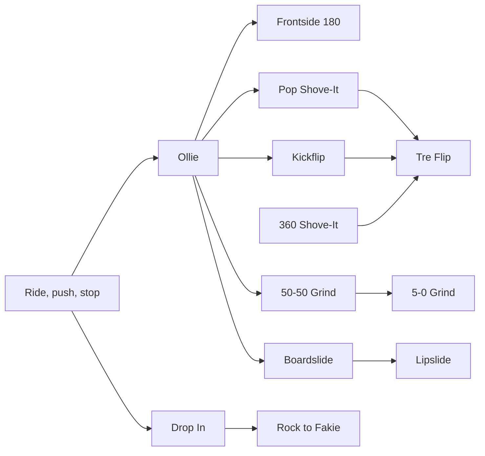
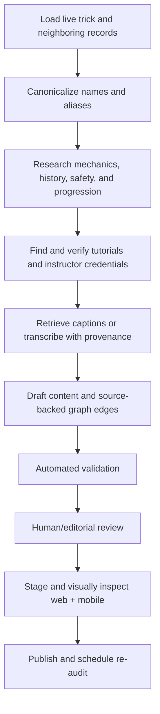

# Trickipedia Network: First-Pass Audit

**Audit date:** 2026-08-31  
**Scope:** Eight live skateboarding records from `GET https://api.thetrickbook.com/api/trickipedia`

## Executive summary

The current records are useful as standalone articles, but they are not yet an encyclopedia network. All eight sampled records return `null`/missing `prerequisites`, `relatedTricks`, and `tips`. Video records identify a platform and title, but do not reliably identify the instructor, their professional credentials, attribution link, transcript state, or why the tutorial was selected.

The existing documentation describes `prerequisites` and `relatedTricks`, but the live backend create/update routes do not validate or persist them. The documented slug lookup route and several documented filters/pagination parameters also do not exist in the current route implementation. The build should therefore treat the graph, tutorial attribution, transcript provenance, API behavior, and docs correction as one migration.

## Sample audit

### Ollie

- **Current strengths:** detailed history, clear seven-step explanation, four tutorials, two images.
- **Content gaps:** no stance setup, rolling-versus-stationary recommendation, common-failure diagnostics, safety note, or structured tips.
- **Foundation:** riding stance, pushing, stopping, tic-tacs/kickturns.
- **Next steps:** frontside 180, backside 180, pop shove-it, kickflip, 50-50 grind.
- **Tutorial lead:** [Skate IQ — The Easiest Way to Ollie](https://www.youtube.com/watch?v=hLVIvMWCih0), taught by professional vert skater and coach Mitchie Brusco. Public and auto-captioned at audit time.
- **Recommendation:** retain the shorter Tactics tutorial as an alternate; make Skate IQ the coaching/deep-dive option and store the instructor separately from the publishing channel.

### Pop Shove-It

- **Current strengths:** concise mechanics and four live tutorial links.
- **Content gaps:** does not distinguish backside shove direction by stance; no troubleshooting for flipping, under-rotation, or board travel.
- **Foundation:** riding, ollie/pop timing, body-over-board control.
- **Next steps:** backside bigspin, varial kickflip, tre flip.
- **Related:** backside pop shove-it (near-duplicate/alias decision required), frontside pop shove-it.
- **Tutorial lead:** [SKATEDELUXE — How to Pop Shove It](https://www.youtube.com/watch?v=v5OsgpOsUOE). Public and auto-captioned; instructor identity should be researched before it receives a “pro” badge.

### Frontside 180

- **Current strengths:** good body/shoulder sequence and four tutorials.
- **Content gaps:** direction language assumes a stance; “frontside” should be explained for regular and goofy riders. No pivot-versus-clean-rotation diagnostic.
- **Foundation:** ollie, fakie riding, kickturn/revert.
- **Next steps:** frontside pop shove-it, frontside bigspin, frontside kickflip.
- **Related:** backside 180, switch ollie, nollie.
- **Tutorial lead:** [Tom’s Tutorials — Frontside 180 Tutorial](https://www.youtube.com/watch?v=Ize_UuHKxJ4). Public with creator-supplied English captions; credential is currently unverified, so label as creator tutorial rather than professional tutorial.

### Kickflip

- **Current strengths:** useful foot-placement detail and TrickBook-owned Instagram tutorials.
- **Content gaps:** the record’s six external videos are documentary/breakdown footage, not instruction. Description is conversational and thinner than the Ollie record; no common fixes for rocket flips, downward flicks, or one-foot catches.
- **Foundation:** ollie, controlled front-foot slide, stable rolling stance.
- **Next steps:** varial kickflip, backside/frontside kickflip (new records if absent), tre flip.
- **Related:** heelflip, varial heelflip, hardflip.
- **Tutorial recommendation:** keep the Ryan Sheckler Costco videos as history/inspiration, but do not present them as tutorials. Add a verified instructor-led tutorial and transcript as the primary lesson.

### Boardslide

- **Current strengths:** clear basic sequence and one TrickBook original.
- **Content gaps:** conflates the generic family with backside boardslide; does not describe rail height progression, wax/speed tradeoffs, bailout direction, or frontside versus backside approach.
- **Foundation:** ollie, frontside/backside 180 motion, riding off curbs; optional deck-only practice on a low stationary rail.
- **Next steps:** frontside boardslide, lipslide, bluntslide.
- **Related:** 50-50 grind, noseslide, tailslide.
- **Tutorial lead:** [SKATEDELUXE — How to Backside Boardslide](https://www.youtube.com/watch?v=xI9UaaSvssA). Public and auto-captioned; verify instructor identity before a pro label.

### 50-50 Grind

- **Current strengths:** good high-level explanation and frontside/backside tutorial coverage.
- **Content gaps:** beginner difficulty is misleading without an obstacle context; curb/ledge 50-50 and rail 50-50 have materially different risk. No lock-in or hang-up troubleshooting.
- **Foundation:** ollie, riding off curbs, precise bolt landings.
- **Next steps:** 5-0 grind, nosegrind, smith grind, feeble grind.
- **Related:** axle stall (transition), boardslide, crooked grind.
- **Tutorial lead:** [SKATEDELUXE — How to 50-50 Grind](https://www.youtube.com/watch?v=SKrntystOnE). Public and auto-captioned.

### Drop In

- **Current strengths:** approachable explanation of commitment and correct forward weight transfer.
- **Content gaps:** needs explicit protective-gear guidance, ramp-height progression, an assisted first-drop option, and a warning not to learn alone. “Beginner” should be scoped to transition, not absolute risk.
- **Foundation:** riding comfortably, kickturns on banks/transition, pumping, knee slides/bail practice.
- **Next steps:** rock to fakie, axle stall, tail stall, carving bowls.
- **Related:** kickturn, rock to fakie, axle stall.
- **Tutorial lead:** [SKATEDELUXE — How to Drop In](https://www.youtube.com/watch?v=PoEfV7AMEyo). Public and auto-captioned; supplement with a credentialed coach/pro lesson emphasizing safe progression.

### Tre Flip (360 Flip)

- **Current strengths:** six tutorials, including direct professional instruction, and broad alternate coverage.
- **Content gaps:** description is far less developed than the other sampled records; no common-error section or distinction between scoop-driven and flick-driven technique. Two thumbnails are only `hqdefault`.
- **Foundation:** kickflip, backside pop shove-it, 360 shove-it; strong rolling control.
- **Next steps:** switch tre flip, fakie tre flip, bigflip, laser flip.
- **Related:** varial kickflip, backside bigspin, impossible.
- **Professional tutorial:** [Paul Rodriguez — Learn How to 360 Flip](https://www.youtube.com/watch?v=Zl13ASE_1Qg). Public and auto-captioned. A caption retrieval test succeeded and produced a 14 KB English VTT file.
- **Recommendation:** make P-Rod the featured professional tutorial and Skate IQ the secondary coaching tutorial. Store history/demo footage separately from lessons.

## Proposed graph model

Use ObjectId references, not trick-name strings. Names change, collide across sports, and already have near-duplicates such as `Pop Shove-It` and `Backside Pop Shove-it`.

```javascript
progression: {
  prerequisites: [{
    trickId: ObjectId,
    strength: "required" | "recommended" | "helpful",
    reason: String,
    order: Number
  }],
  nextSteps: [{
    trickId: ObjectId,
    reason: String,
    order: Number
  }],
  related: [{
    trickId: ObjectId,
    relation: "variation" | "opposite-direction" | "same-family" | "combination" | "terrain-transfer",
    reason: String
  }]
}
```

`nextSteps` can theoretically be derived from reverse prerequisite edges, but storing curated next steps allows intentional ordering and explanatory copy. A validation job must reject self-links, missing IDs, cross-sport links unless explicitly marked, duplicate edges, and required-prerequisite cycles.

### Relation research standard

Relations must be researched, not inferred from similar names or generated from difficulty labels. Every edge needs a short editorial reason and evidence from at least two of the following where practical:

- Direct instruction from a professional skater or established coach
- A reputable skate school, manufacturer, or skate publication progression guide
- Technique decomposition showing that the target reuses the prerequisite's motion
- Broad agreement across multiple independent tutorials
- Editorial verification by a competent skater

Use biomechanical specificity. For example, “Tre flip requires kickflip and backside pop shove-it” is directionally useful but incomplete: the back-foot scoop is closer to a 360 shove-it, while the front-foot action and catch reuse kickflip control. Mark kickflip and 360 shove-it as `recommended`; mark ordinary backside pop shove-it as `helpful` if it is only an earlier stepping stone.

Do not force one universal progression. Body mechanics, stance, terrain, age, mobility, fear tolerance, and prior board-sport experience change what feels easier. The graph expresses likely preparation, not a gate that prevents a user from attempting a trick.

### Edge review states

```javascript
research: {
  status: "draft" | "reviewed" | "published" | "disputed",
  confidence: "high" | "medium" | "low",
  evidence: [{
    sourceUrl: String,
    sourceType: "pro-tutorial" | "coach" | "publication" | "technique-analysis" | "editorial-review",
    note: String,
    checkedAt: Date
  }],
  reviewedBy: String,
  reviewedAt: Date
}
```

Only `reviewed` or `published` edges should appear in production. Low-confidence or disputed edges stay in the editorial interface.

### Initial eight-trick network



This diagram is a starting hypothesis. Each edge still requires source-backed review before publication.

## Proposed tutorial and transcript model

```javascript
tutorials: [{
  _id: ObjectId,
  platform: "youtube" | "instagram" | "vimeo" | "other",
  externalId: String,
  canonicalUrl: String,
  embedUrl: String,
  title: String,
  contentType: "tutorial" | "slowmo" | "history" | "demonstration",
  instructor: {
    name: String,
    profileUrl: String,
    isProfessional: Boolean,
    credential: String,
    credentialSourceUrl: String
  },
  publisher: { name: String, channelUrl: String },
  attributionText: String,
  language: String,
  durationSeconds: Number,
  featured: Boolean,
  embedAllowed: Boolean,
  availability: "active" | "removed" | "private" | "blocked",
  lastVerifiedAt: Date,
  transcript: {
    status: "pending" | "captioned" | "transcribed" | "unavailable" | "restricted",
    source: "creator-captions" | "auto-captions" | "whisper",
    language: String,
    rawObjectKey: String,
    normalizedObjectKey: String,
    checksum: String,
    retrievedAt: Date,
    rights: "search-only" | "display-excerpt" | "licensed-display"
  }
}]
```

Keep full transcripts out of the trick document. Store the raw/normalized transcript in object storage and indexed chunks in the knowledge base. MongoDB should contain provenance and retrieval state. Knowledge chunks should include `trickId`, `tutorialId`, `videoId`, instructor, publisher, timestamps, language, chunk index, checksum, and exact source URL.

## Transcript policy

- Treat YouTube/Instagram embedding, transcript ingestion for internal retrieval, and republishing transcript text as separate permissions.
- Prefer creator captions; otherwise use auto-captions, then speech-to-text as a fallback.
- Keep raw captions for audit, normalize into timestamped sentences, then create semantic chunks without losing source timestamps.
- The UI should show tutorial attribution and short cited takeaways, not a full third-party transcript unless the creator/license permits it.
- Re-check availability, embed permission, instructor credit, and transcript checksum on a schedule.
- Instagram should remain link-first unless the official embed path is reliable; transcript extraction needs a separate fallback and rights review.

## API and migration work

1. Add schema validation for `progression`, `tutorials`, `tips`, aliases, safety notes, common mistakes, and audit metadata.
2. Preserve these fields in POST/PUT. The current route silently drops the documented graph fields.
3. Add `GET /api/trickipedia/url/:slug` or remove it from docs; it is documented but not implemented.
4. Either implement the documented `sportType`, `limit`, and `skip` behavior or correct the docs to match the current API.
5. Add `GET /api/trickipedia/:id/network` returning hydrated prerequisite, next-step, and related cards.
6. Backfill in two phases: canonicalize/merge aliases first, then add edges. Do not create edges against names before duplicate resolution.
7. Add indexes on `progression.prerequisites.trickId`, `progression.nextSteps.trickId`, `progression.related.trickId`, and `tutorials.externalId`.
8. Add an idempotent transcript ingestion job keyed by platform + external ID + transcript checksum.

## UI recommendation

On each trick page, show:

1. “Learn these first” (required/recommended foundations with reasons)
2. Featured tutorial with instructor credit and professional credential when verified
3. Steps, common mistakes, safety, and transcript-derived coaching takeaways
4. “Try next” (ordered progression)
5. “Related variations” (non-linear exploration)

This is clearer than one undifferentiated “related tricks” carousel and gives the user both a learning path and encyclopedia browsing.

## Web experience

### Desktop

- Use a two-column detail layout: lesson content at approximately two thirds width and a sticky “Your path” rail at one third.
- Put the featured tutorial above the fold with instructor name, credential, publisher, duration, caption availability, and a visible external-source link.
- Render foundations and next steps as compact cards with image, difficulty, relation reason, and the user's state: `not added`, `learning`, or `landed`.
- Keep the full network one click away in an accessible graph/list toggle. The graph is discovery; the ordered list is the primary learning interface.
- Separate “Tutorials” from “History and inspiration” so documentary clips are never mislabeled as instruction.
- Preserve a stable canonical trick URL and add internal links between every published relation for SEO and crawlability.

### Tablet and narrow web

- Collapse the sticky rail into an inline “Your path” section immediately after the featured tutorial.
- Use horizontal card scrollers only when cards retain visible labels and keyboard controls; otherwise use a two-column grid.
- Do not require hover for relation reasons, source details, or transcript-derived takeaways.

### Loading and failure states

- Render the core trick document even if graph hydration or tutorial metadata fails.
- Use aspect-ratio placeholders to prevent video layout shift.
- If embedding is blocked, show the thumbnail, credit, and “Watch on source” action.
- If a related trick was unpublished or removed, omit the card and log the broken edge rather than displaying a dead destination.

## Mobile experience

- Use a single-column sequence: identity/hero, progress action, featured tutorial, foundations, lesson, common mistakes, next steps, related variations.
- Open the full progression network as a bottom sheet or dedicated screen; do not shrink a desktop node graph into an unreadable viewport.
- Keep tutorial credit and source link visible below the player. Never hide attribution behind an overflow menu.
- Allow users to add a prerequisite or next step directly to a personal list without leaving the trick page.
- Cache hydrated relation cards and text for offline use, but do not assume an external video remains playable offline.
- Respect portrait/landscape video, safe areas, Dynamic Type/font scaling, reduced motion, and screen-reader traversal order.
- Deep-link related cards to the native trick-detail route and preserve a web fallback for shared links.

### Shared web/mobile component contract

Both clients should consume the same presentation-ready API shape:

```json
{
  "trick": { "id": "...", "name": "Tre Flip", "slug": "tre-flip-360-flip" },
  "foundations": [{
    "trick": { "id": "...", "name": "Kickflip", "slug": "kickflip", "image": "..." },
    "strength": "recommended",
    "reason": "Builds flick, board tracking, and catch control",
    "userState": "landed"
  }],
  "nextSteps": [],
  "related": [],
  "featuredTutorial": {},
  "alternateTutorials": []
}
```

Keep user state optional so the public endpoint remains cacheable. Authenticated clients can request or merge progress separately.

## Content completeness standard

Each published trick should eventually include:

- Canonical name, aliases, sport, family, stance/direction semantics, terrain, and difficulty context
- Precise description and history with claims sourced
- Prerequisites, next steps, variations, opposites, and combination relationships
- Foot position, approach, pop/initiation, body mechanics, board motion, catch/lock-in, landing/exit
- Common mistakes mapped to likely causes and corrective drills
- Safety and terrain progression appropriate to the trick
- At least one verified instructional video, with professional/coach preference rather than a hard requirement
- Instructor and publisher credit, credential evidence, embed status, availability check, and transcript provenance
- Transcript-derived takeaways checked against the video instead of copied blindly
- Quality media with rights/attribution recorded
- Editorial audit date, reviewer, confidence, and source list

Avoid filler. Three genuinely useful steps are better than seven paraphrases, and one excellent tutorial is better than several weak clips.

## Editorial workflow



Automated validation covers IDs, URLs, captions, duplicates, cycles, missing attribution, required fields, and text quality. Editorial review covers skate correctness, whether the relationship actually helps learning, whether “professional” is supported, and whether the media is honestly categorized.

## Analytics and success criteria

Instrument without turning the learning page into an engagement trap:

- Foundation-card and next-step-card opens
- Add-to-list actions from relation cards
- Tutorial starts and source-link opens
- Completion/landed transitions after viewing a trick
- Dead embed and transcript retrieval failures
- Search exits where no useful neighboring trick was offered

Primary product signals are increased progression-list additions, successful landings over time, and useful path traversal. Raw video watch time is secondary.

## Accessibility and trust

- Text labels accompany colors, arrows, badges, and relation strength.
- Cards and graph nodes have logical keyboard and screen-reader order.
- Captions are surfaced when available; transcript takeaways do not pretend to be verbatim quotations.
- Safety guidance is prominent for transition, rails, gaps, and advanced tricks without becoming generic boilerplate.
- A “Why is this related?” explanation is always available.
- Users can report an incorrect relation, removed tutorial, attribution issue, or unsafe instruction.

## Delivery plan

### Phase 1: contracts and editorial tooling

- Finalize MongoDB and API shapes, duplicate policy, validation, and migration scripts.
- Correct existing Trickipedia documentation that does not match the live route.
- Add a staging-only editor for relations, evidence, tutorial credits, and review state.

### Phase 2: eight-trick vertical slice

- Fully research and migrate the eight audited tricks plus any missing foundation nodes they require.
- Ship the network endpoint and web/mobile presentation behind a feature flag.
- Test real user progress states, offline mobile behavior, blocked embeds, and missing relations.

### Phase 3: expand by connected clusters

- Expand Ollie/flatground, grinds/slides, and transition as connected clusters rather than alphabetical records.
- Run duplicate/alias cleanup before each cluster so graph references remain stable.
- Re-audit tutorials and transcripts on a scheduled rotation.

### Phase 4: personalization

- Rank next steps using landed tricks, saved goals, stance, preferred terrain, and confidence.
- Keep the curated graph authoritative; personalization changes ordering, not factual relationships.

## Definition of done for the first build

- Eight audited tricks migrated with valid ObjectId graph edges and no cycles.
- At least one active, embeddable tutorial per trick; professional status displayed only when sourced.
- At least one transcript-backed knowledge entry per trick where captions/audio are available.
- Full attribution and transcript provenance stored.
- Network endpoint and UI cards covered by tests.
- Docs updated to match the shipped MongoDB shape and actual API routes.
